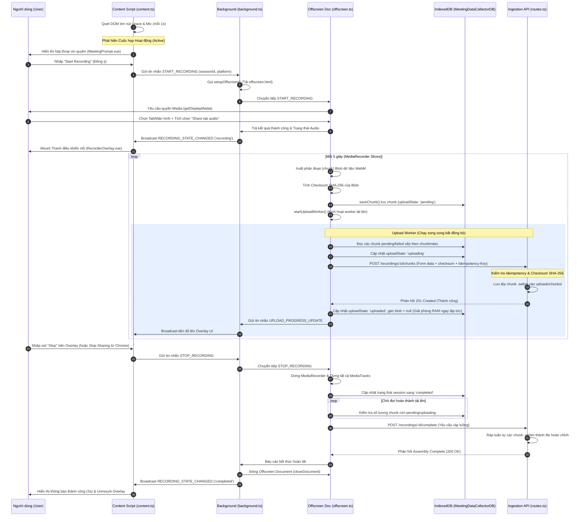
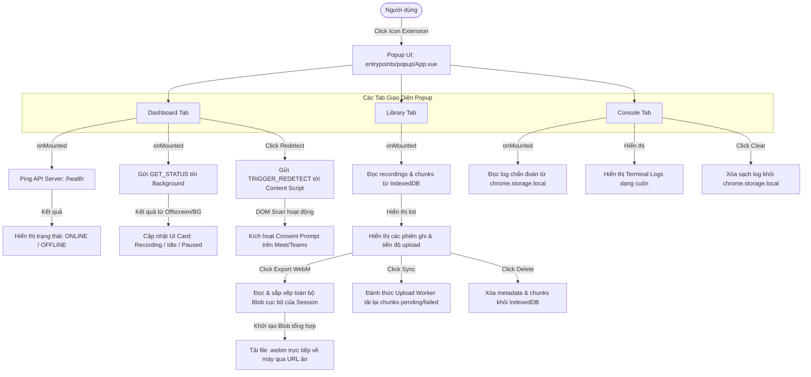
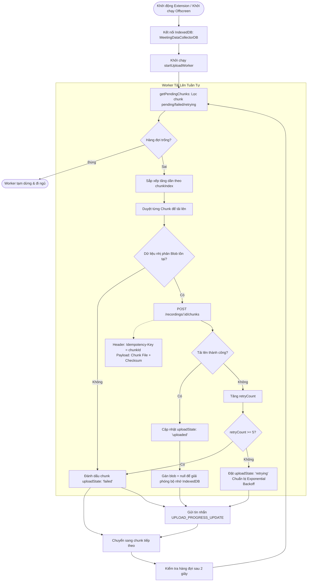
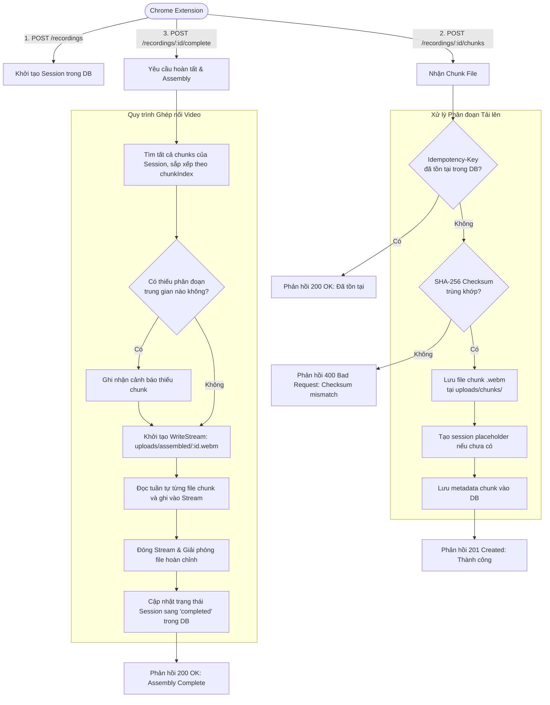

# Tài Liệu Kỹ Thuật Chi Tiết Codebase Chrome Extension: Meeting Data Collector

Tài liệu này cung cấp cái nhìn toàn diện và chi tiết về kiến trúc, cấu trúc thư mục, chức năng của từng tệp tin nguồn, ánh xạ tính năng và phân tích luồng xử lý dữ liệu của Chrome Extension **Meeting Data Ingestion Pipeline**.

---

## 1. Tổng Quan Cấu Trúc Dự Án (Project Structure Overview)

Dưới đây là sơ đồ cây thư mục của dự án Chrome Extension (sau khi loại bỏ các thư mục phụ trợ như `node_modules`, `dist`, `.output`, `.wxt`, `.git`):

```text
/home/intern-lnduy/Dzi/Record-Extension
├── assets/
│   └── tailwind.css             # Cấu hình Tailwind CSS và định nghĩa CSS tùy chỉnh (ví dụ: drag class)
├── components/
│   ├── ActivityFeed.vue         # Component Vue hiển thị nhật ký hoạt động timeline
│   ├── EmptyState.vue           # Component Vue hiển thị màn hình trống khi không có cuộc họp
│   ├── MeetingPrompt.vue        # Component Vue hiển thị hộp thoại xin quyền ghi âm/ghi hình khi phát hiện cuộc họp
│   ├── MeetingStatusCard.vue    # Component Vue hiển thị cuộc họp phát hiện và nút ghi hình
│   ├── PermissionStatusCard.vue # Component Vue hiển thị trạng thái xin quyền và hướng dẫn khắc phục
│   ├── RecorderOverlay.vue      # Component Vue hiển thị bảng điều khiển nổi (floating overlay) khi đang ghi
│   ├── RecordingStatusCard.vue  # Component Vue điều khiển phiên ghi (Pause/Resume/Stop/Sync/Export)
│   ├── RecordingTimer.vue       # Component Vue định dạng hiển thị đồng hồ thời gian ghi hình HH:MM:SS
│   ├── RecoveryDialog.vue       # Component Vue phục vụ khôi phục/đồng bộ lại các session bị gián đoạn (chưa được mount)
│   └── StatusIndicator.vue      # Component Vue hiển thị huy hiệu trạng thái hệ thống
├── entrypoints/
│   ├── background.ts            # Service Worker (Background Script) điều phối luồng và quản lý Offscreen Document
│   ├── content.ts               # Content Script được inject vào trang Meet/Teams để quét DOM và hiển thị UI
│   ├── offscreen.html           # File HTML làm vật chứa cho offscreen.ts trong môi trường nền
│   └── popup/
│       ├── App.vue              # Bảng điều khiển chính (Dashboard/Library/Console) hiển thị khi click vào icon extension
│       ├── index.html           # Khung HTML cho Popup UI
│       └── main.ts              # Entry point khởi tạo ứng dụng Vue cho Popup UI
├── src/
│   ├── bypass-csp.ts            # Script bypass Trusted Types CSP trên các trang web bảo mật cao như Teams
│   ├── logger.ts                # Bộ ghi log chẩn đoán (debug/info/warn/error) được đồng bộ qua chrome.storage.local
│   └── offscreen.ts             # Script chạy trong Offscreen Document, trực tiếp capture stream và lưu/tải lên chunks
├── tests/
│   ├── fixtures/                # Mock HTML để chạy test trạng thái DOM (Google Meet/Teams)
│   │   ├── meet-active.html
│   │   ├── meet-lobby.html
│   │   ├── teams-active.html
│   │   └── teams-lobby.html
│   ├── detection.test.ts        # Test suite kiểm thử bộ logic phát hiện cuộc họp (sử dụng Vitest)
│   └── run-tests-happy.js       # Script test độc lập tích hợp Happy-DOM kiểm thử logic phát hiện lobby/active call
├── backend/                     # Mã nguồn máy chủ Ingestion Backend (Express + Sequelize SQLite/PostgreSQL)
│   ├── src/
│   │   ├── database.ts          # Thiết lập Sequelize models cho recordings và recording_chunks
│   │   ├── routes.ts            # Các API endpoints xử lý session, upload chunk (SHA256, Idempotency) và assembly
│   │   └── server.ts            # Khởi động server Express trên port 3000
│   └── package.json
├── package.json                 # Cấu hình dự án extension, khai báo script và các dependency (Vue, WXT, Tailwind)
└── wxt.config.ts                # Cấu hình WXT framework, phân bổ permission MV3 và cấu hình host_permissions
```

### Vai Trò Của Các Thư Mục Quan Trọng Trong Kiến Trúc Extension:
*   **`entrypoints/`**: Chứa tất cả các điểm đầu vào (entry points) được quy định bởi framework WXT. Mỗi tệp hoặc thư mục con ở đây sẽ được compile thành một thành phần tương ứng của Chrome Extension (background script, content script, popup page, offscreen document).
*   **`src/`**: Chứa mã nguồn dùng chung hoặc các module xử lý logic nghiệp vụ tách biệt, bao gồm cấu hình CSP bypass, bộ ghi log tập trung, và hạt nhân ghi hình (`offscreen.ts`).
*   **`components/`**: Lưu trữ các UI component Vue 3 tái sử dụng được tiêm (inject) vào DOM của trang web đích thông qua Content Script.
*   **`assets/`**: Chứa các file tài nguyên tĩnh như CSS tổng thể (Tailwind).
*   **`tests/`**: Chứa bộ kiểm thử tự động đảm bảo tính chính xác cho bộ chọn DOM (selectors) để phát hiện trạng thái cuộc họp.
*   **`backend/`**: Không thuộc môi trường Chrome Extension nhưng đóng vai trò là server tiếp nhận dữ liệu tải lên (Ingestion Server), lắp ghép các phân đoạn video/audio WebM thành file hoàn chỉnh.

---

## 2. Mô Tả Chi Tiết Từng Tệp Tin Nguồn (File-by-File Functional Description)

### Thư mục `entrypoints/`

#### Tệp tin: [entrypoints/background.ts](file:///home/intern-lnduy/Dzi/Record-Extension/entrypoints/background.ts)
*   **Mục đích**: Làm Service Worker chạy nền của Extension (Manifest V3), chịu trách nhiệm tạo/đóng Offscreen Document, lắng nghe thay đổi URL tab để hỗ trợ SPA navigation, và chuyển tiếp các thông điệp điều khiển giữa Content Script/Popup tới Offscreen Document.
*   **Trách nhiệm chính**:
    *   Khởi tạo cấu trúc nền và ghi log khởi động.
    *   Quản lý vòng đời của Offscreen Document (đảm bảo chỉ có tối đa một thực thể offscreen chạy tại một thời điểm).
    *   Lắng nghe sự kiện chuyển hướng trang trong các tab Google Meet / MS Teams để phát tín hiệu kích hoạt content script.
    *   Nhận yêu cầu và phân phối tin nhắn điều khiển ghi âm/hình (`START_RECORDING`, `STOP_RECORDING`, `PAUSE_RECORDING`, `RESUME_RECORDING`).
    *   Phát quảng bá (broadcast) cập nhật trạng thái ghi hình từ Offscreen Document đến tất cả các tab cuộc họp đang hoạt động để đồng bộ UI Overlay.
*   **Các hàm xuất ra**:
    *   Hàm mặc định `defineBackground()` khởi chạy Service Worker.
    *   Hàm nội bộ `setupOffscreen()` (Dòng 9–52): Kiểm tra sự tồn tại của Offscreen Document và khởi tạo nó với lý do `DISPLAY_MEDIA` và `BLOBS`.
    *   Hàm nội bộ `closeOffscreen()` (Dòng 55–63): Đóng Offscreen Document an toàn khi kết thúc hoặc xảy ra lỗi.
*   **Các biến/hằng số quan trọng**:
    *   `offscreenCreating` (Dòng 6): Promise theo dõi tiến trình khởi tạo Offscreen Document nhằm tránh việc gọi trùng lặp (race condition).
*   **Thư viện/tệp tin phụ thuộc**:
    *   Import từ dự án: [src/logger.ts](file:///home/intern-lnduy/Dzi/Record-Extension/src/logger.ts) (`logDebug`).
*   **Các file khác phụ thuộc vào nó**:
    *   Đây là file chạy nền độc lập do Chrome Engine tự nạp theo cấu hình `manifest.json`.

---

#### Tệp tin: [entrypoints/content.ts](file:///home/intern-lnduy/Dzi/Record-Extension/entrypoints/content.ts)
*   **Mục đích**: Chạy trong ngữ cảnh biệt lập (isolated context) của các trang web Google Meet và MS Teams. Thực hiện quét cấu trúc DOM để phát hiện cuộc họp đang diễn ra, hiển thị giao diện Popup xin quyền (Consent UI), và hiển thị Overlay điều khiển nổi trên màn hình cuộc họp.
*   **Trách nhiệm chính**:
    *   Chạy vòng lặp định kỳ (mỗi 1 giây) để phát hiện xem người dùng đã thực sự tham gia cuộc họp hay chưa.
    *   Tự động mount ứng dụng Vue 3 làm màng bọc chứa `MeetingPrompt.vue` khi phát hiện cuộc họp và chưa xin quyền.
    *   Mount ứng dụng Vue chứa `RecorderOverlay.vue` khi trạng thái ghi hình chuyển sang active (đang ghi hoặc tạm dừng).
    *   Gửi thông điệp điều khiển lên Background Service Worker khi người dùng tương tác trên UI.
    *   Lắng nghe thông điệp `TRIGGER_REDETECT` từ Popup để thực hiện quét DOM thủ công và báo cáo kết quả.
    *   Duy trì và đồng bộ các biến trạng thái hiển thị của Overlay (thời lượng, trạng thái âm thanh, số phân đoạn đã upload).
*   **Các hàm xuất ra**:
    *   Hàm mặc định `defineContentScript()` đăng ký script chạy trên các URL phù hợp (`matches`).
    *   Hàm nội bộ `isMeetingActive(silent)` (Dòng 34–72): Quét DOM để tìm sự hiện diện đồng thời của nút rời cuộc họp (leave button) và nút tắt/mở mic (mic control button) tương ứng với từng nền tảng Google Meet hoặc MS Teams.
    *   Hàm nội bộ `getSessionId()` (Dòng 75–82): Lấy hoặc sinh mới một UUID phiên lưu trữ trong `sessionStorage`.
    *   Hàm nội bộ `showMeetingPrompt()` (Dòng 85–109): Tiêm phần tử DOM và mount component `MeetingPrompt.vue` bằng Vue.
    *   Hàm nội bộ `dismissPrompt()` (Dòng 111–120): Gỡ bỏ hộp thoại xin quyền.
    *   Hàm nội bộ `mountRecorderOverlay()` (Dòng 122–159): Tiêm phần tử DOM và mount component `RecorderOverlay.vue` điều khiển.
    *   Hàm nội bộ `unmountRecorderOverlay()` (Dòng 161–170): Gỡ bỏ overlay điều khiển nổi.
    *   Hàm nội bộ `triggerStartRecording()` (Dòng 173–188): Gửi thông điệp yêu cầu bắt đầu ghi lên background.
    *   Hàm nội bộ `checkRunningSessions()` (Dòng 236–249): Hỏi background trạng thái ghi hiện tại để khôi phục UI Overlay nếu trang bị tải lại giữa chừng.
    *   Hàm nội bộ `checkForMeetingPrompt()` (Dòng 251–262): Thiết lập interval chạy tối đa 30 giây đầu tiên để tự động kích hoạt Prompt khi cuộc họp bắt đầu.
*   **Các biến/hằng số quan trọng**:
    *   `overlayStatus`, `overlayDuration`, `overlayHasAudio`, `overlayUploaded`, `overlayTotal` (Dòng 25-29): Các ref Vue 3 theo dõi trạng thái đồng bộ động của Overlay.
    *   `platform` (Dòng 31): Xác định nền tảng `'meet'` hoặc `'teams'` dựa trên tên miền hiện tại.
*   **Thư viện/tệp tin phụ thuộc**:
    *   Import từ dự án: [src/bypass-csp.ts](file:///home/intern-lnduy/Dzi/Record-Extension/src/bypass-csp.ts), [src/logger.ts](file:///home/intern-lnduy/Dzi/Record-Extension/src/logger.ts), [components/MeetingPrompt.vue](file:///home/intern-lnduy/Dzi/Record-Extension/components/MeetingPrompt.vue), [components/RecorderOverlay.vue](file:///home/intern-lnduy/Dzi/Record-Extension/components/RecorderOverlay.vue), [components/RecoveryDialog.vue](file:///home/intern-lnduy/Dzi/Record-Extension/components/RecoveryDialog.vue).
*   **Các file khác phụ thuộc vào nó**:
    *   [tests/detection.test.ts](file:///home/intern-lnduy/Dzi/Record-Extension/tests/detection.test.ts) (tham chiếu đến bộ chọn và logic URL validator).

---

#### Tệp tin: [entrypoints/offscreen.html](file:///home/intern-lnduy/Dzi/Record-Extension/entrypoints/offscreen.html)
*   **Mục đích**: Là cấu trúc khung HTML tối giản làm vật chứa để tải script `offscreen.ts` chạy ngầm.
*   **Trách nhiệm chính**: Nạp [src/offscreen.ts](file:///home/intern-lnduy/Dzi/Record-Extension/src/offscreen.ts) như một ES Module trong môi trường ngữ cảnh offscreen.
*   **Thư viện/tệp tin phụ thuộc**:
    *   Import từ dự án: [src/offscreen.ts](file:///home/intern-lnduy/Dzi/Record-Extension/src/offscreen.ts).
*   **Các file khác phụ thuộc vào nó**:
    *   Được nạp bởi [entrypoints/background.ts](file:///home/intern-lnduy/Dzi/Record-Extension/entrypoints/background.ts) qua hàm `chrome.offscreen.createDocument()`.

---

#### Thư mục `entrypoints/popup/`

##### Tệp tin: [entrypoints/popup/index.html](file:///home/intern-lnduy/Dzi/Record-Extension/entrypoints/popup/index.html)
*   **Mục đích**: File HTML làm giao diện nền cho Popup. Định nghĩa kích thước cố định `480px x 560px` và nạp module khởi động Vue.

##### Tệp tin: [entrypoints/popup/main.ts](file:///home/intern-lnduy/Dzi/Record-Extension/entrypoints/popup/main.ts)
*   **Mục đích**: Entry point của Popup, khởi tạo và mount ứng dụng Vue 3 từ `App.vue` vào thẻ `#app`.

##### Tệp tin: [entrypoints/popup/App.vue](file:///home/intern-lnduy/Dzi/Record-Extension/entrypoints/popup/App.vue)
*   **Mục đích**: Cung cấp giao diện quản trị và cấu hình chính cho người dùng khi click vào biểu tượng Extension ở thanh công cụ.
*   **Trách nhiệm chính**:
    *   **Dashboard Tab**: Điều phối và hiển thị các trạng thái hệ thống theo kiểu thẻ (Card-based). Quản lý và liên kết các sub-component (`StatusIndicator`, `EmptyState`, `MeetingStatusCard`, `RecordingStatusCard`, `PermissionStatusCard` và `ActivityFeed`). Tự động quét và phát hiện phòng họp active khi mở popup.
    *   **Library Tab**: Truy vấn cơ sở dữ liệu IndexedDB (`MeetingDataCollectorDB`) để lấy danh sách các phiên ghi hình đã lưu trữ cục bộ kèm theo tiến độ đồng bộ hóa phân đoạn (chunks). Cung cấp chức năng tải xuống trực tiếp file `.webm` tổng hợp (merge các blob cục bộ) hoặc xóa vĩnh viễn phiên ghi hình khỏi bộ nhớ.
    *   **Console Tab**: Lắng nghe và hiển thị các log chẩn đoán từ pipeline ghi hình lưu trữ trong `chrome.storage.local`. Cho phép gửi lệnh quét DOM thủ công lên tab hiện tại qua tin nhắn `TRIGGER_REDETECT` và xóa sạch nhật ký log.
    *   **Server Health**: Kiểm tra tình trạng kết nối tới API Ingest server cục bộ (`http://localhost:3000/api/recordings/health`) theo định kỳ mỗi 8 giây để hiển thị trạng thái `ONLINE`/`OFFLINE`.
    *   **Theme Switcher**: Cung cấp khả năng chuyển đổi giao diện Sáng/Tối (Light/Dark mode) đồng bộ với biến trạng thái `isDark` và lưu trữ lựa chọn trong `localStorage`.
*   **Các hàm chính**:
    *   `scanActiveTab()` (Mới): Tự động truy vấn tab hiện hành và gửi tin nhắn `CHECK_MEETING_ACTIVE` tới content script để nhận biết trạng thái và nền tảng cuộc họp mà không kích hoạt Consent UI trên trang đích.
    *   `loadStoredState()` (Mới): Đồng bộ hóa trạng thái `recorder_status`, `recorder_error` và `activity_feed` từ `chrome.storage.local`.
    *   `clearActivityFeed()` (Mới): Xóa trắng danh sách sự kiện hoạt động gần đây.
    *   `dismissState()` (Mới): Thiết lập lại trạng thái ghi hình về `IDLE` sau khi kết thúc hoặc gặp sự cố và quét lại tab.
    *   `fetchLogs()`: Tải dữ liệu nhật ký chẩn đoán từ `chrome.storage.local`.
    *   `clearLogs()`: Gọi bộ xóa sạch logs.
    *   `openDB()`: Mở kết nối IndexedDB phục vụ đọc dữ liệu.
    *   `loadRecordings()`: Đọc toàn bộ các bản ghi từ bảng `recordings` và bảng `recording_chunks` của IndexedDB để tổng hợp tiến độ tải lên cục bộ của từng session.
    *   `checkServerHealth()`: Thực hiện ping kiểm tra backend server.
    *   `scanActiveTab()`, `loadStoredState()`, `clearActivityFeed()`, `dismissState()`, `fetchLogs()`, `clearLogs()`, `openDB()`, `loadRecordings()`, `checkServerHealth()`, `startRecordingFromPopup()`, `pauseRecording()`, `resumeRecording()`, `stopRecording()`, `resumeSync(sessionId)`, `exportSession(sessionId)`, `deleteSession(sessionId)`, `queryRunningStatus()`.
*   **Các file khác phụ thuộc vào nó**:
    *   [entrypoints/background.ts](file:///home/intern-lnduy/Dzi/Record-Extension/entrypoints/background.ts), [entrypoints/content.ts](file:///home/intern-lnduy/Dzi/Record-Extension/entrypoints/content.ts), [src/offscreen.ts](file:///home/intern-lnduy/Dzi/Record-Extension/src/offscreen.ts), [entrypoints/popup/App.vue](file:///home/intern-lnduy/Dzi/Record-Extension/entrypoints/popup/App.vue).

---

### Thư mục `src/`

#### Tệp tin: [src/bypass-csp.ts](file:///home/intern-lnduy/Dzi/Record-Extension/src/bypass-csp.ts)
*   **Mục đích**: Vô hiệu hóa tính năng kiểm tra Trusted Types Content Security Policy (CSP) trong ngữ cảnh biệt lập của extension.

#### Tệp tin: [src/logger.ts](file:///home/intern-lnduy/Dzi/Record-Extension/src/logger.ts)
*   **Mục đích**: Cung cấp giải pháp ghi nhật ký chẩn đoán (Diagnostic Logs) tập trung và quản lý trạng thái, lịch sử hoạt động cục bộ.

#### Tệp tin: [src/offscreen.ts](file:///home/intern-lnduy/Dzi/Record-Extension/src/offscreen.ts)
*   **Mục đích**: **Trái tim của hệ thống ghi hình**. Chạy trong ngữ cảnh Offscreen Document để thực hiện ghi hình và đồng bộ hóa tải lên máy chủ.
*   **Trách nhiệm chính**:
    *   Yêu cầu quay màn hình tab thông qua API `navigator.mediaDevices.getDisplayMedia`.
    *   Lưu trữ phân đoạn tạm thời vào IndexedDB (`MeetingDataCollectorDB`) để tránh tràn Heap.
    *   Tự động cập nhật trạng thái `recorder_status` và ghi nhận nhật ký vào `activity_feed` thông qua `logActivity`.
    *   Xếp hàng tải lên tuần tự lên máy chủ Ingestion Server, hỗ trợ Idempotency-Key và tự động retry.
*   **Các hàm xuất ra**:
    *   `setRecorderStatus(status, error)`, `openDB()`, `saveRecording(recording)`, `saveChunk(chunk)`, `getPendingChunks()`, `getActiveUploadsForSession(sessionId)`, `updateRecordingStatus(sessionId, status)`, `calculateSHA256(blob)`, `startUploadWorker()`, `uploadChunkWithRetry(chunk)`, `startRecording(sessionId, platform)`, `pauseRecording()`, `resumeRecording()`, `stopRecording()`, `cleanup()`.
*   **Các biến/hằng số quan trọng**:
    *   `BACKEND_URL` (Dòng 5): URL đích của Ingestion Server (`http://localhost:3000/api`).
    *   `mediaRecorder` (Dòng 131): Đối tượng MediaRecorder đảm nhận việc thu mã hóa nhị phân WebM.
    *   `activeStream` (Dòng 132): Chứa luồng Capture thu được từ API MediaDevices.
    *   `isAudioActive` (Dòng 137): Xác định luồng ghi có chứa âm thanh hệ thống/tab được chia sẻ hay không.
*   **Thư viện/tệp tin phụ thuộc**:
    *   Import từ dự án: [src/logger.ts](file:///home/intern-lnduy/Dzi/Record-Extension/src/logger.ts).
*   **Các file khác phụ thuộc vào nó**:
    *   Được nạp trực tiếp bởi [entrypoints/offscreen.html](file:///home/intern-lnduy/Dzi/Record-Extension/entrypoints/offscreen.html).

---

### Thư mục `components/`

#### Tệp tin: [components/ActivityFeed.vue](file:///home/intern-lnduy/Dzi/Record-Extension/components/ActivityFeed.vue)
*   **Mục đích**: Hiển thị nhật ký hoạt động dạng dòng thời gian (timeline) của extension trong Popup UI.
*   **Trách nhiệm chính**:
    *   Hiển thị danh sách các sự kiện hoạt động gần đây (`feed` prop).
    *   Hiển thị thông báo khi danh sách trống.
    *   Cho phép xóa sạch nhật ký hoạt động bằng cách bấm nút "Clear" và phát ra sự kiện `clear`.
*   **Thuộc tính nhận vào (Props)**:
    *   `feed`: `ActivityEvent[]` (mảng các sự kiện hoạt động).
*   **Sự kiện phát ra (Emits)**:
    *   `clear`: Khi bấm nút xóa để dọn dẹp danh sách hoạt động.
*   **Thư viện/tệp tin phụ thuộc**:
    *   Import từ bên ngoài: `lucide-vue-next` (`Trash2`).
    *   Import từ dự án: [src/logger.ts](file:///home/intern-lnduy/Dzi/Record-Extension/src/logger.ts) (`ActivityEvent`).
*   **Các file khác phụ thuộc vào nó**:
    *   Được nạp và hiển thị trực tiếp trong [entrypoints/popup/App.vue](file:///home/intern-lnduy/Dzi/Record-Extension/entrypoints/popup/App.vue).

---

#### Tệp tin: [components/EmptyState.vue](file:///home/intern-lnduy/Dzi/Record-Extension/components/EmptyState.vue)
*   **Mục đích**: Hiển thị giao diện trạng thái trống trong Dashboard khi không tìm thấy cuộc họp nào đang hoạt động.
*   **Trách nhiệm chính**:
    *   Trình bày giao diện trực quan cho thấy extension đang sẵn sàng nhưng chưa phát hiện tab cuộc họp hợp lệ.
    *   Cung cấp các nút liên kết nhanh (Deep Links) cho phép người dùng mở Google Meet hoặc MS Teams trong tab mới.
*   **Thuộc tính nhận vào (Props)**: Không có.
*   **Sự kiện phát ra (Emits)**: Không có.
*   **Thư viện/tệp tin phụ thuộc**:
    *   Import từ bên ngoài: `lucide-vue-next` (`VideoOff`).
*   **Các file khác phụ thuộc vào nó**:
    *   Được nạp và hiển thị trực tiếp trong [entrypoints/popup/App.vue](file:///home/intern-lnduy/Dzi/Record-Extension/entrypoints/popup/App.vue).

---

#### Tệp tin: [components/MeetingPrompt.vue](file:///home/intern-lnduy/Dzi/Record-Extension/components/MeetingPrompt.vue)
*   **Mục đích**: Component Vue hiển thị hộp thoại cảnh báo và xin phép ghi hình cuộc họp của người dùng dưới dạng overlay cố định ngay trên màn hình Meet/Teams.
*   **Trách nhiệm chính**:
    *   Hiển thị tên nền tảng (Google Meet hoặc Microsoft Teams) được phát hiện.
    *   Cung cấp thông tin mô tả về tính năng và chính sách bảo mật/sự an toàn của dữ liệu ghi hình.
    *   Cho phép người dùng bấm nút đồng ý ("Start Recording") hoặc từ chối ("Dismiss").
*   **Thuộc tính nhận vào (Props)**:
    *   `platform`: `'meet' | 'teams'` (nền tảng cuộc họp).
*   **Sự kiện phát ra (Emits)**:
    *   `start`: Khi người dùng bấm đồng ý ghi hình.
    *   `dismiss`: Khi người dùng từ chối ghi hình.
*   **Thư viện/tệp tin phụ thuộc**:
    *   Import từ bên ngoài: `vue` (`computed`).
*   **Các file khác phụ thuộc vào nó**:
    *   Được nạp và hiển thị bởi Content Script [entrypoints/content.ts](file:///home/intern-lnduy/Dzi/Record-Extension/entrypoints/content.ts).

---

#### Tệp tin: [components/MeetingStatusCard.vue](file:///home/intern-lnduy/Dzi/Record-Extension/components/MeetingStatusCard.vue)
*   **Mục đích**: Hiển thị thẻ thông tin cuộc họp được phát hiện ngay trên giao diện Dashboard của Popup.
*   **Trách nhiệm chính**:
    *   Hiển thị logo nền tảng và tiêu đề phòng họp hoạt động.
    *   Cung cấp nút bấm "Start Capture" để kích hoạt ghi hình trực tiếp từ Popup.
*   **Thuộc tính nhận vào (Props)**:
    *   `platform`: `'meet' | 'teams'` (nền tảng được phát hiện).
    *   `title`: `string` (tên cuộc họp hiện hành).
*   **Sự kiện phát ra (Emits)**:
    *   `start`: Phát sự kiện bắt đầu khi click nút "Start Capture".
*   **Thư viện/tệp tin phụ thuộc**:
    *   Import từ bên ngoài: `lucide-vue-next` (`Video`, `CheckCircle2`, `Play`).
*   **Các file khác phụ thuộc vào nó**:
    *   Được nạp và hiển thị trực tiếp trong [entrypoints/popup/App.vue](file:///home/intern-lnduy/Dzi/Record-Extension/entrypoints/popup/App.vue).

---

#### Tệp tin: [components/PermissionStatusCard.vue](file:///home/intern-lnduy/Dzi/Record-Extension/components/PermissionStatusCard.vue)
*   **Mục đích**: Hiển thị thông báo và hướng dẫn cấp quyền ghi âm/ghi hình khi extension đang xin quyền hoặc bị từ chối quyền.
*   **Trách nhiệm chính**:
    *   Nhận diện trạng thái xin quyền và đưa ra giao diện hướng dẫn phù hợp.
    *   Hiển thị các bước khắc phục lỗi cụ thể nếu quyền bị từ chối (`PERMISSION_DENIED`).
    *   Cung cấp các nút "Retry Request" và "Dismiss" để người dùng xử lý.
*   **Thuộc tính nhận vào (Props)**:
    *   `status`: `RecorderStatus` (trạng thái hệ thống).
*   **Sự kiện phát ra (Emits)**:
    *   `retry`: Khi click nút xin cấp lại quyền.
    *   `dismiss`: Khi click nút đóng thông báo.
*   **Thư viện/tệp tin phụ thuộc**:
    *   Import từ bên ngoài: `lucide-vue-next` (`ShieldCheck`, `AlertTriangle`, `Loader2`, `RefreshCw`).
    *   Import từ dự án: [src/logger.ts](file:///home/intern-lnduy/Dzi/Record-Extension/src/logger.ts) (`RecorderStatus`).
*   **Các file khác phụ thuộc vào nó**:
    *   Được nạp trực tiếp trong [entrypoints/popup/App.vue](file:///home/intern-lnduy/Dzi/Record-Extension/entrypoints/popup/App.vue).

---

#### Tệp tin: [components/RecorderOverlay.vue](file:///home/intern-lnduy/Dzi/Record-Extension/components/RecorderOverlay.vue)
*   **Mục đích**: Component Vue hiển thị thanh trạng thái ghi nổi (Floating Control Bar Overlay) nằm trên màn hình cuộc họp đích (Meet/Teams).
*   **Trách nhiệm chính**:
    *   Cho phép người dùng kéo thả (drag and drop) để định vị thanh điều khiển ở vị trí bất kỳ trên màn hình họp.
    *   Hiển thị bộ đếm thời lượng ghi thực tế theo định dạng `HH:MM:SS`.
    *   Cảnh báo trực quan nếu luồng ghi bị thiếu âm thanh (chưa tích chọn chia sẻ audio tab).
    *   Hiển thị tiến trình đồng bộ dữ liệu chunk lên máy chủ (Upload Sync Progress).
    *   Cung cấp các nút bấm tương tác nhanh: Pause/Resume và Stop.
*   **Thuộc tính nhận vào (Props)**:
    *   `status`: `'recording' | 'paused' | 'completed' | 'failed' | 'inactive'` (trạng thái ghi).
    *   `duration`: `number` (thời lượng tính bằng giây).
    *   `hasAudio`: `boolean` (trạng thái kết nối micro/audio).
    *   `uploadedChunks`: `number` (số lượng chunk đã tải lên).
    *   `totalChunks`: `number` (tổng số chunk ghi nhận).
*   **Sự kiện phát ra (Emits)**:
    *   `pause`: Tạm dừng phiên ghi.
    *   `resume`: Tiếp tục phiên ghi.
    *   `stop`: Kết thúc phiên ghi.
*   **Thư viện/tệp tin phụ thuộc**:
    *   Import từ bên ngoài: `vue` (`ref`, `computed`, `onMounted`).
*   **Các file khác phụ thuộc vào nó**:
    *   Được nạp và hiển thị trực tiếp bởi Content Script [entrypoints/content.ts](file:///home/intern-lnduy/Dzi/Record-Extension/entrypoints/content.ts).

---

#### Tệp tin: [components/RecordingStatusCard.vue](file:///home/intern-lnduy/Dzi/Record-Extension/components/RecordingStatusCard.vue)
*   **Mục đích**: Component điều khiển hoạt động chính hiển thị trên Popup UI Dashboard khi cuộc họp đang được ghi hình, lưu trữ hoặc đã lưu thành công.
*   **Trách nhiệm chính**:
    *   Đo lường và hiển thị bộ đếm thời gian thực ghi hình (HH:MM:SS) qua component `RecordingTimer`.
    *   Hiển thị thanh tiến trình tải lên cụ thể kèm theo phần trăm (%) và số phân đoạn hoàn thành khi đang đồng bộ (`SAVING`).
    *   Hiển thị thông báo thành công kèm nút "Export WebM" (tải xuống blob tổng hợp từ IndexedDB) và nút "Dismiss" khi ghi hình hoàn tất (`COMPLETED`).
    *   Hiển thị cảnh báo lỗi chi tiết khi phiên ghi thất bại (`FAILED`) kèm nút "Retry Capture".
    *   Cung cấp bộ nút hành động điều khiển: Pause/Resume, Stop.
*   **Thuộc tính nhận vào (Props)**:
    *   `status`: `RecorderStatus` (trạng thái ghi hiện tại).
    *   `duration`: `number` (thời lượng giây).
    *   `platform`: `'meet' | 'teams'` (nền tảng phòng họp).
    *   `hasAudio`: `boolean` (trạng thái có âm thanh/mic).
    *   `uploaded`: `number` (số lượng chunk đã tải lên).
    *   `total`: `number` (tổng số chunk của phiên).
    *   `errorMsg`: `string` (thông điệp lỗi chi tiết).
    *   `sessionId`: `string` (mã phiên ghi hình hiện hành).
*   **Sự kiện phát ra (Emits)**:
    *   `pause`: Tạm dừng.
    *   `resume`: Tiếp tục.
    *   `stop`: Dừng ghi.
    *   `dismiss`: Đóng thẻ.
    *   `retry`: Thử lại.
    *   `export`: Xuất file WebM từ IndexedDB.
*   **Thư viện/tệp tin phụ thuộc**:
    *   Import từ bên ngoài: `vue` (`computed`), `lucide-vue-next` (`Pause`, `Play`, `Square`, `CheckCircle2`, `AlertTriangle`, `Loader2`, `Download`).
    *   Import từ dự án: [src/logger.ts](file:///home/intern-lnduy/Dzi/Record-Extension/src/logger.ts) (`RecorderStatus`), [components/RecordingTimer.vue](file:///home/intern-lnduy/Dzi/Record-Extension/components/RecordingTimer.vue).
*   **Các file khác phụ thuộc vào nó**:
    *   Được nạp và hiển thị trực tiếp trong [entrypoints/popup/App.vue](file:///home/intern-lnduy/Dzi/Record-Extension/entrypoints/popup/App.vue).

---

#### Tệp tin: [components/RecordingTimer.vue](file:///home/intern-lnduy/Dzi/Record-Extension/components/RecordingTimer.vue)
*   **Mục đích**: Component Vue siêu nhỏ chịu trách nhiệm định dạng hiển thị bộ đếm thời gian.
*   **Trách nhiệm chính**:
    *   Nhận vào số giây đã trôi qua, tự động tính toán và trả về chuỗi định dạng hiển thị `HH:MM:SS` (sử dụng monospace font để tránh co giật Layout khi chữ số thay đổi).
*   **Thuộc tính nhận vào (Props)**:
    *   `duration`: `number` (thời lượng giây).
*   **Sự kiện phát ra (Emits)**: Không có.
*   **Thư viện/tệp tin phụ thuộc**:
    *   Import từ bên ngoài: `vue` (`computed`).
*   **Các file khác phụ thuộc vào nó**:
    *   Được nạp bởi [components/RecordingStatusCard.vue](file:///home/intern-lnduy/Dzi/Record-Extension/components/RecordingStatusCard.vue) và [components/RecorderOverlay.vue](file:///home/intern-lnduy/Dzi/Record-Extension/components/RecorderOverlay.vue) (hoặc trực tiếp qua props).

---

#### Tệp tin: [components/RecoveryDialog.vue](file:///home/intern-lnduy/Dzi/Record-Extension/components/RecoveryDialog.vue)
*   **Mục đích**: Component Vue cung cấp giao diện khôi phục và xử lý thủ công các phiên ghi hình bị gián đoạn trước đó (do sự cố trình duyệt tắt đột ngột, tab bị crash hoặc mất điện).
*   **Trách nhiệm chính**:
    *   Liệt kê danh sách các phiên ghi hình chưa hoàn thành đồng bộ tải lên server được lưu trữ trong IndexedDB.
    *   Cho phép khôi phục đồng bộ lên server (`resume`), xuất dữ liệu WebM lưu cục bộ (`export`) hoặc xóa vĩnh viễn dữ liệu rác để giải phóng dung lượng (`delete`).
*   **Thuộc tính nhận vào (Props)**:
    *   `isOpen`: Trạng thái ẩn hiện của modal.
    *   `brokenSessions`: Danh sách chứa metadata của các session bị lỗi.
*   **Sự kiện phát ra (Emits)**:
    *   `close`, `resume`, `export`, `delete`.
*   **Ghi chú bổ sung**: Hiện tại component này đã được lập trình sẵn các hàm xử lý sự kiện đầy đủ, tuy nhiên chưa được kích hoạt gắn kết vào file `content.ts` hay `App.vue` để hiển thị tự động trên UI thực tế của extension (mã nguồn chỉ mới import nó).

---

#### Tệp tin: [components/StatusIndicator.vue](file:///home/intern-lnduy/Dzi/Record-Extension/components/StatusIndicator.vue)
*   **Mục đích**: Huy hiệu hiển thị trạng thái tổng quan của extension trên giao diện Popup.
*   **Trách nhiệm chính**:
    *   Ánh xạ trạng thái hệ thống hiện hành (`status` prop) thành nhãn và màu sắc tương ứng.
    *   Tự động hiển thị các biểu tượng tương tác (ví dụ: quay vòng tròn khi quét, chấm đỏ nhấp nháy khi ghi hình).
*   **Thuộc tính nhận vào (Props)**:
    *   `status`: `RecorderStatus` (trạng thái hệ thống).
*   **Sự kiện phát ra (Emits)**: Không có.
*   **Thư viện/tệp tin phụ thuộc**:
    *   Import từ bên ngoài: `vue` (`computed`), `lucide-vue-next` (`Circle`, `Loader2`, `CheckCircle2`, `ShieldCheck`, `AlertTriangle`, `Upload`, `VideoOff`, `Video`).
    *   Import từ dự án: [src/logger.ts](file:///home/intern-lnduy/Dzi/Record-Extension/src/logger.ts) (`RecorderStatus`).
*   **Các file khác phụ thuộc vào nó**:
    *   Được nạp và hiển thị trực tiếp trong [entrypoints/popup/App.vue](file:///home/intern-lnduy/Dzi/Record-Extension/entrypoints/popup/App.vue).

### Thư mục `tests/`

#### Tệp tin: [tests/run-tests-happy.js](file:///home/intern-lnduy/Dzi/Record-Extension/tests/run-tests-happy.js)
*   **Mục đích**: Một file script chạy thử độc lập sử dụng Happy-DOM giả lập cấu trúc tài liệu HTML nhằm kiểm chứng thuật toán chọn lọc thẻ DOM (DOM Selectors) và biểu thức chính quy kiểm tra định dạng URL (URL Validator) cho cả Meet và Teams.
*   **Trách nhiệm chính**:
    *   Giả lập môi trường trình duyệt nhẹ bằng Happy-DOM.
    *   Định nghĩa lại các selector đích của Meet/Teams và các hàm định vị tương đương với content script.
    *   Nạp các file HTML mockup tĩnh trong thư mục `fixtures/` để kiểm tra khả năng phát hiện chính xác trạng thái phòng chờ (Lobby) và cuộc họp đang diễn ra (Active Call).
*   **Thư viện/tệp tin phụ thuộc**:
    *   `happy-dom` (`Window`), `fs`, `path`, `url`.

#### Tệp tin: [tests/detection.test.ts](file:///home/intern-lnduy/Dzi/Record-Extension/tests/detection.test.ts)
*   **Mục đích**: Chạy thử nghiệm phát hiện cuộc họp bằng Vitest kết hợp giả lập môi trường JSDOM.
*   **Trách nhiệm chính**: Mock môi trường API toàn cục của Chrome Extension (`chrome.runtime`, `chrome.storage`), giả lập biến toàn cầu `sessionStorage`, `window.location` để chạy kiểm thử logic trích xuất của Content Script mà không làm crash môi trường Node.js.

---

### Thư mục cấu hình gốc

#### Tệp tin: [wxt.config.ts](file:///home/intern-lnduy/Dzi/Record-Extension/wxt.config.ts)
*   **Mục đích**: Cấu hình biên dịch và đóng gói cho WXT Framework.
*   **Cấu hình quan trọng**:
    *   Đăng ký module Vue 3: `modules: ['@wxt-dev/module-vue']`.
    *   Khai báo quyền (Permissions) của Extension trong Manifest V3: `storage`, `offscreen`, `tabs`, `activeTab`.
    *   Khai báo quyền truy cập tên miền đích (Host Permissions) để Content Script được phép hoạt động: `https://meet.google.com/*`, `https://teams.microsoft.com/*`, `https://teams.live.com/*`.

#### Tệp tin: [package.json](file:///home/intern-lnduy/Dzi/Record-Extension/package.json)
*   **Mục đích**: Quản lý các tập lệnh thực thi (scripts) và các thư viện dependencies của dự án.
*   **Tập lệnh chính**:
    *   `npm run dev`: Chạy môi trường phát triển nóng tự động nạp lại (hot-reload) cho extension.
    *   `npm run build`: Tạo bản đóng gói tối ưu hóa cho Production.
    *   `npm run test`: Khởi chạy tập lệnh kiểm thử DOM độc lập sử dụng Happy-DOM.
    *   `vitest`: Chạy các file kiểm thử unit.

---

## 3. Ánh Xạ Tính Năng (Feature Mapping)

Hệ thống cung cấp một quy trình khép kín từ khâu phát hiện, thu nhận dữ liệu đến đồng bộ tải lên máy chủ. Dưới đây là phân tích chi tiết của từng tính năng cốt lõi:

---

### Tính năng: Meeting Detection (Phát hiện cuộc họp)
*   **Mô tả**: Tự động phát hiện khi người dùng truy cập một liên kết họp hợp lệ và tham gia cuộc họp thực tế (bỏ qua trạng thái chuẩn bị ở phòng chờ - Lobby).
*   **Entry Point**: `entrypoints/content.ts` (Chạy ở chế độ `document_idle`)
*   **Related Files**:
    *   [entrypoints/content.ts](file:///home/intern-lnduy/Dzi/Record-Extension/entrypoints/content.ts)
    *   [entrypoints/popup/App.vue](file:///home/intern-lnduy/Dzi/Record-Extension/entrypoints/popup/App.vue) (Hỗ trợ nút kích hoạt quét thủ công)
*   **Main Flow**:
    1. Khi tải trang Meet/Teams, Content script sẽ thực hiện kiểm tra URL xem có cấu trúc phòng họp hợp lệ không.
    2. Một chu kỳ lặp lại (mỗi 1 giây) quét DOM trang web được khởi động thông qua hàm `checkForMeetingPrompt()`.
    3. Bộ logic `isMeetingActive()` thực hiện kiểm tra sự tồn tại đồng thời của Nút Rời cuộc họp và Nút điều khiển Microphone của Google Meet hoặc MS Teams.
    4. Nếu cả hai nút được phát hiện, hệ thống xác nhận cuộc họp đang hoạt động (Active) và hiển thị Popup xin quyền ghi âm/ghi hình (`showMeetingPrompt()`).
*   **Key Functions**:
    *   `isMeetingActive()` (Dòng 34–72) trong `content.ts`.
    *   `checkForMeetingPrompt()` (Dòng 257–268) trong `content.ts`.

---

### Tính năng: Audio Recording (Ghi âm)
*   **Mô tả**: Thu âm thanh hệ thống/tab cuộc họp đang diễn ra để phục vụ lưu trữ phân đoạn WebM.
*   **Entry Point**: `src/offscreen.ts`
*   **Related Files**:
    *   [src/offscreen.ts](file:///home/intern-lnduy/Dzi/Record-Extension/src/offscreen.ts)
    *   [entrypoints/background.ts](file:///home/intern-lnduy/Dzi/Record-Extension/entrypoints/background.ts)
    *   [components/RecorderOverlay.vue](file:///home/intern-lnduy/Dzi/Record-Extension/components/RecorderOverlay.vue)
*   **Main Flow**:
    1. Khi người dùng bấm "Start Recording", Offscreen Document được khởi tạo và gửi yêu cầu cấp quyền `getDisplayMedia({ audio: true })`.
    2. Trong hộp thoại Chrome hiện lên, người dùng cần chia sẻ màn hình/tab và **bắt buộc phải tích chọn checkbox "Share tab audio"**.
    3. Offscreen kiểm tra luồng âm thanh qua `activeStream.getAudioTracks()`.
    4. Nếu không tìm thấy track âm thanh nào đang hoạt động, biến `isAudioActive` chuyển thành `false`.
    5. Trạng thái âm thanh được gửi ngược về Content Script qua sự kiện `AUDIO_STATUS_CHANGED` để hiển thị cảnh báo nhấp nháy trên Overlay giúp người dùng sửa cấu hình kịp thời.
*   **Key Functions**:
    *   `startRecording()` (Dòng 272–402) trong `offscreen.ts` (kiểm tra track âm thanh tại dòng 291–293).

---

### Tính năng: Screen & Tab Capture (Quay màn hình / Tab)
*   **Mô tả**: Chụp luồng luồng video của màn hình cuộc họp với tốc độ khung hình giới hạn để tiết kiệm tài nguyên.
*   **Entry Point**: `src/offscreen.ts`
*   **Related Files**:
    *   [src/offscreen.ts](file:///home/intern-lnduy/Dzi/Record-Extension/src/offscreen.ts)
*   **Main Flow**:
    1. Hàm `getDisplayMedia` cấu hình chụp video với tốc độ khung hình `frameRate: 15` (Dòng 284–287) để giảm tải CPU và kích thước phân đoạn.
    2. Luồng video thu được gán làm đầu vào cho `MediaRecorder` với định dạng nén tối ưu `video/webm;codecs=vp9,opus` (hoặc `vp8,opus` nếu vp9 không được hỗ trợ).
    3. Gắn sự kiện lắng nghe `onended` cho video track. Khi người dùng click chọn nút "Stop Sharing" tích hợp mặc định của Chrome ở viền dưới màn hình, hệ thống sẽ tự động gọi hàm `stopRecording()`.
*   **Key Functions**:
    *   `startRecording()` (Dòng 272–305) trong `offscreen.ts`.

---

### Tính năng: Extension Popup UI (Giao diện Popup)
*   **Mô tả**: Cung cấp giao diện tương tác độc lập để quản lý trạng thái, thư viện cục bộ và nhật ký hệ thống.
*   **Entry Point**: `entrypoints/popup/App.vue`
*   **Related Files**:
    *   [entrypoints/popup/App.vue](file:///home/intern-lnduy/Dzi/Record-Extension/entrypoints/popup/App.vue)
    *   [entrypoints/popup/index.html](file:///home/intern-lnduy/Dzi/Record-Extension/entrypoints/popup/index.html)
    *   [entrypoints/popup/main.ts](file:///home/intern-lnduy/Dzi/Record-Extension/entrypoints/popup/main.ts)
*   **Main Flow**:
    1. Khi người dùng click icon Extension, Popup hiển thị, tự động ping backend để kiểm tra kết nối và truy vấn background lấy trạng thái phiên ghi hiện hành.
    2. Ở tab Library, Popup nạp danh sách session ghi hình từ IndexedDB và tính phần trăm tiến độ tải lên của từng session.
    3. Ở tab Console, Popup đọc log chẩn đoán từ bộ nhớ để hiển thị dạng terminal.

---

### Tính năng: Background Service Worker (Trình chạy nền)
*   **Mô tả**: Điều phối nền cho Extension MV3, duy trì hoạt động ngầm thông qua cơ chế lắng nghe tin nhắn sự kiện (Event-driven).
*   **Entry Point**: `entrypoints/background.ts`
*   **Related Files**:
    *   [entrypoints/background.ts](file:///home/intern-lnduy/Dzi/Record-Extension/entrypoints/background.ts)
*   **Main Flow**: Xem mô tả chi tiết luồng xử lý ở mục 4 (Architecture Analysis).

---

### Tính năng: Messaging between scripts (Giao tiếp giữa các script)
*   **Mô tả**: Truyền tải tin nhắn bất đồng bộ qua lại giữa các môi trường cô lập trong Extension.
*   **Related Files**:
    *   Tất cả các tệp nguồn.
*   **Main Flow**:
    *   **Content Script -> Background**: Gửi `START_RECORDING`, `STOP_RECORDING`, `PAUSE_RECORDING`, `RESUME_RECORDING` thông qua `chrome.runtime.sendMessage`.
    *   **Background -> Offscreen**: Chuyển tiếp (forward) các tin nhắn điều khiển bằng cách gọi tiếp `chrome.runtime.sendMessage` (được lắng nghe bởi trình bắt sự kiện trong offscreen document).
    *   **Offscreen -> Background/Content/Popup**: Phát trạng thái `RECORDING_STATE_CHANGED`, `UPLOAD_PROGRESS_UPDATE` và `AUDIO_STATUS_CHANGED`. Background nhận sự kiện và tiếp tục broadcast xuống mọi tab đang hoạt động để đồng bộ giao diện overlay qua `chrome.tabs.sendMessage`.
    *   **Popup -> Content Script**: Gửi tin nhắn kiểm tra lại cuộc họp `TRIGGER_REDETECT` đến tab hiện tại.

---

### Tính năng: Storage Management (Quản lý bộ nhớ IndexedDB & local)
*   **Mô tả**: Lưu trữ an toàn các chunk video nhị phân và dữ liệu log chẩn đoán mà không gây tràn bộ nhớ.
*   **Related Files**:
    *   [src/offscreen.ts](file:///home/intern-lnduy/Dzi/Record-Extension/src/offscreen.ts)
    *   [src/logger.ts](file:///home/intern-lnduy/Dzi/Record-Extension/src/logger.ts)
    *   [entrypoints/popup/App.vue](file:///home/intern-lnduy/Dzi/Record-Extension/entrypoints/popup/App.vue)
*   **Main Flow**:
    1. `chrome.storage.local` dùng để lưu trữ danh sách logs với cơ chế FIFO giới hạn 100 phần tử (Dòng 39–43 trong `logger.ts`).
    2. IndexedDB quản lý cơ sở dữ liệu `MeetingDataCollectorDB` với 2 object store:
        *   `recordings`: Lưu metadata phiên ghi (Dòng 11–17 trong `offscreen.ts`).
        *   `recording_chunks`: Lưu trữ nhị phân các chunk gồm các trường `chunkId`, `sessionId`, `chunkIndex`, `createdAt`, `blob` (chứa dữ liệu nhị phân WebM), `checksum` và `uploadState` (Dòng 19–28).
    3. Sau khi tải lên thành công, dữ liệu nhị phân được giải phóng khỏi IndexedDB bằng lệnh gán `blob = null` giúp tiết kiệm tài nguyên lưu trữ của Chrome nhưng vẫn giữ lại metadata để đối soát.

---

### Tính năng: Recording Lifecycle (Vòng đời ghi hình)
*   **Mô tả**: Quản lý trạng thái chuyển đổi của phiên ghi hình từ khi bắt đầu, tạm dừng, tiếp tục đến khi dừng hẳn và giải phóng bộ nhớ.
*   **Entry Point**: `src/offscreen.ts`
*   **Related Files**:
    *   [src/offscreen.ts](file:///home/intern-lnduy/Dzi/Record-Extension/src/offscreen.ts)
    *   [entrypoints/content.ts](file:///home/intern-lnduy/Dzi/Record-Extension/entrypoints/content.ts)
*   **Main Flow**:
    *   **Bắt đầu (Start)**: Người dùng đồng ý -> Sinh Session ID mới -> Khởi chạy Offscreen -> Khởi tạo MediaRecorder với lát cắt đệm 5 giây -> Tạo bản ghi metadata trên Ingestion Server và IndexedDB -> Ghi nhận log khởi động.
    *   **Tạm dừng (Pause)**: MediaRecorder chuyển sang trạng thái tạm dừng (`mediaRecorder.pause()`) -> Tắt bộ đếm thời gian -> Cập nhật trạng thái `'paused'` trong DB và gửi thông điệp đồng bộ UI.
    *   **Tiếp tục (Resume)**: MediaRecorder hoạt động lại (`mediaRecorder.resume()`) -> Kích hoạt lại bộ đếm giây -> Cập nhật trạng thái `'recording'` trong DB và gửi thông điệp đồng bộ UI.
    *   **Kết thúc (Stop)**: Dừng MediaRecorder -> Đóng luồng chụp màn hình -> Đợi tất cả ghi chú DB hiện tại kết thúc ghi -> Cập nhật trạng thái `'completed'` -> Đợi hàng đợi upload giải phóng toàn bộ chunk chưa truyền -> Gửi yêu cầu ráp luồng lên server (`/complete`) -> Tự động đóng Offscreen Document để giải phóng tài nguyên.

---

### Tính năng: Upload / Local File Saving (Tải lên / Lưu file cục bộ)
*   **Mô tả**: Tự động tải lên các phân đoạn nhị phân lên server ingestion hoặc kết xuất thành file hoàn chỉnh lưu về đĩa cứng máy tính.
*   **Entry Point**: `src/offscreen.ts` (Tự động tải lên), `entrypoints/popup/App.vue` (Xuất file cục bộ)
*   **Related Files**:
    *   [src/offscreen.ts](file:///home/intern-lnduy/Dzi/Record-Extension/src/offscreen.ts)
    *   [entrypoints/popup/App.vue](file:///home/intern-lnduy/Dzi/Record-Extension/entrypoints/popup/App.vue)
*   **Main Flow (Upload)**:
    1. Mỗi khi phân đoạn 5 giây được lưu thành công vào IndexedDB, worker `startUploadWorker()` được đánh thức.
    2. Worker lấy các chunk có trạng thái `'pending'` hoặc `'failed'` xếp theo thứ tự `chunkIndex` tăng dần.
    3. Gửi POST request dạng FormData chứa dữ liệu nhị phân của chunk lên API `/recordings/:sessionId/chunks` cùng header `Idempotency-Key` (dạng `${sessionId}_${chunkIndex}`).
    4. Nếu tải lên thành công, cập nhật `uploadState = 'uploaded'`, giải phóng bộ nhớ blob và thông báo cập nhật tiến trình.
    5. Nếu thất bại, thử lại theo thuật toán giãn cách lũy thừa tối đa 5 lần trước khi gắn nhãn trạng thái `'failed'`.
*   **Main Flow (Export cục bộ)**:
    1. Người dùng chọn "Export WebM" ở giao diện Library của Popup.
    2. Popup mở kết nối IndexedDB, đọc toàn bộ các chunk của session đó, sắp xếp theo `chunkIndex`.
    3. Tạo một Blob tổng hợp từ danh sách các Blob của chunk: `new Blob(blobs, { type: 'video/webm' })`.
    4. Tạo URL tạm thời bằng `URL.createObjectURL` và tự động kích hoạt thẻ `<a>` ảo để tải file về máy.
*   **Key Functions**:
    *   `startUploadWorker()` (Dòng 152–230) & `uploadChunkWithRetry()` (Dòng 232–270) trong `offscreen.ts`.
    *   `exportSession()` (Dòng 579–606) trong `App.vue`.

---

### Tính năng: Error Handling (Xử lý lỗi)
*   **Mô tả**: Nhận biết và đưa ra phương án xử lý đối với các sự cố mất kết nối mạng, tràn dung lượng lưu trữ IndexedDB, hoặc lỗi người dùng từ chối cấp quyền màn hình.
*   **Related Files**:
    *   [src/offscreen.ts](file:///home/intern-lnduy/Dzi/Record-Extension/src/offscreen.ts)
    *   [entrypoints/content.ts](file:///home/intern-lnduy/Dzi/Record-Extension/entrypoints/content.ts)
*   **Main Flow**:
    *   **Từ chối quyền quay màn hình**: Bắt sự kiện lỗi `catch` trong hàm `startRecording()` -> Gửi tin nhắn trạng thái `'failed'` kèm thông điệp lỗi cho content script -> Content script hiển thị thông báo alert lỗi màn hình -> Gọi giải phóng dọn dẹp.
    *   **Tràn dung lượng lưu trữ (Quota Exceeded)**: Bắt sự kiện tại hàm ghi `saveChunk()` nhị phân -> Phát tin nhắn lỗi và tự động thực hiện tạm dừng buổi ghi hình (`pauseRecording()`) để tránh mất dữ liệu.
    *   **Mất kết nối API Server**: Khi tải lên thất bại do sự cố mạng, worker không hủy session mà lưu trạng thái chunk là `'failed'` hoặc `'retrying'`. Hàng đợi sẽ được kích hoạt đồng bộ lại ngay khi mạng ổn định hoặc khi khởi chạy lại extension bằng cách nạp lại worker tại dòng 620–623 của `offscreen.ts`.

---

### Tính năng: Settings & Configuration (Cài đặt & Cấu hình)
*   **Mô tả**: Cho phép cấu hình thuộc tính biên dịch và các tham số phân quyền của WXT.
*   **Related Files**:
    *   [wxt.config.ts](file:///home/intern-lnduy/Dzi/Record-Extension/wxt.config.ts)

---

### Tính năng: Permission Handling (Xử lý quyền hạn)
*   **Mô tả**: Khai báo và yêu cầu các quyền đặc quyền Manifest V3 để thu nhận màn hình và truy xuất bộ nhớ.
*   **Related Files**:
    *   [wxt.config.ts](file:///home/intern-lnduy/Dzi/Record-Extension/wxt.config.ts)
*   **Main Flow**:
    *   Extension yêu cầu quyền truy cập API ngầm `offscreen` để tạo document ghi hình không phụ thuộc popup.
    *   Quyền `storage` để lưu log chẩn đoán và quyền `tabs` / `activeTab` để thực hiện giao tiếp điều hướng với Content Script.
    *   `host_permissions` chỉ định rõ Google Meet và MS Teams nhằm cho phép Content Script tự động chạy khi người dùng truy cập phòng họp.

---

### Tính năng: State Management (Quản lý trạng thái)
*   **Mô tả**: Quản lý đồng bộ trạng thái thực thi nội bộ thông qua Vue 3 Reactive APIs (refs và computed). Mặc dù dự án có khai báo thư viện quản lý trạng thái tập trung **Pinia** trong file `package.json`, tuy nhiên trên thực tế, codebase hiện tại **không sử dụng** Pinia. Trạng thái hoạt động của Extension hoàn toàn dựa trên cơ chế phản ứng Vue Ref tại chỗ và cơ chế lưu trữ IndexedDB/chrome.storage.local kết hợp Event Messaging để truyền tin.

---

### Tính năng không tồn tại trong codebase hiện tại:
*   **Authentication (Xác thực)**: **Không tồn tại**. Hệ thống hiện tại không có luồng đăng nhập, quản lý token JWT hoặc phân quyền người dùng. Mọi cuộc họp đều được ghi tự động dựa trên sự cho phép (Consent) tại chỗ của người dùng.
*   **Notifications (Thông báo hệ thống)**: **Không tồn tại**. Extension không sử dụng API `chrome.notifications` để hiển thị bong bóng thông báo của hệ điều hành. Các thông báo lỗi hiện tại đang được hiển thị dưới dạng hộp thoại `alert` mặc định của trình duyệt hoặc cảnh báo nhấp nháy trực tiếp trên component `RecorderOverlay.vue`.

---

## 4. Phân Tích Kiến Trúc (Architecture Analysis)

### Kiến Trúc Tổng Quan & Các Thành Phần Manifest V3 Sử Dụng:
Hệ thống tuân thủ chặt chẽ kiến trúc **Manifest V3** của Google Chrome nhằm đảm bảo tính bảo mật và tối ưu hóa hiệu năng, giảm thiểu điện năng tiêu thụ:

1.  **Background Service Worker (`background.ts`)**: Thành phần chạy ngầm dưới dạng Service Worker. Hoạt động theo cơ chế hướng sự kiện (Event-driven) – nó sẽ tự động được hệ thống tắt (suspend) khi không hoạt động để tiết kiệm RAM và chỉ thức dậy khi nhận được tin nhắn hoặc sự kiện điều hướng tab.
2.  **Content Scripts (`content.ts`)**: Được tiêm trực tiếp vào các tab chứa trang web Google Meet và MS Teams. Thành phần này đóng vai trò cầu nối tương tác với DOM của trang họp và nhúng các UI Vue 3 vào giao diện người dùng. Do chính sách bảo mật cô lập ngữ cảnh của Chrome, Content Script không thể truy cập trực tiếp các API ghi âm hệ thống hoặc API offscreen, do đó nó phải giao tiếp gián tiếp qua Background.
3.  **Offscreen Document (`offscreen.html` + `offscreen.ts`)**: Vì Manifest V3 loại bỏ cấu hình `background.html` truyền thống và Service Worker không thể truy cập các API liên quan đến DOM hoặc API ghi phương tiện (`getUserMedia` / `getDisplayMedia`), Chrome cung cấp giải pháp **Offscreen Document**. Thành phần này được tạo ngầm bởi Service Worker để cung cấp một môi trường chứa DOM ẩn, cho phép lấy luồng quay tab và thực hiện các tính toán nặng (như băm SHA-256) mà không gây ảnh hưởng tới UI chính của trang web.
4.  **Shared Storage & API Services**:
    *   `chrome.storage.local`: Lưu trữ dữ liệu cấu hình nhẹ và log chẩn đoán.
    *   `IndexedDB`: Nơi lưu trữ đệm các chunk nhị phân ghi âm/hình dung lượng lớn dưới dạng các đối tượng Blob trước khi đồng bộ.

---

### Sơ Đồ Luồng Hoạt Động Chi Tiết Hệ Thống (Detailed Mermaid Diagrams):

> [!TIP]
> Bạn có thể mở trực tiếp tệp [render_mermaid.html](file:///home/intern-lnduy/Dzi/Record-Extension/render_mermaid.html) bằng trình duyệt để xem toàn bộ các sơ đồ dạng Web trực quan, phóng to, thu nhỏ và tương tác với sơ đồ luồng một cách mượt mà nhất.

Để hiểu rõ toàn bộ các tương tác bất đồng bộ, truyền nhận thông điệp (Chrome Messaging) và xử lý dữ liệu nhị phân giữa các thành phần, chúng ta chia sơ đồ tổng thể thành các luồng nghiệp vụ chi tiết sau:

#### 1. Sơ đồ Vòng đời Ghi hình & Đồng bộ hóa Dữ liệu (Overall Recording Lifecycle & Sync Flow)
Sơ đồ tuần tự mô tả quy trình từ lúc phát hiện cuộc họp hoạt động, xin quyền từ người dùng, thực hiện ghi video/audio ngầm, đệm dữ liệu IndexedDB, truyền tải phân đoạn lên máy chủ và kích hoạt ráp luồng hoàn tất:




#### 2. Sơ đồ Luồng Giao Tiếp & Tương Tác từ Popup UI (Popup UI Interaction Flow)
Mô tả các kịch bản tương tác khi người dùng mở Popup, kiểm tra Server Health, thực hiện quét thủ công, quản lý kho lưu trữ, tải xuống và phục vụ gộp dữ liệu cục bộ:




#### 3. Sơ đồ Luồng Khôi Phục Sự Cố & Quản Lý Upload Queue (Crash Recovery & Resilient Upload Flow)
Chi tiết thuật toán tự động khôi phục và xử lý truyền tải phân đoạn (như mất mạng, tự động thử lại giãn cách lũy thừa - exponential backoff, và giải phóng bộ nhớ IndexedDB):




#### 4. Sơ đồ Luồng Xử Lý Lắp Ghép Video Phía Backend (Backend Ingestion & Stream Assembly Flow)
Chi tiết các bước kiểm tra Idempotency, xác minh tính toàn vẹn (Checksum), và cơ chế stream ghi tuần tự trên đĩa cứng phía máy chủ:




---

### Mô Tả Chi Tiết Mối Quan Hệ Giao Tiếp & Phục Hồi:

1.  **Giai đoạn Kích hoạt & Thỏa thuận (Consent)**: Content script (`content.ts`) hoạt động độc lập trên trang cuộc họp, tự động quét các cấu trúc điều khiển đặc trưng của Meet (như nút kết thúc cuộc gọi, mic) hoặc Teams. Khi phát hiện trạng thái hoạt động thực sự (không phải ở sảnh chuẩn bị - Lobby), nó hiển thị màng bọc UI Vue `MeetingPrompt.vue`. Khi người dùng xác nhận ghi hình, content script sinh mã UUID độc bản (`sessionId`) lưu vào `sessionStorage` để duy trì định danh ngay cả khi F5 tải lại trang họp, rồi gửi tín hiệu `START_RECORDING` lên Background.
2.  **Giai đoạn Khởi chạy Offscreen**: Background Service Worker (`background.ts`) tiếp nhận yêu cầu, kiểm tra sự tồn tại của Offscreen Document. Nếu chưa có, nó khởi tạo Offscreen ngầm bằng cách nạp `offscreen.html` kèm các lý do cấp quyền bắt buộc (`DISPLAY_MEDIA`, `BLOBS`). Khi Offscreen khởi chạy thành công, Background chuyển tiếp lệnh ghi hình. Offscreen gọi API trình duyệt `navigator.mediaDevices.getDisplayMedia` để kích hoạt giao diện hệ thống cho phép người dùng cấp quyền chia sẻ tab và chia sẻ âm thanh hệ thống.
3.  **Giai đoạn Chụp dữ liệu (Capture) & Phân đoạn**: Offscreen cấu hình `MediaRecorder` thu video ở tốc độ `15 FPS` để tiết kiệm băng thông và tài nguyên CPU. Lát cắt thời gian được cấu hình cố định `5000ms` (5 giây). Khi sự kiện `ondataavailable` phát ra định kỳ, Offscreen thực hiện tính toán mã băm SHA-256 của phân đoạn nhị phân đó (giúp máy chủ đối soát dữ liệu), tạo đối tượng chunk với trạng thái `'pending'` lưu trực tiếp vào IndexedDB, rồi đánh thức luồng Worker tải lên.
4.  **Giai đoạn Đệm & Truyền tải Chống mất mạng (Resilient Sync Queue)**: Upload Worker chạy độc lập trong Offscreen Document. Khi được đánh thức, nó lọc toàn bộ các chunk có trạng thái `'pending'`, `'failed'` hoặc `'retrying'` từ IndexedDB, sắp xếp tăng dần theo chỉ mục `chunkIndex` nhằm đảm bảo tính đúng đắn khi lắp ghép. Mỗi chunk được tải lên Ingestion Server bằng phương thức POST với header `Idempotency-Key` (bảo vệ chống ghi trùng lặp do kết nối chập chờn). Nếu máy chủ xác thực thành công và phản hồi `201`, Worker cập nhật trạng thái trong IndexedDB thành `'uploaded'` đồng thời gán dữ liệu `blob = null` để lập tức giải phóng bộ nhớ của trình duyệt. Trường hợp lỗi mạng, Worker tự động áp dụng thuật toán exponential backoff để thử lại tối đa 5 lần trước khi gắn trạng thái `'failed'`.
5.  **Giai đoạn Dừng & Hoàn tất (Assembly Pipeline)**: Khi cuộc họp kết thúc (hoặc khi người dùng nhấn Stop / click nút Stop Sharing mặc định của trình duyệt), Offscreen tắt toàn bộ luồng phương tiện, dừng đếm giây và chờ tất cả ghi nhận DB hoàn tất. Khi hàng đợi upload sạch bóng chunk, Offscreen gửi POST request lên API `/recordings/:sessionId/complete`. Phía Express backend, API định vị tất cả chunk trong cơ sở dữ liệu Sequelize SQLite/PostgreSQL, kiểm tra xem có chỉ mục nào bị khuyết hay không (đảm bảo tính toàn vẹn), sau đó tạo một Node.js `WriteStream` và đọc tuần tự các tệp WebM lưu trong thư mục `uploads/chunks/` để ghép liền mạch thành file `.webm` cuối cùng lưu tại `uploads/assembled/`. Sau khi hoàn tất, Background Service Worker nhận thông báo và đóng Offscreen Document để giải phóng hoàn toàn bộ nhớ RAM.
6.  **Giai đoạn Khôi phục khi Crash (Crash Recovery)**: Nếu người dùng lỡ tay đóng tab cuộc họp, tắt trình duyệt hoặc mất nguồn điện đột ngột trong khi ghi, các phân đoạn nhị phân chưa được tải lên vẫn được bảo vệ an toàn trong IndexedDB (`MeetingDataCollectorDB`). Ở lần khởi động hoặc mở trang họp tiếp theo, extension sẽ mở IndexedDB và tự động đánh thức Worker tải lên để dọn dẹp các phân đoạn tồn đọng. Ngoài ra, giao diện Popup UI tab Library cũng cung cấp cho người dùng khả năng gộp các phân đoạn nhị phân trực tiếp trên trình duyệt bằng cách đọc từ IndexedDB và xuất ra file WebM hoàn chỉnh để tải về máy cục bộ mà không cần phụ thuộc vào API Server. Giao diện này cũng cho phép đồng bộ thủ công hoặc dọn sạch bộ nhớ. Giao diện Console hỗ trợ kỹ sư đọc log hoạt động từ `chrome.storage.local` để dễ dàng gỡ lỗi hệ thống.

