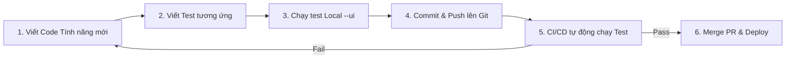

# Hướng dẫn Nền tảng về Playwright dành cho Developer mới bắt đầu

Tài liệu này cung cấp cái nhìn tổng quan, hệ thống và dễ tiếp cận nhất về **Playwright** – công cụ tự động hóa trình duyệt hiện đại. Hướng dẫn này được thiết kế dành cho các lập trình viên Junior/Mid-level muốn làm quen với Automation Testing trước khi đi sâu vào các chủ đề nâng cao như CI/CD hay kiểm thử Chrome Extension.

---

## Thuật ngữ Quan trọng (Glossary)

* **Automation Testing (Kiểm thử tự động)**: Việc sử dụng mã nguồn để tự động điều khiển phần mềm chạy các ca kiểm thử thay vì thao tác bằng tay.
* **E2E Testing (End-to-End Testing)**: Kiểm thử luồng nghiệp vụ hoàn chỉnh từ giao diện người dùng (Frontend) qua hệ thống mạng đến cơ sở dữ liệu (Backend).
* **Headless Mode**: Trình duyệt chạy ngầm và không hiển thị giao diện đồ họa (tiết kiệm tài nguyên, thích hợp cho CI/CD).
* **Headed Mode**: Trình duyệt chạy hiển thị giao diện đồ họa thực tế (thích hợp cho việc phát triển và gỡ lỗi trực quan).
* **Flaky Test**: Các bài kiểm thử không ổn định (lúc pass lúc fail) dù code của ứng dụng và test không hề thay đổi.
* **Page Object Model (POM)**: Mẫu thiết kế tổ chức code test bằng cách gom các locator và hành động của một trang web vào một class riêng biệt.

---

## 1. Playwright là gì?

### Playwright là gì?
**Playwright** là một thư viện Node.js được phát triển bởi Microsoft, dùng để tự động hóa các trình duyệt web hiện đại (Chromium, Firefox, WebKit) bằng một API duy nhất. 

### Playwright giải quyết vấn đề gì?
Trước khi Playwright ra đời, việc viết kiểm thử tự động cho web thường gặp rất nhiều khó khăn:
* **Flakiness (Không ổn định)**: Trình duyệt chưa kịp tải xong phần tử mà code test đã click, dẫn đến lỗi crash.
* **Cài đặt phức tạp**: Phải cấu hình các Driver riêng biệt cho từng trình duyệt (như ChromeDriver, GeckoDriver).
* **Tốc độ chậm**: Selenium và các công cụ đời đầu chạy test khá nặng nề và khó chạy song song quy mô lớn.

Playwright được xây dựng để cung cấp các bài test **nhanh hơn, ổn định hơn và dễ viết hơn** nhờ cơ chế Auto-waiting và kiến trúc kết nối trực tiếp đến trình duyệt.

### Playwright có phải chỉ dùng để test UI không?
**Không**. Ngoài việc tương tác UI, Playwright còn cực kỳ mạnh mẽ trong:
* **Kiểm thử API**: Gửi các request HTTP trực tiếp từ ngữ cảnh của trình duyệt.
* **Crawl dữ liệu (Web Scraping)**: Tự động trích xuất thông tin từ các trang web động.
* **Automation Tasks**: Tự động hóa các tác vụ lặp đi lặp lại như chụp ảnh báo cáo, xuất file PDF, điền dữ liệu biểu mẫu tự động.

### So sánh với Manual Testing (Kiểm thử thủ công)
Manual testing giúp đánh giá trải nghiệm thực tế (UX, màu sắc, độ mượt), nhưng khi dự án lớn lên, việc lặp đi lặp lại hàng trăm bước kiểm thử hồi quy (regression testing) bằng tay sẽ gây nhàm chán và dễ bỏ sót lỗi. Playwright giải phóng lập trình viên khỏi các thao tác lặp lại đó chỉ trong vài giây chạy lệnh.

### Vai trò đối với từng Developer
* **Frontend Developer**: Test nhanh xem component mình viết ra có hiển thị đúng với các state dữ liệu khác nhau hay không.
* **Backend Developer**: Giả lập hành vi người dùng gọi API để thực hiện kiểm thử tích hợp (integration testing).
* **Full-stack Developer**: Tự tin refactor code hệ thống mà không sợ làm gãy (broken) các tính năng hiện có của sản phẩm.

---

## 2. Playwright dùng để làm gì? (Use cases)

Dưới đây là các ứng dụng phổ biến nhất của Playwright trong thực tế:

* **End-to-End (E2E) Testing**:
  * *Mô tả*: Test toàn bộ hệ thống từ đầu đến cuối.
  * *Ví dụ*: Kiểm thử luồng mua hàng: Đăng nhập -> Thêm sản phẩm -> Nhập thông tin thanh toán -> Đặt hàng -> Kiểm tra email xác nhận.
* **UI/UX Testing**:
  * *Mô tả*: Kiểm tra tính đúng đắn của giao diện.
  * *Ví dụ*: Đảm bảo sidebar thu gọn khi click nút toggle, modal hiển thị đúng tiêu đề.
* **Functional Testing (Kiểm thử chức năng)**:
  * *Mô tả*: Xác minh một tính năng cụ thể hoạt động đúng nghiệp vụ.
  * *Ví dụ*: Test tính năng tạo todo mới: nhập chữ, bấm Enter, kiểm tra item mới có trong danh sách.
* **Regression Testing (Kiểm thử hồi quy)**:
  * *Mô tả*: Chạy lại toàn bộ test suite để đảm bảo code mới viết không làm hỏng tính năng cũ.
  * *Ví dụ*: Chạy test sau khi nâng cấp thư viện UI từ AntDesign v4 lên v5.
* **Cross-browser Testing (Kiểm thử đa trình duyệt)**:
  * *Mô tả*: Chạy cùng một kịch bản test trên nhiều trình duyệt khác nhau.
  * *Ví dụ*: Xác nhận trang thanh toán hoạt động tốt trên cả Chrome, Edge, Firefox và Safari (WebKit).
* **API Testing**:
  * *Mô tả*: Gửi các API request (GET, POST, DELETE) để kiểm tra logic backend mà không cần qua UI.
  * *Ví dụ*: Kiểm tra API đăng ký trả về đúng token JWT và status 201.
* **Visual Testing (Visual Regression)**:
  * *Mô tả*: So sánh ảnh chụp màn hình UI hiện tại với ảnh chuẩn mẫu lưu từ trước.
  * *Ví dụ*: Đảm bảo nút "Đăng ký" không bị lệch hoặc tràn chữ trên màn hình di động.
* **Automation Task**:
  * *Mô tả*: Tự động hóa tác vụ lặp lại của người dùng.
  * *Ví dụ*: Đăng nhập trang thuế hàng tháng, chụp màn hình hóa đơn và tải về máy.
* **Debug luồng người dùng**:
  * *Mô tả*: Chạy test từng bước để lập trình viên tìm ra lỗi xảy ra ở bước nào trong quy trình nghiệp vụ phức tạp.

---

## 3. Playwright hỗ trợ những gì?

### 3.1 Browser Support
Playwright hỗ trợ kiểm thử trên tất cả các engine trình duyệt phổ biến nhất:
* **Chromium**: Engine của Google Chrome, Microsoft Edge, Opera, Brave...
* **Firefox**: Engine Gecko của Mozilla Firefox.
* **WebKit**: Engine của Apple Safari.
* **Chrome & Edge thật**: Có thể cấu hình để chạy trực tiếp trên phiên bản Google Chrome hoặc Edge cài sẵn trên máy của bạn thay vì bản Chromium mặc định của Playwright.
* **Chế độ chạy**: Hỗ trợ linh hoạt cả **Headless** (chạy ngầm, không UI, tối ưu tốc độ) và **Headed** (chạy hiện giao diện).

### 3.2 Language Support
Bạn có thể viết kịch bản kiểm thử bằng ngôn ngữ yêu thích:
* **TypeScript / JavaScript** (Khuyên dùng và phổ biến nhất).
* **Python**
* **Java**
* **.NET (C#)**

> [!NOTE]
> Tài liệu này sử dụng **TypeScript** vì đây là ngôn ngữ phổ biến nhất trong giới Web Developer, giúp tận dụng tối đa hệ thống Type tự động gợi ý code (Autocompletion) của IDE.

### 3.3 Platform Support
Playwright hoạt động đa nền tảng nhất quán:
* **Hệ điều hành**: Windows, macOS, Linux.
* **Môi trường chạy**: Máy tính cá nhân (Local development) và các hệ thống máy chủ tự động hóa (CI/CD như GitHub Actions, GitLab CI, Jenkins, Docker).

---

## 4. Các khái niệm quan trọng trong Playwright

Để bắt đầu viết test, bạn cần hiểu rõ các viên gạch nền tảng cấu thành nên Playwright:

```text
+-------------------------------------------------------+
|                       Browser                         |
|   (Một phiên chạy duy nhất của Chrome, Firefox...)    |
+-------------------------------------------------------+
                           |
            +--------------+--------------+
            |                             |
+-----------------------+     +-----------------------+
|    Browser Context    |     |    Browser Context    |
| (Isolate cookies/auth)|     | (Isolate cookies/auth)|
+-----------------------+     +-----------------------+
            |                             |
      +-----+-----+                 +-----+-----+
      |           |                 |           |
  +-------+   +-------+         +-------+   +-------+
  | Page  |   | Page  |         | Page  |   | Page  |
  | (Tab) |   | (Tab) |         | (Tab) |   | (Tab) |
  +-------+   +-------+         +-------+   +-------+
```

### 4.1 Test (Ca kiểm thử)
Một `test` là một hàm đóng gói một kịch bản kiểm thử độc lập. Nó thường bao gồm:
* Khai báo môi trường đầu vào (thông qua fixtures).
* Thực hiện các hành động (Actions).
* Xác minh kết quả mong muốn bằng Assertions.

### 4.2 Browser
Đại diện cho một phiên chạy (instance) của trình duyệt (ví dụ: một tiến trình Chromium đang chạy). Trong thực tế, Playwright sẽ khởi tạo Browser một lần duy nhất cho toàn bộ phiên chạy test của bạn để tiết kiệm thời gian.

### 4.3 Browser Context
Giống như một cửa sổ ẩn danh (Incognito Window). Mỗi Browser Context hoàn toàn cô lập:
* Không chia sẻ Cookies, LocalStorage hay Session.
* Giúp các bài test chạy song song mà không sợ bị ảnh hưởng lẫn nhau (ví dụ: test A đăng nhập tài khoản 1, test B đăng nhập tài khoản 2 cùng một lúc mà không bị đá phiên).

### 4.4 Page
Đại diện cho một tab đơn lẻ (hoặc một cửa sổ popup) nằm trong một Browser Context. Hầu hết các lệnh tương tác UI hàng ngày của bạn sẽ được gọi trực tiếp thông qua đối tượng `page` này.
* Ví dụ: `page.goto()`, `page.click()`.

### 4.5 Locator
Là cách Playwright tìm và bám theo (bind) các phần tử giao diện trên trang web ở bất kỳ thời điểm nào. Khác với selector thông thường (chỉ tìm tại thời điểm gọi lệnh), Locator sẽ tự động tính toán lại đường dẫn tìm kiếm mỗi khi bạn thực hiện tương tác, giúp tránh lỗi phần tử bị thay đổi/vẽ lại (Stale Element).

### 4.6 Action
Là các thao tác mô phỏng hành vi của con người trên UI:
* `.click()`: Click chuột.
* `.fill('text')`: Gõ chữ vào ô input.
* `.hover()`: Rê chuột lên phần tử.
* `.press('Enter')`: Nhấn phím nóng.
* `.check()`: Chọn checkbox/radio button.
* `.selectOption('value')`: Chọn item từ thẻ `<select>`.

### 4.7 Assertion
Là các biểu thức khẳng định để kiểm tra xem hệ thống có trả về kết quả mong muốn hay không.
* Ví dụ: `await expect(page).toHaveURL('https://my-app.com/dashboard');`
* Nếu assertion đúng, test tiếp tục chạy. Nếu sai, test dừng lại và báo lỗi.

### 4.8 Auto-wait (Tự động chờ)
Playwright tự động chờ các phần tử đạt trạng thái **Actionable** (hiển thị, ổn định kích thước, không bị che khuất, được enable) trước khi thực hiện hành động. Bạn không cần phải viết các dòng code chờ đợi thủ công kiểu `sleep(2000)` nữa.

### 4.9 Test Runner
Là bộ công cụ quản lý và chạy các file test. Nó cung cấp:
* Khả năng chạy song song (Parallel execution) để tối đa hiệu năng CPU.
* Cơ chế tự động chạy lại khi test fail (Retries).
* Xuất các báo cáo kiểm thử trực quan dưới dạng HTML (HTML Reporter).

---

## 5. Cài đặt Playwright

### Yêu cầu môi trường
* **Node.js**: Phiên bản LTS mới nhất (khuyến nghị v18 trở lên).

### Khởi tạo dự án
Để cài đặt Playwright vào một dự án mới hoặc dự án hiện tại, hãy mở terminal tại thư mục dự án và chạy lệnh sau:

```bash
npm init playwright@latest
```

### Các lựa chọn khi cài đặt (Interactive Prompt)
Khi chạy lệnh trên, hệ thống sẽ hỏi bạn một số tùy chọn:
1. **Choose between TypeScript or JavaScript**: Chọn **TypeScript** (Khuyên dùng).
2. **Where to put your end-to-end tests?**: Nhấn Enter để chọn mặc định thư mục `tests`.
3. **Add a GitHub Actions workflow?**: Chọn **Yes** (Y) để tự tạo file cấu hình CI/CD mẫu, hoặc **No** (N) nếu muốn tự cấu hình sau.
4. **Install Playwright browsers?**: Chọn **Yes** (Y) để tải về các engine trình duyệt của Playwright.

### Cấu trúc thư mục sau khi cài đặt
Sau khi cài đặt xong, bạn sẽ thấy các file và thư mục quan trọng sau:

```text
my-project/
├── node_modules/
├── tests/                    # Nơi chứa các file viết kịch bản test
│   └── example.spec.ts       # File test mẫu được tạo sẵn
├── tests-examples/           # Thư mục chứa các ví dụ test chi tiết của Playwright
├── playwright.config.ts      # File cấu hình trung tâm của Playwright
├── package.json              # Khai báo dependencies và scripts của Node.js
└── package-lock.json
```

---

## 6. Viết ca kiểm thử (Test Case) đầu tiên

Hãy cùng xem và giải thích một kịch bản test cơ bản trong file `tests/first-test.spec.ts`:

```typescript
import { test, expect } from '@playwright/test';

// Khởi tạo một block test với tên kịch bản cụ thể
test('người dùng có thể tìm kiếm thông tin trên trang chủ', async ({ page }) => {
  // 1. Đi đến trang web cần test
  await page.goto('https://playwright.dev/');

  // 2. Kiểm tra xem tiêu đề trang có chứa chữ "Playwright" không
  await expect(page).toHaveTitle(/Playwright/);

  // 3. Định vị nút "Get Started" và click vào nó
  const getStartedBtn = page.getByRole('link', { name: 'Get started' });
  await getStartedBtn.click();

  // 4. Kiểm tra xem URL sau khi chuyển trang có chứa '/docs/intro' không
  await expect(page).toHaveURL(/.*intro/);
});
```

### Giải thích chi tiết từng dòng code:
* `import { test, expect }`: Nhập thư viện kiểm thử `test` và thư viện kiểm tra kết quả `expect`.
* `async ({ page }) => { ... }`:
  * Mọi hành động của Playwright đều là bất đồng bộ (Asynchronous), vì vậy ta bắt buộc phải dùng từ khóa `async/await`.
  * `{ page }` là một **fixture** được Playwright tự động truyền vào, đại diện cho một tab trình duyệt sạch sẽ.
* `await page.goto('...')`: Điều hướng tab trình duyệt hiện tại đến URL được chỉ định. Lệnh này sẽ đợi cho đến khi trang tải xong sự kiện `DOMContentLoaded`.
* `page.getByRole('link', { name: 'Get started' })`: Tìm phần tử có thẻ HTML là liên kết (`<a>`) và hiển thị chữ "Get started".
* `await expect(page).toHaveURL(...)`: Khẳng định URL hiện tại khớp với regex `/.*intro/`. Nếu sau 5 giây (timeout mặc định) URL không khớp, test sẽ báo fail.

---

## 7. Cách Playwright định vị (Find) phần tử trên UI

Playwright cung cấp một bộ định vị (Locators) phong phú. Dưới đây là các loại locator phổ biến và ví dụ cụ thể:

### 7.1 Các Locators Khuyến Nghị (Best Practices)

#### 1. Định vị theo vai trò ngữ nghĩa (`getByRole`)
Tìm các nút bấm, input, heading dựa trên vai trò tiếp cận của HTML. Điều này giúp code test không bị hỏng khi Designer đổi giao diện từ nút bấm sang liên kết hoặc ngược lại:
```typescript
// Tìm nút có tên hiển thị là "Đăng ký"
await page.getByRole('button', { name: 'Đăng ký' }).click();
```

#### 2. Định vị bằng nội dung văn bản (`getByText`)
Tìm phần tử hiển thị đoạn chữ cụ thể trên màn hình:
```typescript
// Kiểm tra xem trên màn hình có dòng thông báo thành công không
await expect(page.getByText('Đăng nhập thành công!')).toBeVisible();
```

#### 3. Định vị qua Nhãn liên kết (`getByLabel`)
Tìm ô nhập liệu (input) thông qua nhãn `<label>` đi kèm:
```typescript
// Gõ mật khẩu vào ô input có label tương ứng là "Mật khẩu"
await page.getByLabel('Mật khẩu').fill('myPassword123');
```

#### 4. Định vị qua Văn bản gợi ý (`getByPlaceholder`)
Tìm ô nhập liệu qua placeholder gợi ý của nó:
```typescript
// Nhập email vào ô input có placeholder "Nhập email của bạn..."
await page.getByPlaceholder('Nhập email của bạn...').fill('user@gmail.com');
```

#### 5. Định vị qua thuộc tính kiểm thử chuyên dụng (`getByTestId`)
Khi giao diện quá phức tạp hoặc các thuộc tính khác hay bị thay đổi bởi designer, hãy thêm thuộc tính `data-testid` vào code HTML và định vị nó:
```typescript
// HTML: <span data-testid="recording-timer">00:15</span>
await expect(page.getByTestId('recording-timer')).toHaveText('00:15');
```

### 7.2 Các Locator Khác
* `page.getByAltText(text)`: Tìm ảnh qua thuộc tính mô tả ảnh `alt`.
* `page.getByTitle(text)`: Tìm phần tử có thuộc tính tooltip `title`.
* `page.locator(selector)`: Cho phép viết css selector hoặc xpath khi cần thiết:
  ```typescript
  // Tránh lạm dụng cách viết này vì css class dễ bị thay đổi khi build/refactor
  await page.locator('.btn-primary > span').click();
  ```

---

## 8. Cách kiểm tra kết quả bằng Assertion

Assertions là phần quan trọng nhất để quyết định một bài test pass hay fail. Playwright sử dụng lớp `expect` tích hợp sẵn cơ chế **Auto-retry** (tự động thử lại) để tránh flaky test.

| Dạng Assertion | Ý nghĩa | Ví dụ |
| :--- | :--- | :--- |
| `toBeVisible()` | Phần tử đang hiển thị trên UI | `await expect(page.getByRole('alert')).toBeVisible();` |
| `toBeHidden()` | Phần tử đã biến mất hoặc ẩn đi | `await expect(page.getByTestId('loading-spinner')).toBeHidden();` |
| `toHaveText(text)` | Phần tử chứa chính xác đoạn chữ | `await expect(page.locator('h1')).toHaveText('Welcome');` |
| `toContainText(text)` | Phần tử chứa một phần đoạn chữ | `await expect(page.locator('p')).toContainText('đăng nhập');` |
| `toHaveURL(url)` | Trình duyệt đang ở đúng URL | `await expect(page).toHaveURL('https://my-app.com/home');` |
| `toBeEnabled()` | Nút bấm/input không bị disabled | `await expect(page.getByRole('button')).toBeEnabled();` |
| `toBeDisabled()` | Nút bấm/input đang bị khóa | `await expect(page.getByRole('button')).toBeDisabled();` |
| `toHaveCount(number)` | Số lượng phần tử khớp locator | `await expect(page.locator('li.todo-item')).toHaveCount(3);` |

---

## 9. Các công cụ hỗ trợ và cách Debug

Playwright cung cấp một hệ sinh thái các công cụ tuyệt vời đi kèm giúp việc học viết test trở nên vô cùng dễ dàng.

### 9.1 Codegen (Tự động tạo code test)
**Codegen** mở ra hai cửa sổ trình duyệt: một cửa sổ để bạn thao tác thực tế và một cửa sổ hiển thị code test được sinh ra tự động theo thời gian thực.
* *Cách dùng*: Chạy lệnh:
  ```bash
  npx playwright codegen https://playwright.dev
  ```
* *Khi nào dùng*: Rất thích hợp cho người mới học để xem cách Playwright định vị locator và tạo cấu trúc test.
* *Lưu ý*: Không nên lạm dụng 100% code sinh ra từ codegen vì đôi khi nó sẽ chọn các css selector thô cứng thay vì các locator ngữ nghĩa tối ưu. Bạn nên chỉnh sửa lại code sau khi sinh.

### 9.2 UI Mode (Chạy test trực quan)
**UI Mode** là một ứng dụng desktop quản lý test suite của bạn:
* *Cách dùng*: Chạy lệnh:
  ```bash
  npx playwright test --ui
  ```
* *Tính năng*: Cho phép xem danh sách test, click chạy từng test, xem lại lịch sử tương tác qua timeline (time travel), kiểm tra logs và network request trực tiếp.

### 9.3 Trace Viewer (Gỡ lỗi nâng cao)
Khi chạy test trên CI/CD bị lỗi, Playwright có thể xuất ra file `.zip` chứa toàn bộ dữ liệu chạy của test đó. Bạn có thể mở file này bằng Trace Viewer để debug lỗi:
* Xem snapshot trạng thái DOM tại từng mili-giây.
* Inspect console logs của browser lúc bị lỗi.
* Xem chi tiết thông số network request nào bị fail (API timeout, 500...).

### 9.4 Screenshots & Videos
Dễ dàng cấu hình tự động chụp ảnh màn hình hoặc quay video khi test bị fail để lưu vết và báo cáo lỗi cho team thiết kế/phát triển.

---

## 10. Cấu hình Playwright cơ bản (`playwright.config.ts`)

Dưới đây là một file cấu hình mẫu cơ bản, phù hợp cho các dự án Web App:

```typescript
import { defineConfig, devices } from '@playwright/test';

export default defineConfig({
  testDir: './tests', // Thư mục chứa các file test
  timeout: 30 * 1000, // Timeout tối đa cho một test case (30 giây)
  expect: {
    timeout: 5000,   // Timeout tối đa cho mỗi dòng expect (5 giây)
  },
  fullyParallel: true,   // Chạy song song tất cả các test để tiết kiệm thời gian
  retries: process.env.CI ? 2 : 0, // Tự động chạy lại 2 lần nếu fail trên CI
  reporter: 'html',      // Xuất báo cáo kiểm thử dạng trang web HTML
  
  use: {
    baseURL: 'http://localhost:3000', // URL mặc định của trang web cần test
    trace: 'on-first-retry',          // Chỉ ghi file trace khi test bị fail và chạy lại
    screenshot: 'only-on-failure',    // Chỉ chụp ảnh màn hình khi test bị fail
    video: 'retain-on-failure',       // Chỉ lưu video chạy test khi bị fail
  },

  projects: [
    {
      name: 'chromium',
      use: { ...devices['Desktop Chrome'] },
    },
    {
      name: 'firefox',
      use: { ...devices['Desktop Firefox'] },
    },
    {
      name: 'webkit',
      use: { ...devices['Desktop Safari'] },
    },
  ],
});
```

---

## 11. Các lệnh chạy test phổ biến

Bạn sẽ làm việc với các lệnh terminal sau hàng ngày trong dự án:

| Lệnh chạy | Tác dụng | Khi nào dùng |
| :--- | :--- | :--- |
| `npx playwright test` | Chạy toàn bộ các test case ở chế độ headless. | Chạy kiểm tra tổng thể trước khi push code lên Git. |
| `npx playwright test --headed` | Chạy test và hiển thị cửa sổ trình duyệt thực tế. | Muốn nhìn thấy trực quan trình duyệt đang thao tác gì. |
| `npx playwright test --ui` | Mở giao diện UI Mode tương tác. | Khi đang phát triển viết test mới hoặc debug test. |
| `npx playwright test --debug` | Chạy test từng dòng một (Step-by-step). | Debug sâu khi test bị lỗi khó hiểu. |
| `npx playwright test tests/login.spec.ts` | Chỉ chạy riêng các test trong file chỉ định. | Khi đang sửa đổi code test của một tính năng cụ thể. |
| `npx playwright show-report` | Mở báo cáo kết quả kiểm thử dạng HTML trên browser. | Xem chi tiết kết quả chạy test, xem ảnh screenshot lỗi. |

---

## 12. Báo cáo kết quả và xử lý lỗi khi Test Fail

### HTML Report của Playwright
Sau khi chạy test xong, Playwright sinh ra một trang HTML báo cáo kết quả rất chuyên nghiệp. Nó liệt kê danh sách các test:
* **Màu xanh (Passed)**: Test chạy thành công.
* **Màu đỏ (Failed)**: Test bị lỗi. Click vào để xem chi tiết dòng code bị lỗi, stack trace, ảnh chụp UI lúc bị lỗi, video và trace file.

### 5 Lỗi phổ biến nhất của người mới học và cách sửa:

#### 1. Lỗi: `Target closed / Page navigation failed`
* *Nguyên nhân*: Trang web chưa kịp khởi động xong (ví dụ local server `http://localhost:3000` chưa chạy) mà kịch bản test đã cố gắng truy cập.
* *Cách sửa*: Chạy server local trước khi chạy test, hoặc cấu hình trường `webServer` trong config của Playwright để tự khởi động web app trước khi chạy test.

#### 2. Lỗi: `Timeout 30000ms exceeded`
* *Nguyên nhân*: Trình duyệt đợi một phần tử hiển thị quá thời gian timeout (thường do API phản hồi quá chậm hoặc bạn chọn sai selector định vị phần tử).
* *Cách sửa*: Kiểm tra xem locator định vị phần tử có đúng không. Mở UI Mode để xem tại bước đó giao diện hiển thị cái gì.

#### 3. Lỗi: `strict mode violation: locator('button') resolved to 3 elements`
* *Nguyên nhân*: Playwright yêu cầu tính duy nhất (strictness). Bạn định vị bằng một locator chung chung nhưng trang web lại có tới 3 phần tử khớp với locator đó.
* *Cách sửa*: Thu hẹp phạm vi tìm kiếm bằng cách thêm thuộc tính tên `{ name: 'Lưu lại' }` hoặc dùng `data-testid` để phân biệt.

#### 4. Lỗi: `Assertion error: expected 'Success' but received 'Loading'`
* *Nguyên nhân*: Bạn chạy khẳng định (assertion) quá nhanh khi quá trình xử lý bất đồng bộ ở phía backend chưa hoàn thành.
* *Cách sửa*: Đảm bảo bạn dùng đúng Web-first Assertion (ví dụ `await expect().toHaveText()`) vì nó sẽ tự động retry chờ đợi trạng thái thay đổi thay vì kiểm tra tức thì.

---

## 13. Quy trình làm việc (Workflow) của Developer với Playwright

Tích hợp Playwright vào quy trình phát triển giúp nâng cao chất lượng sản phẩm:



1. **Khi viết tính năng mới**: Developer tạo một file test tương ứng cho luồng nghiệp vụ đó.
2. **Trước khi Commit**: Chạy `npx playwright test` để đảm bảo code mới viết không làm ảnh hưởng (gãy) các tính năng cũ.
3. **Khi tạo Pull Request (PR)**: Hệ thống CI (ví dụ GitHub Actions) tự động chạy bộ test suite. Nếu có bất kỳ test case nào bị fail, PR sẽ bị khóa không cho phép Merge.
4. **Trước khi Release**: Chạy toàn bộ các bài test E2E nặng và test visual regression trên môi trường Staging/Pre-production để đảm bảo an toàn tuyệt đối trước khi đưa sản phẩm tới tay khách hàng.

---

## 14. So sánh Playwright với các công cụ kiểm thử khác

| Tiêu chí | Playwright | Cypress | Selenium | Puppeteer |
| :--- | :--- | :--- | :--- | :--- |
| **Kiến trúc** | Sử dụng CDPs (Chrome DevTools Protocol) trực tiếp. | Chạy trực tiếp trong iframe của trình duyệt. | Sử dụng WebDriver giao tiếp qua giao thức mạng HTTP. | CDPs trực tiếp. |
| **Tốc độ** | **Cực kỳ nhanh**. | Nhanh. | Khá chậm. | Nhanh. |
| **Hỗ trợ trình duyệt**| Chromium, Firefox, WebKit (Safari). | Chromium, Firefox, Electron (Không WebKit gốc). | Tất cả các trình duyệt. | Chỉ Chromium (sau này có thêm Firefox thử nghiệm). |
| **Auto-waiting** | Tích hợp sẵn và hoạt động rất thông minh. | Tích hợp sẵn. | Phải tự viết các hàm chờ thủ công. | Phải viết code chờ thủ công. |
| **Đa ngôn ngữ** | TS/JS, Python, Java, C#. | Chỉ hỗ trợ JavaScript / TypeScript. | Hỗ trợ hầu hết mọi ngôn ngữ. | Chỉ JavaScript / TypeScript. |
| **Độ tin cậy** | Rất cao, hầu như không bị flaky. | Khá tốt. | Flaky cao nếu không xử lý bất đồng bộ khéo. | Trung bình, thiết kế chủ yếu cho crawl web. |

* **Nên chọn Playwright khi**: Cần viết test nhanh, muốn test chạy trên cả Safari (WebKit), cần test song song tối đa, hoặc dự án có sử dụng nhiều API/Network mocking.

---

## 15. Khi nào nên dùng Playwright?

* Khi dự án có những luồng nghiệp vụ cốt lõi phức tạp và quan trọng (như Đăng nhập, Thanh toán, Đăng ký) cần được bảo vệ và chạy kiểm tra hàng ngày.
* Khi bạn muốn kiểm tra xem trang web của mình có hiển thị và hoạt động ổn định trên cả macOS Safari (WebKit), Chrome và Firefox hay không.
* Khi dự án cần kiểm thử trên các kích thước màn hình thiết bị di động (Responsive layout).
* Khi muốn tiết kiệm thời gian viết code test nhờ hệ thống sinh code tự động (Codegen) và kiểm soát lỗi trực quan qua UI Mode.

---

## 16. Khi nào không nên lạm dụng Playwright?

* **Khi logic tính năng quá nhỏ**: Các hàm xử lý thuật toán thuần túy (ví dụ: hàm định dạng ngày tháng, hàm tính toán tiền thuế) nên được kiểm thử bằng **Unit Test** (sử dụng Vitest hoặc Jest) vì unit test chạy nhanh hơn Playwright gấp hàng trăm lần.
* **UI của dự án thay đổi liên tục hàng ngày**: Khi dự án đang ở giai đoạn đầu định hình thiết kế (UI thay đổi liên tục), việc viết test E2E quá sớm sẽ tạo gánh nặng bảo trì (maintenance) cho lập trình viên vì code test liên tục bị gãy do đổi giao diện.
* **Giao diện native của Hệ điều hành**: Các popup hỏi đường dẫn lưu file trên máy tính, hay cửa sổ chọn màn hình chia sẻ của OS không thể tự động hóa bằng click thông thường.

---

## 17. Checklist Best Practices cho người mới bắt đầu

- [ ] Luôn ưu tiên định vị bằng các locator ngữ nghĩa như `getByRole`, `getByText`, `getByLabel`.
- [ ] Chỉ sử dụng `getByTestId` khi phần tử đó không có vai trò hoặc text đặc trưng và khó định vị.
- [ ] Tuyệt đối không sử dụng hàm ngủ cứng `page.waitForTimeout(ms)` để chờ đợi UI render.
- [ ] Đảm bảo mỗi file test có thể chạy độc lập và không phụ thuộc vào kết quả của file test khác.
- [ ] Tận dụng tối đa công cụ `Codegen` để học viết test nhưng hãy chỉnh sửa lại code cho sạch đẹp trước khi commit.
- [ ] Bật tính năng chụp ảnh và quay video khi test fail trong file cấu hình để dễ debug.
- [ ] Sử dụng **Page Object Model** để quản lý code test của các dự án lớn, tránh việc lặp lại định nghĩa locator ở nhiều nơi.

---

## 18. Lộ trình học Playwright đề xuất

```text
Giai đoạn 1: Nền tảng (1-2 ngày)
├── Cài đặt Node.js & init Playwright
├── Viết kịch bản test chuyển trang cơ bản
└── Hiểu Page, Locator, Action và Assertions
      │
Giai đoạn 2: Tương tác UI nâng cao (3-5 ngày)
├── Xử lý Form, Checkbox, Dropdown, Alert dialogs
├── Xử lý Iframe, New Tab, file Upload/Download
└── Học cách sử dụng Codegen và UI Mode
      │
Giai đoạn 3: Debug và Quản lý code (1 tuần)
├── Sử dụng Trace Viewer tìm lỗi trên CI/CD
├── Áp dụng Page Object Model (POM) để refactor code test
└── Thiết lập cấu hình playwright.config.ts chuyên sâu
      │
Giai đoạn 4: Tích hợp Hệ thống (1-2 tuần)
├── Đăng nhập một lần dùng Storage State cho nhiều test
├── Sử dụng API Mocking (page.route) để test các case lỗi
└── Tích hợp chạy test tự động trên GitHub Actions CI/CD
      │
Giai đoạn 5: Nâng cao & Visual (Liên tục)
├── Kiểm thử Visual Regression (expect.toHaveScreenshot)
├── Giả lập quyền thiết bị (Camera/Microphone/Geolocation)
└── Viết Custom Fixtures và tự động hóa Chrome Extension test
```

---

## 19. Mini Project thực hành: Kiểm thử ứng dụng Todo

Để luyện tập, hãy viết test kiểm thử cho trang Todo MVC nổi tiếng của Playwright tại địa chỉ: `https://demo.playwright.dev/todomvc`

### Đề bài thực hành:
1. Truy cập trang web `https://demo.playwright.dev/todomvc/`.
2. Tạo 3 công việc mới (Todo items): "Học Playwright", "Viết test case", "Chạy CI/CD".
3. Xác nhận danh sách hiển thị đúng 3 items vừa tạo.
4. Tích chọn hoàn thành công việc đầu tiên ("Học Playwright").
5. Click chuyển sang tab "Completed" và kiểm tra xem chỉ có duy nhất công việc "Học Playwright" hiển thị ở đây.
6. Click quay lại tab "Active" và kiểm tra xem còn lại 2 công việc chưa hoàn thành.
7. Xóa công việc "Chạy CI/CD" bằng cách rê chuột (hover) và click nút xóa (X).
8. Xác nhận danh sách chưa hoàn thành chỉ còn lại đúng 1 công việc.

### File code giải đề mẫu (`tests/todo-app.spec.ts`):

```typescript
import { test, expect } from '@playwright/test';

test.describe('Ứng dụng Todo MVC', () => {
  
  test.beforeEach(async ({ page }) => {
    // Chạy trước mỗi test case: đi đến trang chủ Todo MVC
    await page.goto('https://demo.playwright.dev/todomvc/');
  });

  test('nên cho phép người dùng tạo, hoàn thành và xóa todo', async ({ page }) => {
    const todoInput = page.getByPlaceholder('What needs to be done?');
    
    // 1. Tạo 3 Todo items
    await todoInput.fill('Học Playwright');
    await todoInput.press('Enter');
    
    await todoInput.fill('Viết test case');
    await todoInput.press('Enter');
    
    await todoInput.fill('Chạy CI/CD');
    await todoInput.press('Enter');

    // Xác nhận danh sách có đúng 3 items
    const todoListItems = page.getByTestId('todo-item');
    await expect(todoListItems).toHaveCount(3);
    await expect(todoListItems).toHaveText([
      'Học Playwright',
      'Viết test case',
      'Chạy CI/CD'
    ]);

    // 2. Hoàn thành công việc đầu tiên
    // Tìm phần tử todo đầu tiên, tìm nút checkbox bên trong nó và click
    const firstTodoCheckbox = todoListItems.nth(0).getByRole('checkbox');
    await firstTodoCheckbox.check();
    
    // Xác nhận item đầu tiên đã có trạng thái completed (thường bị gạch ngang chữ)
    await expect(todoListItems.nth(0)).toHaveClass(/completed/);

    // 3. Kiểm tra lọc danh sách Completed
    await page.getByRole('link', { name: 'Completed' }).click();
    await expect(todoListItems).toHaveCount(1);
    await expect(todoListItems).toHaveText(['Học Playwright']);

    // 4. Kiểm tra lọc danh sách Active (Chưa hoàn thành)
    await page.getByRole('link', { name: 'Active' }).click();
    await expect(todoListItems).toHaveCount(2);
    await expect(todoListItems).toHaveText(['Viết test case', 'Chạy CI/CD']);

    // 5. Xóa công việc "Chạy CI/CD"
    const secondTodoItem = todoListItems.filter({ hasText: 'Chạy CI/CD' });
    // Rê chuột lên item thứ hai để nút xóa (destroy button) xuất hiện
    await secondTodoItem.hover();
    // Click vào nút xóa
    await secondTodoItem.getByRole('button', { name: 'Delete' }).click();

    // Xác nhận danh sách Active chỉ còn 1 item
    await expect(todoListItems).toHaveCount(1);
    await expect(todoListItems).toHaveText(['Viết test case']);
  });
});
```

---

## 20. Kết luận

**Playwright** là một trong những công cụ tự động hóa web tốt nhất hiện nay, giúp thu hẹp khoảng cách giữa phát triển và kiểm thử. 

Đối với các lập trình viên mới bắt đầu:
* Hãy bắt đầu viết từ các ca kiểm thử **nhỏ, đơn giản** và độc lập.
* Sử dụng **UI Mode** thường xuyên để hiểu trực quan cách trình duyệt tương tác.
* Sau khi đã làm chủ các khái niệm cơ bản (Page, Locator, Actions, Assertions), hãy bắt đầu áp dụng **Page Object Model** để cấu trúc code test của bạn một cách chuyên nghiệp.
* Luôn nhớ rằng: Kiểm thử tự động không nhằm thay thế hoàn toàn con người, mà là tấm khiên vững chắc giúp phần mềm của bạn không bao giờ bị lỗi hồi quy khi cập nhật tính năng mới.
