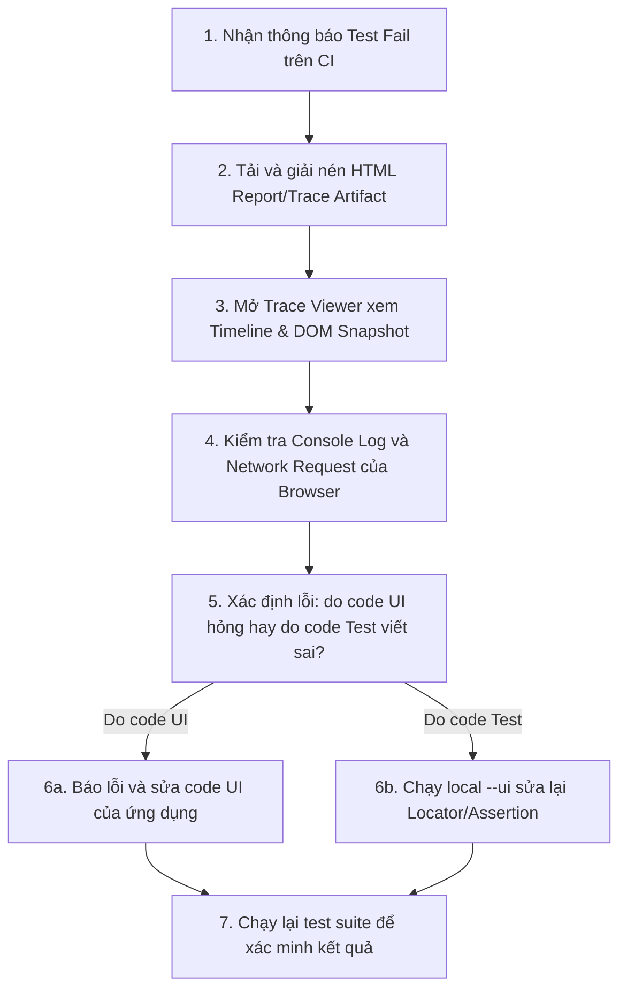

# Hướng dẫn Nghiên cứu Chuyên sâu: Playwright cho UI Testing và Chiến lược Kiểm thử Frontend

Tài liệu này cung cấp hướng dẫn nghiên cứu chuyên sâu về cách thiết kế, xây dựng, tổ chức và duy trì (maintain) hệ thống kiểm thử giao diện người dùng (UI Testing) bằng **Playwright** cho các dự án Frontend hiện đại. Hướng dẫn này tập trung vào các giải pháp thực tế, kỹ thuật chống flaky test, chiến lược giả lập (mocking) và tích hợp CI/CD.

---

## 1. Mục tiêu của UI Testing với Playwright

### UI Testing là gì?
UI Testing (User Interface Testing) là quá trình kiểm tra các khía cạnh trực quan và chức năng của giao diện người dùng để đảm bảo ứng dụng hiển thị chính xác và hoạt động đúng theo thiết kế và nghiệp vụ yêu cầu khi tương tác với người dùng.

### So sánh vị trí của UI Testing trong Chiến lược Kiểm thử

Để hiểu rõ vai trò của UI Testing, chúng ta cần phân biệt nó với các loại kiểm thử khác:

| Loại kiểm thử | Phạm vi kiểm tra | Tốc độ chạy | Chi phí bảo trì | Mức độ tin cậy thực tế |
| :--- | :--- | :--- | :--- | :--- |
| **Unit Test** | Một hàm, một lớp, hoặc một component biệt lập không có side-effects. | Siêu nhanh (vài ms) | Rất thấp | Thấp (chỉ chứng minh code chạy đúng logic cục bộ) |
| **Integration Test** | Sự phối hợp giữa 2 hay nhiều component hoặc module với nhau (ví dụ: Component + State Store). | Nhanh (vài chục ms) | Thấp - Trung bình | Trung bình |
| **API Test** | Các endpoint của Backend (payload, status code, response time). | Nhanh (vài trăm ms) | Thấp | Trung bình - Cao (về mặt dữ liệu và logic nghiệp vụ) |
| **UI Testing (Playwright)** | Luồng hiển thị, tương tác CSS/HTML, hành vi trên trình duyệt thật (có thể mock API). | Trung bình (vài giây) | Trung bình - Cao | Cao (kiểm thử đúng những gì người dùng thực sự nhìn thấy) |
| **E2E Test (Playwright)** | Toàn bộ hệ thống từ UI qua Network đến Backend và Database thật. | Chậm (vài chục giây) | Rất cao (dễ flaky do dữ liệu/mạng) | Tuyệt đối |

### Vai trò của Playwright trong Testing Strategy
Playwright đóng vai trò như một **cầu nối tự động hóa trình duyệt** mạnh mẽ, hỗ trợ viết cả **Functional UI Test** (kiểm thử giao diện chức năng sử dụng API Mocking) lẫn **E2E Test** (kiểm thử toàn hệ thống). 
Playwright giúp giải phóng lập trình viên khỏi gánh nặng của **Manual Regression Testing** (kiểm thử hồi quy bằng tay). Mỗi khi refactor mã nguồn hoặc nâng cấp thư viện, hệ thống test tự động sẽ quét toàn bộ giao diện trong vài phút, phát hiện tức thì các lỗi sập trang (crash), lệch bố cục (layout shift), hoặc nút bấm bị đơ.

### Nguyên tắc cốt lõi: Kiểm thử Hành vi Người dùng, không kiểm thử Implementation Details
Một lỗi phổ biến của developer khi viết UI test là kiểm tra các chi tiết cài đặt kỹ thuật (implementation details) của code. 
* **Không nên test**: Kiểm tra xem state của component React `isModalOpen` có bằng `true` hay không, hoặc thẻ `div` có chứa class CSS `.flex-col-reverse` hay không. Những chi tiết này có thể thay đổi bất cứ lúc nào khi refactor code mà không làm hỏng tính năng thực tế, dẫn đến việc test bị fail giả (false positive).
* **Nên test**: Kiểm tra xem sau khi click nút "Mở", modal có hiển thị trên màn hình đối với người dùng hay không (`await expect(modal).toBeVisible()`). Hãy tập trung vào việc mô phỏng chính xác hành vi của người dùng: click, nhập liệu, rê chuột và quan sát kết quả hiển thị trên màn hình.

---

## 2. Những loại UI nên test bằng Playwright

Trong một ứng dụng frontend thực tế, không phải phần tử UI nào cũng cần kiểm thử tự động. Dưới đây là bảng phân tích chi tiết:

| Nhóm UI | Có nên tự động hóa? | Loại test phù hợp | Kiểm thử những gì? | Rủi ro flaky & Giải pháp |
| :--- | :---: | :--- | :--- | :--- |
| **1. Login / Authentication** | **Bắt buộc** | Functional UI + E2E | Nhập đúng/sai thông tin, hiển thị lỗi validation, chuyển hướng trang khi thành công, bảo vệ route (protected routes). | **Flaky**: API Auth chậm hoặc OTP.<br>**Giải pháp**: Mock API cho luồng lỗi; sử dụng Storage State cho các bài test khác. |
| **2. Form Create/Edit** | **Nên** | Functional UI | Điền dữ liệu hợp lệ/không hợp lệ, hiển thị lỗi validation trực quan, trạng thái disabled của nút submit khi form không hợp lệ, reset form. | **Flaky**: Dropdown động hoặc datepicker phức tạp.<br>**Giải pháp**: Sử dụng phím tắt keyboard hoặc click chính xác option. |
| **3. Modal / Dialog** | **Nên** | Functional UI | Kích hoạt mở/đóng modal, click vùng ngoài (backdrop) để đóng, tiêu điểm focus chuyển vào modal (accessibility). | **Flaky**: Hoạt ảnh (animation) fade-in/out làm click hụt.<br>**Giải pháp**: Đợi modal visible hoàn toàn trước khi tương tác. |
| **4. Toast Notification** | **Nên** | Functional UI | Xuất hiện toast khi lưu thành công/thất bại, nội dung thông báo chính xác, toast tự biến mất sau một khoảng thời gian. | **Flaky**: Toast tự biến mất quá nhanh trước khi assertion chạy.<br>**Giải pháp**: Assert sự tồn tại tức thì ngay sau hành động trigger. |
| **5. Table / List** | **Nên** | Functional UI | Hiển thị đúng số lượng dòng, dữ liệu hiển thị chính xác ở các cột, xử lý hàng dài (text overflow). | **Flaky**: Dữ liệu từ database thật thay đổi.<br>**Giải pháp**: Mock dữ liệu API trả về một mảng tĩnh cố định. |
| **6. Search / Filter / Page**| **Nên** | Functional UI | Nhập từ khóa -> Table lọc dữ liệu; click chọn filter -> API được gọi đúng tham số; click chuyển trang -> UI update. | **Flaky**: Độ trễ debounce của ô input search.<br>**Giải pháp**: Thêm `page.waitForTimeout` bằng thời gian debounce hoặc dùng `waitForResponse`. |
| **7. Dashboard / Charts** | **Hạn chế** | Visual Regression | Bố cục tổng quan không bị vỡ khi tải dữ liệu, các khối thông tin đặt đúng vị trí. | **Flaky**: Biểu đồ động hoặc dữ liệu số thay đổi liên tục.<br>**Giải pháp**: Mock API dữ liệu và dùng tính năng `mask` để che biểu đồ khi chụp ảnh. |
| **8. Navigation / Sidebar** | **Nên** | Functional UI + Visual | Toggle ẩn/hiện sidebar, active state trên menu link khi chuyển trang, responsive menu trên mobile. | **Flaky**: Layout shifts trong quá trình co giãn sidebar.<br>**Giải pháp**: Chờ sidebar dừng transition hoàn toàn. |
| **9. Loading State** | **Nên** | Functional UI | Hiển thị vòng xoay (spinner) hoặc skeleton screen khi API đang tải, skeleton biến mất khi tải xong. | **Flaky**: API chạy quá nhanh khiến loading state kết thúc trước khi kịp assert.<br>**Giải pháp**: Mock API phản hồi chậm (delay response) khoảng 1-2 giây. |
| **10. Empty State** | **Nên** | Functional UI + Visual | Hiển thị ảnh minh họa rỗng và nút kêu gọi hành động (CTA) khi danh sách trả về không có phần tử nào. | **Flaky**: Ít gặp.<br>**Giải pháp**: Mock API trả về mảng rỗng `[]`. |
| **11. Error State (500/403)**| **Nên** | Functional UI | Hiển thị banner/màn hình báo lỗi thân thiện khi API sập (500) hoặc không có quyền (403), có nút retry. | **Flaky**: Khó tái tạo trên môi trường thật.<br>**Giải pháp**: Bắt buộc dùng `page.route()` để trả về status 500/403. |
| **12. Permission Denied** | **Nên** | Functional UI | Hiển thị hướng dẫn mở quyền khi trình duyệt không cấp quyền camera, micro hoặc định vị. | **Flaky**: Trình duyệt lưu lại cache quyền từ trước.<br>**Giải pháp**: Khởi tạo browser context với cấu hình `permissions: []` trống. |
| **13. File Upload / Download**| **Nên** | Functional UI | Kéo thả file, chọn file từ local, tải file về máy và verify tên file, định dạng file. | **Flaky**: Popup chọn file của hệ điều hành (OS) bị treo.<br>**Giải pháp**: Bypass OS picker bằng `setInputFiles` hoặc bắt sự kiện download. |
| **14. Responsive Layout** | **Nên** | Visual Regression | Giao diện hiển thị chuẩn xác trên Desktop, Tablet và Mobile. | **Flaky**: Font chữ render khác biệt giữa các hệ điều hành.<br>**Giải pháp**: Chỉ chạy visual test trên môi trường Docker đồng nhất. |
| **15. Critical User Flow** | **Bắt buộc** | E2E (Happy Path) | Đi từ bước Đăng nhập -> Vào Dashboard -> Tạo thực thể -> Lưu -> Xác nhận hiển thị. | **Flaky**: Cao nhất do phụ thuộc toàn bộ hệ thống.<br>**Giải pháp**: Viết ít (chỉ 2-3 luồng cốt lõi), chạy tuần tự. |
| **16. Visual Layout chính** | **Nên** | Visual Regression | Landing page, trang hóa đơn cần in ấn, email template preview. | **Flaky**: Độ lệch pixel do render.<br>**Giải pháp**: Đặt sai số cho phép `maxDiffPixels` hoặc `threshold`. |

---

## 3. Thiết kế test case UI

Một bài viết test UI tốt cần đảm bảo tính **dễ đọc, dễ bảo trì và chạy ổn định**. 

### Các nguyên tắc thiết kế test case UI chất lượng:
1. **Thiết kế theo hành vi người dùng (Behavior-driven)**: Viết kịch bản test thể hiện đúng hành động thực tế của người dùng thay vì mô tả kỹ thuật code.
2. **Nguyên tắc Độc lập (Independence)**: Mỗi test case phải bắt đầu bằng một tab trình duyệt sạch và có thể chạy riêng biệt, không phụ thuộc vào việc test case trước đó có chạy thành công hay không.
3. **Mỗi test case có một mục tiêu duy nhất**: Tránh viết các test case quá dài (ví dụ: test toàn bộ tính năng của app trong một test case). Nếu test fail ở dòng thứ 5, bạn sẽ không kiểm tra được 95 dòng còn lại.
4. **Cô lập Test Data**: Sử dụng dữ liệu mock hoặc tạo mới dữ liệu riêng cho mỗi test case để tránh xung đột dữ liệu khi chạy song song (parallel execution).

### So sánh ví dụ thiết kế test case:

#### ❌ Tệ (Phụ thuộc cấu trúc kỹ thuật, gộp nhiều luồng, dễ bị flaky)
```typescript
test('should test user management and billing flows', async ({ page }) => {
  await page.goto('http://localhost:3000/users');
  
  // Bad: Dependent on CSS classes and index in DOM
  await page.locator('.btn-primary').nth(2).click(); 
  await page.locator('input[type="text"]').fill('Jane Doe');
  await page.locator('#save-btn').click();
  
  // Bad: Hard timeout
  await page.waitForTimeout(3000); 
  
  // Bad: Multi-assertions checking internal styling instead of visibility
  expect(await page.locator('.badge').getAttribute('style')).toContain('color: green');
  
  // Bad: Continuing onto an entirely different billing flow in the same test
  await page.goto('http://localhost:3000/billing');
  await page.locator('.card-item').first().click();
});
```

#### ✅ Tốt (Tập trung vào hành vi, độc lập, có mục tiêu rõ ràng và tự phục hồi)
```typescript
test.describe('User Creation Flow', () => {
  test.beforeEach(async ({ page }) => {
    // Navigate to the target page before each test case
    await page.goto('/users');
  });

  test('should successfully create a new user and display in the list', async ({ page }) => {
    // 1. Interact with the UI using semantic, user-facing locators
    await page.getByRole('button', { name: /add new user/i }).click();
    
    const nameInput = page.getByLabel(/full name/i);
    await nameInput.fill('Jane Doe');
    
    // 2. Submit the form
    await page.getByRole('button', { name: /save/i }).click();
    
    // 3. Web-first assertion with auto-retry to verify UI response
    const successToast = page.getByText(/user created successfully/i);
    await expect(successToast).toBeVisible();
    
    const userRow = page.getByRole('row', { name: 'Jane Doe' });
    await expect(userRow).toBeVisible();
  });
});
```

---

## 4. Locator strategy cho UI test

Locator là trái tim của Playwright. Chọn sai locator là nguyên nhân hàng đầu khiến test suite của bạn trở thành "cơn ác mộng" bảo trì.

### Thứ tự ưu tiên chọn Locator (Best Practices):
1. **`getByRole(role, options)`**: Được đề xuất số một. Định vị theo vai trò ngữ nghĩa của phần tử HTML (như `button`, `heading`, `checkbox`, `link`). Giúp kiểm tra được khả năng tiếp cận (Accessibility - a11y).
2. **`getByLabel(text)`**: Định vị các trường nhập liệu thông qua thẻ `<label>`. Cực kỳ phù hợp cho kiểm thử Form.
3. **`getByPlaceholder(text)`**: Dùng cho các input không có label hiển thị trực tiếp nhưng có placeholder.
4. **`getByText(text)`**: Dùng để tìm các thành phần hiển thị thông tin tĩnh như thông báo, tiêu đề, đoạn văn.
5. **`getByTestId(id)`**: Khi không thể định vị bằng các locator trên (giao diện quá động hoặc phức tạp), hãy thêm thuộc tính `data-testid` (ví dụ: `data-testid="timer-display"`) vào mã nguồn HTML. Đây là thỏa thuận an toàn giữa Developer và QA.
6. **`locator('css or xpath')`**: Chỉ sử dụng khi thực sự cần thiết (ví dụ: cào dữ liệu từ trang web bên thứ ba không có data-testid).

### CSS Selectors cần tránh:
* **Tránh selector phụ thuộc cấu trúc DOM**: `div > div > span > button` (chỉ cần bọc thêm một thẻ `div` để sửa style là test bị hỏng ngay).
* **Tránh selector phụ thuộc CSS class động**: `.css-1h9z3d-Button` (thường được sinh ra bởi các thư viện CSS-in-JS như Styled Components hoặc Emotion, sẽ thay đổi sau mỗi lần build).

### Cách xử lý khi locator trả về nhiều phần tử (Strictness Mode):
Playwright mặc định chạy ở chế độ nghiêm ngặt. Nếu một locator khớp với nhiều phần tử, test sẽ báo lỗi ngay lập tức.
* Dùng `.first()`, `.last()`, hoặc `.nth(index)` để lấy phần tử cụ thể.
* Tốt nhất nên thu hẹp phạm vi tìm kiếm bằng cách lọc (`filter`):

```typescript
// Find the row containing the text 'Jane Doe' and click the 'Edit' button in that specific row
const janeRow = page.getByRole('row').filter({ hasText: 'Jane Doe' });
await janeRow.getByRole('button', { name: /edit/i }).click();

// Filter locators containing a specific child element
const activeCard = page.locator('.card').filter({
  has: page.locator('.status-badge-active')
});
```

---

## 5. Action và interaction phổ biến

Playwright cung cấp bộ API mô phỏng hành vi người dùng cực kỳ trực quan và đáng tin cậy. Dưới đây là các thao tác phổ biến:

```typescript
import { test, expect } from '@playwright/test';

test('UI Common Interactions Demo', async ({ page, context }) => {
  await page.goto('/interactions-demo');

  // 1. Basic Actions
  await page.getByRole('button', { name: 'Click Me' }).click();
  await page.getByRole('button', { name: 'Double Click' }).dblclick();
  
  // 2. Form Fields
  const inputField = page.getByLabel('Email Address');
  await inputField.fill('test@example.com');
  await inputField.clear(); // Clear existing text
  
  const checkbox = page.getByLabel('Accept terms');
  await checkbox.check(); // Safe: does nothing if already checked
  await checkbox.uncheck();
  
  const selectDropdown = page.getByLabel('Choose Country');
  await selectDropdown.selectOption('Vietnam'); // Select by value or label

  // 3. Hovering
  await page.getByText('Hover over me for tooltip').hover();

  // 4. Drag and Drop
  await page.locator('.drag-source').dragTo(page.locator('.drop-target'));

  // 5. Upload Files (Direct injection, bypassing OS file picker dialog)
  await page.setInputFiles('input[type="file"]', 'tests/fixtures/test-document.pdf');

  // 6. Handle Native Browser Dialogs (Alert, Confirm, Prompt)
  // Must register listener BEFORE trigger action
  page.once('dialog', async dialog => {
    expect(dialog.message()).toContain('Are you sure?');
    await dialog.accept(); // Or dialog.dismiss()
  });
  await page.getByRole('button', { name: 'Delete Item' }).click();

  // 7. Handle New Tab / Popup Window
  const [newPage] = await Promise.all([
    context.waitForEvent('page'),
    page.getByRole('link', { name: 'Open Terms in New Tab' }).click(),
  ]);
  await newPage.waitForLoadState();
  await expect(newPage).toHaveTitle(/Terms of Service/);

  // 8. Keyboard Shortcuts & Focus
  const searchInput = page.getByPlaceholder('Search...');
  await searchInput.focus();
  await page.keyboard.press('Control+A');
  await page.keyboard.press('Backspace');
  await page.keyboard.press('Enter');

  // 9. Scroll
  await page.getByText('Footer Copy').scrollIntoViewIfNeeded();
});
```

---

## 6. Assertion strategy

Assertion dùng để kiểm tra xem UI có đạt đúng trạng thái mong muốn hay không. Playwright cung cấp bộ thư viện `expect` với khả năng **Web-First Assertions** (tự động thử lại liên tục trong tối đa 5 giây cho đến khi đạt yêu cầu).

### Các Assertions phổ biến nhất:

* `await expect(locator).toBeVisible()`: Kiểm tra phần tử có hiển thị trên màn hình hay không.
* `await expect(locator).toBeHidden()`: Kiểm tra phần tử đã biến mất (ví dụ: spinner sau khi load xong).
* `await expect(locator).toBeEnabled()`: Kiểm tra nút bấm đã được mở khóa để click.
* `await expect(locator).toBeDisabled()`: Kiểm tra nút bấm đang bị khóa (ví dụ: khi chưa điền đủ form).
* `await expect(locator).toHaveText('Welcome')`: Kiểm tra nội dung text khớp chính xác.
* `await expect(locator).toContainText('error')`: Kiểm tra text có chứa chuỗi con (không phân biệt hoa thường).
* `await expect(page).toHaveURL('/dashboard')`: Kiểm tra URL hiện tại của trình duyệt.
* `await expect(locator).toHaveValue('Jane')`: Kiểm tra giá trị của ô nhập liệu (input value).
* `await expect(locator).toHaveClass(/active/)`: Kiểm tra xem phần tử có class CSS mong muốn hay không (dùng regex).

### Chiến lược kiểm tra các trạng thái đặc biệt của UI:

```typescript
// 1. Assert Loading State
const loadingSpinner = page.getByTestId('loading-spinner');
await expect(loadingSpinner).toBeVisible(); // Check spinner appears first
await expect(loadingSpinner).toBeHidden();  // Wait for spinner to disappear (load complete)

// 2. Assert Toast Notification
const successToast = page.getByRole('status').filter({ hasText: /saved successfully/i });
await expect(successToast).toBeVisible(); // Toast is dynamic, assert visibility immediately

// 3. Assert Table Data Updates after Action
const tableRows = page.locator('table tbody tr');
await expect(tableRows).toHaveCount(5); // Verify exact row count

// 4. Assert Error UI Display
const errorMessage = page.getByRole('alert');
await expect(errorMessage).toBeVisible();
await expect(errorMessage).toContainText('Invalid credentials');
```

---

## 7. Auto-waiting và chống flaky test

Flaky test (test chạy lúc pass lúc fail không rõ nguyên nhân) là "kẻ thù" lớn nhất của automation testing. Playwright được thiết kế để giải quyết vấn đề này ở mức kiến trúc.

### Cơ chế Auto-waiting của Playwright
Trước khi thực hiện một hành động (ví dụ: `.click()`), Playwright tự động chạy một loạt các kiểm tra ngầm trên phần tử đó:
* **Attached**: Đảm bảo phần tử đã có mặt trong DOM.
* **Visible**: Đảm bảo phần tử hiển thị trên màn hình (kích thước lớn hơn 0x0, không có `display: none` hay `visibility: hidden`).
* **Stable**: Đảm bảo phần tử không còn di chuyển (hoạt ảnh CSS transition/animation đã dừng).
* **Receive Events**: Đảm bảo phần tử không bị che bởi một phần tử khác (như loading overlay).
* **Enabled**: Đảm bảo phần tử không có thuộc tính `disabled`.

### Tại sao test của bạn vẫn bị flaky và cách khắc phục:

1. **Vấn đề CSS Animations/Transitions**:
   * *Triệu chứng*: Playwright click hụt một nút vì nó đang trượt hoặc mờ dần (fade-in) từ modal.
   * *Giải pháp*: Cấu hình tắt animations khi chạy visual test hoặc chờ hoạt ảnh hoàn tất:
     ```typescript
     // Disabling animations for a specific action
     await page.getByRole('button').click({ force: true });
     ```
2. **Loading Overlay che khuất**:
   * *Triệu chứng*: Click vào nút Save nhưng loading spinner của lần submit trước vẫn đang hiển thị đè lên nút đó.
   * *Giải pháp*: Bắt buộc phải chờ loading overlay biến mất trước khi click tiếp:
     ```typescript
     await expect(page.getByTestId('loading-overlay')).toBeHidden();
     await page.getByRole('button', { name: 'Save' }).click();
     ```
3. **Flaky do Dữ liệu động (Dynamic Data)**:
   * *Triệu chứng*: Màn hình hiển thị thời gian hiện tại (`"Updated 2 seconds ago"`) hoặc số lượng thông báo thay đổi liên tục.
   * *Giải pháp*: Mock API để trả về dữ liệu tĩnh, hoặc sử dụng regex linh hoạt khi so sánh text:
     ```typescript
     await expect(page.getByTestId('last-updated')).toHaveText(/updated \d+ seconds ago/i);
     ```
4. **Tránh tuyệt đối việc tự tạo độ trễ cứng (`waitForTimeout`)**:
   ```typescript
   // ❌ Bad: Hard sleep makes tests slow and is still prone to network drops
   await page.waitForTimeout(3000); 

   // ✅ Good: Wait for a specific UI element state change (dynamic wait)
   await expect(page.getByRole('table')).toBeVisible();
   ```

---

## 8. Mock API và network testing

Mock API là kỹ thuật chặn (intercept) các request mạng phát ra từ trình duyệt và trả về dữ liệu giả lập (mock data) thay vì kết nối với Backend thật.

### Khi nào nên Mock API và khi nào nên dùng Live Backend?

* **Nên Mock API khi (Functional UI Test)**:
  * Cần test các trường hợp biên khó tái tạo (lỗi 500, quá hạn timeout, token hết hạn).
  * Muốt chạy test UI cực kỳ nhanh để feedback tức thì trên PR (mỗi file test mất chưa đến 1-2 giây).
  * Backend chưa phát triển xong API nhưng đã chốt thiết kế data contract (JSON).
* **Nên dùng Live Backend khi (E2E Integration Test)**:
  * Chạy các test case cốt lõi nhất (happy path flows) trước khi deploy release sản phẩm.
  * Xác thực tính tương thích dữ liệu thực tế giữa Frontend và Backend.

### Các kỹ thuật Mock API bằng Playwright:

```typescript
import { test, expect } from '@playwright/test';

test.describe('Network Mocking Scenarios', () => {
  
  test('should mock user list API response', async ({ page }) => {
    // 1. Intercept GET request and fulfill with mock JSON data
    await page.route('**/api/users', async route => {
      await route.fulfill({
        status: 200,
        contentType: 'application/json',
        body: JSON.stringify([
          { id: 1, name: 'Jane Doe', role: 'Admin' },
          { id: 2, name: 'John Smith', role: 'Editor' }
        ])
      });
    });

    await page.goto('/users-list');
    
    // Verify UI renders the exact mock data
    await expect(page.getByRole('row', { name: 'Jane Doe' })).toBeVisible();
    await expect(page.getByRole('row', { name: 'John Smith' })).toBeVisible();
  });

  test('should display visual warning on API 500 error', async ({ page }) => {
    // 2. Simulate Server Error
    await page.route('**/api/users', async route => {
      await route.fulfill({
        status: 500,
        contentType: 'application/json',
        body: JSON.stringify({ message: 'Internal Server Error' })
      });
    });

    await page.goto('/users-list');

    // Verify UI displays friendly error message instead of crashing
    await expect(page.getByRole('alert')).toHaveText(/unable to load users, please try again later/i);
  });

  test('should show skeleton UI when response is delayed', async ({ page }) => {
    // 3. Simulate slow network delay
    await page.route('**/api/users', async route => {
      // Delay response by 3 seconds
      await page.waitForTimeout(3000); 
      await route.fulfill({
        status: 200,
        contentType: 'application/json',
        body: JSON.stringify([])
      });
    });

    await page.goto('/users-list');

    // Assert that skeleton loading states are visible before response arrives
    await expect(page.getByTestId('skeleton-row')).toBeVisible();
  });
});
```

---

## 9. Visual Regression Testing

Visual Regression Testing (So sánh hình ảnh) giúp phát hiện các lỗi giao diện (CSS bị ghi đè, khoảng cách padding bị lệch, font chữ bị đổi) mà functional test thông thường khó phát hiện.

### Cách hoạt động:
1. Lần chạy đầu tiên: Playwright chụp ảnh màn hình và lưu làm **Baseline Snapshot**.
2. Lần chạy tiếp theo: Playwright chụp ảnh màn hình hiện tại và so sánh pixel-by-pixel với Baseline.
3. Nếu độ lệch pixel vượt quá cấu hình cho phép, test sẽ fail và sinh ra 3 ảnh: *Baseline*, *Actual*, và *Diff* (vùng sai lệch được bôi đỏ).

### Chiến lược giảm thiểu Flaky Visual Test:
* **Cố định môi trường chạy**: Ảnh chụp trên macOS sẽ khác ảnh chụp trên Linux (CI) do cơ chế render font (antialiasing). Hãy **chỉ chạy so sánh hình ảnh trên môi trường Docker** hoặc sử dụng các nền tảng cloud (như Percy, Chromatic) để đảm bảo đồng nhất hệ điều hành.
* **Tắt Animation**: Cấu hình option `animations: 'disabled'` khi chụp ảnh.
* **Che các vùng động (Masking)**: Dùng thuộc tính `mask` để che đi các vùng dữ liệu động (như ngày giờ, số dư tài khoản) bằng các khối màu đen để tránh so lệch.
* **Cố định múi giờ và vị trí (Locale/Timezone)**: Thiết lập múi giờ mặc định (ví dụ: `timezoneId: 'Asia/Ho_Chi_Minh'`) trong file config.

```typescript
import { test, expect } from '@playwright/test';

test('Dashboard Layout Visual Regression', async ({ page }) => {
  await page.goto('/dashboard');
  
  // Wait for everything to load and settle down
  await expect(page.getByTestId('dashboard-loaded')).toBeVisible();

  // Assert screenshot matches baseline
  await expect(page).toHaveScreenshot('dashboard-overview.png', {
    maxDiffPixels: 20, // Allow minor pixel differences
    threshold: 0.2,    // Visual difference sensitivity threshold (0 to 1)
    mask: [
      page.getByTestId('live-clock'),       // Mask out dynamic clock element
      page.locator('.user-avatar-image')    // Mask out random user avatar images
    ]
  });
});
```

---

## 10. Test responsive layout

Ứng dụng web cần phải hiển thị đẹp mắt trên cả điện thoại di động, máy tính bảng và màn hình máy tính lớn. Playwright hỗ trợ test responsive cực kỳ dễ dàng thông qua việc thay đổi **viewports**.

### Cấu hình Viewport trong `playwright.config.ts` (ví dụ):
```typescript
import { defineConfig, devices } from '@playwright/test';

export default defineConfig({
  projects: [
    // 1. Desktop Project
    {
      name: 'desktop-chrome',
      use: { 
        ...devices['Desktop Chrome'],
        viewport: { width: 1440, height: 900 }
      },
    },
    // 2. Tablet Project
    {
      name: 'tablet-safari',
      use: { 
        ...devices['iPad Mini'],
        viewport: { width: 768, height: 1024 }
      },
    },
    // 3. Mobile Project
    {
      name: 'mobile-safari',
      use: { 
        ...devices['iPhone 14 Pro'],
        viewport: { width: 393, height: 852 }
      },
    },
  ]
});
```

### Cách viết Test Case kiểm tra hành vi responsive đặc thù:
```typescript
import { test, expect } from '@playwright/test';

test('Mobile Navigation Menu Interactions', async ({ page, isMobile }) => {
  await page.goto('/');

  const navigationLinks = page.getByRole('navigation').getByRole('link');
  const menuButton = page.getByRole('button', { name: /open menu/i });

  if (isMobile) {
    // Mobile Flow: Navigation links should be hidden under burger menu by default
    await expect(navigationLinks).toBeHidden();
    await menuButton.click();
    await expect(navigationLinks).toBeVisible();
  } else {
    // Desktop Flow: Navigation links must always be visible, burger button is hidden
    await expect(navigationLinks).toBeVisible();
    await expect(menuButton).toBeHidden();
  }
});
```

---

## 11. Authentication và storage state

Việc lặp đi lặp lại luồng đăng nhập (điền username/password, vượt OTP) ở đầu mỗi test case là nguyên nhân hàng đầu làm chậm thời gian chạy test suite và gây lỗi ngắt quãng.

### Giải pháp: Đăng nhập một lần duy nhất (Auth Setup)
Playwright cho phép bạn chạy kịch bản đăng nhập một lần, trích xuất trạng thái cookies & LocalStorage lưu vào một file JSON tạm thời, sau đó tự động tiêm (inject) file này vào các Browser Context của mọi test case tiếp theo.

### Cách thiết lập Auth Setup trong Project:

#### 1. Định nghĩa file setup (`tests/auth.setup.ts`):
```typescript
import { test as setup, expect } from '@playwright/test';

const authFile = 'playwright/.auth/user.json';

setup('authenticate user and save session state', async ({ page }) => {
  await page.goto('/login');
  await page.getByLabel('Username').fill('admin');
  await page.getByLabel('Password').fill('secure_password_123');
  await page.getByRole('button', { name: /sign in/i }).click();

  // Assert login was successful by checking redirect/UI element
  await expect(page).toHaveURL('/dashboard');
  
  // Save credentials state to local filesystem
  await page.context().storageState({ path: authFile });
});
```

#### 2. Cấu hình sử dụng lại state trong `playwright.config.ts`:
```typescript
import { defineConfig } from '@playwright/test';

export default defineConfig({
  projects: [
    // Setup project that must run first to prepare auth session state
    {
      name: 'setup',
      testMatch: /auth\.setup\.ts/,
    },
    // Main Chromium project using the auth state
    {
      name: 'chromium',
      use: {
        storageState: 'playwright/.auth/user.json',
      },
      dependencies: ['setup'], // Run setup first!
    },
  ],
});
```

---

## 12. Fixtures và Page Object Model (POM)

Khi quy mô dự án tăng lên, số lượng file test tăng lên hàng trăm. Nếu UI thay đổi, việc tìm sửa hàng nghìn dòng locator trong từng file test sẽ làm tốn rất nhiều thời gian. Chúng ta giải quyết bài toán này bằng sự kết hợp giữa **Page Object Model (POM)** và **Custom Fixtures**.

### Page Object Model (POM)
POM là mẫu thiết kế gom tất cả locator và phương thức tương tác của một trang giao diện cụ thể vào một Class duy nhất. File test sẽ gọi phương thức của Class đó thay vì viết trực tiếp locator.

### Custom Fixture
Fixture cho phép định nghĩa các tài nguyên môi trường chuẩn bị sẵn (như các trang POM đã khởi tạo) và truyền trực tiếp vào hàm test dưới dạng tham số đầu vào.

### Cách triển khai thực tế:

```text
Cấu trúc thư mục tối ưu:
tests/
├── fixtures/
│   └── test-context.fixture.ts  # Custom fixture definition
├── pages/
│   ├── login.page.ts            # LoginPage class (POM)
│   └── dashboard.page.ts        # DashboardPage class (POM)
└── dashboard/
    └── video-management.spec.ts # Spec test file using fixture
```

#### 1. Xây dựng Page Class (`tests/pages/login.page.ts`):
```typescript
import { type Page, type Locator } from '@playwright/test';

export class LoginPage {
  readonly page: Page;
  readonly usernameInput: Locator;
  readonly passwordInput: Locator;
  readonly loginButton: Locator;
  readonly errorMessage: Locator;

  constructor(page: Page) {
    this.page = page;
    this.usernameInput = page.getByLabel(/username/i);
    this.passwordInput = page.getByLabel(/password/i);
    this.loginButton = page.getByRole('button', { name: /login/i });
    this.errorMessage = page.getByRole('alert');
  }

  async navigate() {
    await this.page.goto('/login');
  }

  async submitLoginForm(username: string, password: string) {
    await this.usernameInput.fill(username);
    await this.passwordInput.fill(password);
    await this.loginButton.click();
  }
}
```

#### 2. Định nghĩa Custom Fixture (`tests/fixtures/test-context.fixture.ts`):
```typescript
import { test as base } from '@playwright/test';
import { LoginPage } from '../pages/login.page';

// Declare custom types for your fixtures
type MyFixtures = {
  loginPage: LoginPage;
};

// Extend base test to include custom page fixtures
export const test = base.extend<MyFixtures>({
  loginPage: async ({ page }, use) => {
    const loginPage = new LoginPage(page);
    await use(loginPage); // Pass the initialized page object to tests
  },
});

export { expect } from '@playwright/test';
```

#### 3. Viết Test Case sử dụng Fixture sạch sẽ (`tests/dashboard/video-management.spec.ts`):
```typescript
import { test, expect } from '../fixtures/test-context.fixture';

test('user should not be able to login with wrong credentials', async ({ loginPage }) => {
  await loginPage.navigate();
  await loginPage.submitLoginForm('admin', 'wrong-pass');
  
  // Clean assertion using encapsulated locators
  await expect(loginPage.errorMessage).toBeVisible();
  await expect(loginPage.errorMessage).toContainText('Invalid password');
});
```

---

## 13. Debug UI test

Playwright cung cấp bộ công cụ gỡ lỗi (debugging) được đánh giá là tốt nhất trong số các công cụ tự động hóa hiện nay.

### Các công cụ Debug hàng đầu:
* **UI Mode (`npx playwright test --ui`)**: Cung cấp giao diện đồ họa chạy thử nghiệm test case local. Bạn có thể duyệt lịch sử chạy (Time travel), hover xem sự kiện xảy ra ở từng dòng code, inspect DOM trực tiếp tại thời điểm đó và xem logs của terminal.
* **Trace Viewer (`npx playwright show-trace path/to/trace.zip`)**: Ghi lại file trace chứa toàn bộ snapshot DOM, console logs, network request, timeline của phiên chạy test (đặc biệt hữu ích khi test fail trên CI).
* **Pause / Inspector (`page.pause()`)**: Khi chạy test bằng cờ `--debug`, Playwright sẽ tạm dừng trình duyệt tại dòng code chứa `page.pause()`, hiển thị công cụ Inspector để bạn chạy thử nghiệm các locator, bấm chạy tiếp (step-over), v.v.

### Quy trình 7 bước xử lý lỗi khi Test Fail trên CI:


---

## 14. CI/CD cho UI test

Để đảm bảo chất lượng ứng dụng, toàn bộ bộ test suite phải được tích hợp vào quy trình tích hợp liên tục (CI/CD) tự động chạy trước khi cho phép merge code vào nhánh chính (`main`/`develop`).

### Ví dụ cấu hình GitHub Actions hoàn chỉnh (`.github/workflows/playwright-ui.yml`):
```yaml
name: Playwright UI Regression Tests
on:
  push:
    branches: [ main, develop ]
  pull_request:
    branches: [ main, develop ]

jobs:
  ui-testing:
    timeout-minutes: 20
    runs-on: ubuntu-latest
    
    steps:
    - name: Checkout repository
      uses: actions/checkout@v4

    - name: Setup Node.js
      uses: actions/setup-node@v4
      with:
        node-version: 20
        cache: 'npm'

    - name: Install dependencies
      run: npm ci

    - name: Build frontend application
      run: npm run build

    - name: Install Playwright browsers (with OS dependencies)
      run: npx playwright install --with-deps chromium

    - name: Run Playwright tests
      run: npx playwright test
      env:
        # Pass test environment variables
        BASE_URL: http://localhost:3000

    - name: Upload Test Report & Trace Artifacts on failure
      uses: actions/upload-artifact@v4
      if: always() # Upload report even if tests failed
      with:
        name: playwright-report
        path: playwright-report/
        retention-days: 14
```

### Chiến lược phân nhóm Test Suite theo tag:
Để tiết kiệm chi phí tài nguyên và thời gian chạy CI, hãy sử dụng tag để phân loại test trong code:

```typescript
test('Verify basic page routing @smoke', async ({ page }) => { ... });
test('Complete onboarding signup wizard @regression @e2e', async ({ page }) => { ... });
```

Chạy phân nhóm bằng CLI lệnh:
* **Smoke test (Chạy trên mỗi commit/PR)**: `npx playwright test --grep @smoke` (Chạy rất nhanh, < 1 phút).
* **Full Regression (Chạy trước khi release)**: `npx playwright test --grep @regression` (Chạy đầy đủ).

---

## 15. Test plan mẫu cho một frontend project

Dưới đây là Test Plan thiết kế chuẩn cho một dự án Frontend (Ví dụ: Web Application quản lý video/recording).

```
📂 UI Test Suite
├── 📄 smoke.spec.ts           # Smoke Tests (Level 1)
├── 📄 auth.spec.ts            # Authentication Tests (Level 2)
├── 📄 form-creation.spec.ts   # Form Interaction Tests (Level 2)
├── 📄 video-table.spec.ts     # Data Table & Filtering (Level 2)
├── 📄 dashboard.spec.ts       # Visual & State Dashboard (Level 2/3)
├── 📄 responsive.spec.ts      # Multi-device Viewports (Level 3)
└── 📄 recording-flow.spec.ts  # End-to-End Core User Flow (Level 4)
```

### Nhóm 1: Smoke Tests (Xác minh sự sống của ứng dụng)
* **Mục tiêu**: Đảm bảo ứng dụng load được bình thường, không trắng trang, định tuyến (routing) hoạt động.
* **Test cases**:
  * Trang chủ truy cập được và trả về tiêu đề (title) chính xác.
  * Trang Login load thành công mà không báo lỗi console.
  * Điều hướng sang trang 404 hiển thị giao diện báo lỗi hợp lệ.

### Nhóm 2: Authentication Tests
* **Mục tiêu**: Đảm bảo luồng bảo mật tài khoản hoạt động đúng.
* **Test cases**:
  * Đăng nhập thành công với tài khoản hợp lệ -> Lưu storageState -> Redirect sang Dashboard.
  * Hiển thị cảnh báo lỗi khi nhập sai mật khẩu hoặc tài khoản không tồn tại.
  * Click Logout -> Xoá cookies -> Đưa người dùng về trang Login -> Block quyền truy cập trang Dashboard.

### Nhóm 3: Form Interaction Tests
* **Mục tiêu**: Đảm bảo các biểu mẫu thu thập dữ liệu đúng đắn.
* **Test cases**:
  * Điền đầy đủ form hợp lệ -> Nút Save chuyển trạng thái active -> Click Save -> Toast thông báo thành công hiển thị.
  * Trình duyệt báo lỗi inline validation khi bỏ trống trường bắt buộc.
  * Nhập sai định dạng email -> hiển thị thông báo lỗi `"Email không hợp lệ"`.

### Nhóm 4: Table & List Tests
* **Mục tiêu**: Đảm bảo dữ liệu hiển thị, tìm kiếm, lọc hoạt động chính xác.
* **Test cases**:
  * Nhập từ khóa tìm kiếm -> Table tự lọc hiển thị đúng dòng khớp từ khóa.
  * Click nút Select All -> Checkbox ở tất cả các dòng được chọn -> Action Bar hiển thị số lượng dòng đã chọn.
  * Click phân trang (next page) -> Chuyển sang trang tiếp theo -> URL cập nhật tham số page.

### Nhóm 5: Dashboard Tests
* **Mục tiêu**: Xác minh hiển thị tổng quan và trạng thái dữ liệu.
* **Test cases**:
  * API sập (500) -> Màn hình hiển thị widget báo lỗi và nút "Thử lại".
  * API trả về mảng rỗng -> Widget hiển thị Empty State (ảnh minh họa trống).
  * API phản hồi chậm -> Trạng thái Skeleton UI được kích hoạt và tự động ẩn khi dữ liệu load xong.

### Nhóm 6: Responsive Layout Tests
* **Mục tiêu**: Đảm bảo giao diện hiển thị mượt mà trên nhiều thiết bị.
* **Test cases**:
  * Viewport Mobile: Header thu gọn thành menu Hamburger -> Click hamburger menu hiển thị các liên kết điều hướng.
  * Viewport Mobile: Bảng dữ liệu tự động kích hoạt thanh cuộn ngang (overflow-x) để không bị tràn màn hình.
  * Viewport Desktop: Hiển thị sidebar menu cố định bên tay trái.

### Nhóm 7: Visual Comparison Tests
* **Mục tiêu**: Bảo vệ giao diện thiết kế khỏi các thay đổi ngoài ý muốn.
* **Test cases**:
  * Chụp ảnh so sánh giao diện Landing Page (Desktop & Mobile) với ảnh gốc baseline.
  * Chụp ảnh so sánh hóa đơn in ấn (Print layout) định dạng PDF/HTML.

---

## 16. Code mẫu

Dưới đây là tuyển tập code mẫu TypeScript hoàn chỉnh cho các kịch bản kiểm thử giao diện thực tế phổ biến:

### 16.1 Basic UI Test (`tests/smoke.spec.ts`)
```typescript
import { test, expect } from '@playwright/test';

test.describe('App Basic Smoke Suite', () => {
  test('should successfully load home page and verify title', async ({ page }) => {
    // Navigate to baseline landing URL
    await page.goto('/');
    
    // Assert title matches using regex to avoid minor white-space issues
    await expect(page).toHaveTitle(/Meeting Recorder/i);
    
    // Confirm main heading is rendered
    await expect(page.getByRole('heading', { name: /simplify your meeting/i })).toBeVisible();
  });
});
```

### 16.2 Form Submit Test (`tests/form-creation.spec.ts`)
```typescript
import { test, expect } from '@playwright/test';

test.describe('Form Submission Suite', () => {
  test('should validate input constraints and submit form successfully', async ({ page }) => {
    await page.goto('/video/new');

    const saveButton = page.getByRole('button', { name: /save video/i });
    const nameInput = page.getByLabel(/video title/i);

    // 1. Trigger validation by submitting empty form
    await saveButton.click();
    await expect(page.getByText(/title is required/i)).toBeVisible();

    // 2. Fill correct form data
    await nameInput.fill('Monthly Team Sync Retrospective');
    await page.getByLabel(/category/i).selectOption('Meeting');
    await page.getByLabel(/description/i).fill('Internal sprint retro for design team.');

    // 3. Submit and verify UI reaction (toast/redirect)
    await saveButton.click();
    await expect(page.getByRole('status')).toContainText(/saved successfully/i);
    await expect(page).toHaveURL(/\/video\/\d+/);
  });
});
```

### 16.3 Modal Interaction Test (`tests/modal.spec.ts`)
```typescript
import { test, expect } from '@playwright/test';

test.describe('Modal Overlay Interactions', () => {
  test('should open, confirm action inside modal, and close overlay', async ({ page }) => {
    await page.goto('/videos');

    const deleteBtn = page.getByRole('button', { name: /delete video/i }).first();
    await deleteBtn.click();

    // Verify modal elements are visible
    const modalHeader = page.getByRole('heading', { name: /confirm deletion/i });
    await expect(modalHeader).toBeVisible();

    // Confirm warning text
    await expect(page.getByText(/this action cannot be undone/i)).toBeVisible();

    // Perform confirm action inside modal
    await page.getByRole('button', { name: /yes, delete/i }).click();

    // Verify modal is completely hidden and toast shows
    await expect(modalHeader).toBeHidden();
    await expect(page.getByText(/video deleted/i)).toBeVisible();
  });
});
```

### 16.4 Toast Notification Test (`tests/toast.spec.ts`)
```typescript
import { test, expect } from '@playwright/test';

test.describe('Toast System Alert Suite', () => {
  test('should display toast and automatically disappear after timeout', async ({ page }) => {
    await page.goto('/settings');

    await page.getByRole('button', { name: /reset all configs/i }).click();

    const successToast = page.getByRole('status').filter({ hasText: /configs reset/i });
    
    // 1. Toast must appear instantly
    await expect(successToast).toBeVisible();

    // 2. Toast should automatically fade out and be hidden from DOM within 6 seconds
    await expect(successToast).toBeHidden({ timeout: 6000 });
  });
});
```

### 16.5 Table Search & Filtering Test (`tests/table.spec.ts`)
```typescript
import { test, expect } from '@playwright/test';

test.describe('Data Table Operations Suite', () => {
  test('should search and filter rows correctly', async ({ page }) => {
    await page.goto('/dashboard/history');

    const searchInput = page.getByPlaceholder(/search by name/i);
    
    // 1. Perform search action
    await searchInput.fill('Sprint planning');
    await searchInput.press('Enter');

    // 2. Wait for API call to complete, checking count of matching rows
    const tableRows = page.locator('table tbody tr');
    await expect(tableRows).toHaveCount(1);
    await expect(tableRows.first()).toContainText('Sprint planning');

    // 3. Clear filter and verify table count resets
    await page.getByRole('button', { name: /clear search/i }).click();
    await expect(tableRows).toHaveCount(10); // Standard page count size
  });
});
```

### 16.6 API Network Mock Test (`tests/api-mock.spec.ts`)
```typescript
import { test, expect } from '@playwright/test';

test.describe('API Mocking & Fault Injection Suite', () => {
  test('should show empty state on empty array response', async ({ page }) => {
    // Intercept data endpoint and inject mock payload
    await page.route('**/api/v1/recordings*', async route => {
      await route.fulfill({
        status: 200,
        contentType: 'application/json',
        body: JSON.stringify([]), // Empty array injection
      });
    });

    await page.goto('/recordings');

    // Verify empty state graphic is rendered
    await expect(page.getByTestId('empty-state-card')).toBeVisible();
    await expect(page.getByRole('button', { name: /record your first video/i })).toBeVisible();
  });
});
```

### 16.7 Visual Regression Test (`tests/visual.spec.ts`)
```typescript
import { test, expect } from '@playwright/test';

test.describe('Visual Regression Suite', () => {
  test('should match design snapshot on pristine dashboard state', async ({ page }) => {
    // Setup timezone and mock network state for visual consistency
    await page.route('**/api/v1/metrics', async route => {
      await route.fulfill({
        status: 200,
        body: JSON.stringify({ hours: 120, recordings: 45, spaceUsed: '15.4 GB' })
      });
    });

    await page.goto('/dashboard');
    await expect(page.getByText('120 hrs')).toBeVisible(); // Anchor to ensure render completed

    // Execute screenshot pixel difference comparison
    await expect(page).toHaveScreenshot('dashboard-pristine.png', {
      animations: 'disabled',
      mask: [page.getByTestId('user-display-name')] // Mask variable usernames
    });
  });
});
```

### 16.8 Responsive Viewport Test (`tests/responsive.spec.ts`)
```typescript
import { test, expect } from '@playwright/test';

test.describe('Cross Viewport Suite', () => {
  test('should display responsive sidebar on iPad and burger menu on Mobile', async ({ page }) => {
    // 1. Mobile Screen Test Simulation
    await page.setViewportSize({ width: 375, height: 812 });
    await page.goto('/dashboard');

    const burgerMenu = page.getByRole('button', { name: /toggle sidebar/i });
    await expect(burgerMenu).toBeVisible();
    await expect(page.getByRole('navigation')).toBeHidden(); // Menu links hidden

    // 2. Desktop Viewport Resize
    await page.setViewportSize({ width: 1440, height: 900 });
    await page.reload();
    await expect(burgerMenu).toBeHidden();
    await expect(page.getByRole('navigation')).toBeVisible(); // Permanently sidebar display
  });
});
```

### 16.9 Download File Test (`tests/download.spec.ts`)
```typescript
import { test, expect } from '@playwright/test';

test.describe('File Download Operations Suite', () => {
  test('should trigger download and verify target file output name', async ({ page }) => {
    await page.goto('/video/details/42');

    // 1. Register listener for download event
    const downloadPromise = page.waitForEvent('download');

    // 2. Trigger the download action
    await page.getByRole('button', { name: /export to webm/i }).click();
    
    // 3. Resolve the promise
    const download = await downloadPromise;

    // 4. Assertions on downloaded file name and structure
    expect(download.suggestedFilename()).toContain('.webm');
    
    // Save to test downloads folder for archival or verify file size later
    const path = `./tests/downloads/${download.suggestedFilename()}`;
    await download.saveAs(path);
  });
});
```

### 16.10 Auth Storage State Re-use Example (`tests/auth-storage.spec.ts`)
```typescript
import { test, expect } from '@playwright/test';

// Reuse context configured with user credentials storage state
test.use({ storageState: 'playwright/.auth/user.json' });

test.describe('Authenticated User Dashboard Flow', () => {
  test('should load authenticated landing page directly without logging in again', async ({ page }) => {
    await page.goto('/dashboard');

    // Verify profile page loaded successfully directly
    await expect(page.getByTestId('profile-badge')).toBeVisible();
    await expect(page).toHaveURL(/\/dashboard/);
  });
});
```

### 16.11 Page Object Model (POM) Example (`tests/dashboard/pom.spec.ts`)
```typescript
import { test, expect } from '../../fixtures/test-context.fixture';
import { LoginPage } from '../../pages/login.page';

test('should login successfully with POM structure', async ({ page }) => {
  const loginPage = new LoginPage(page);
  
  await loginPage.navigate();
  await loginPage.submitLoginForm('valid_user', 'valid_password');
  
  await expect(page).toHaveURL('/dashboard');
});
```

### 16.12 Playwright Config file (`playwright.config.ts`)
```typescript
import { defineConfig, devices } from '@playwright/test';

export default defineConfig({
  testDir: './tests',
  timeout: 45 * 1000, // Maximum timeout for a single test case (45s)
  expect: {
    timeout: 8000,    // Maximum timeout for dynamic expect assertions (8s)
  },
  fullyParallel: true, // Run test files in parallel
  forbidOnly: !!process.env.CI, // Throw error on CI if test.only is committed
  retries: process.env.CI ? 2 : 0, // Auto-retry failed tests on CI environment
  workers: process.env.CI ? 4 : undefined, // Parallel worker instances allocation
  reporter: [['html', { open: 'never' }]], // HTML Test results reporter output
  use: {
    baseURL: process.env.BASE_URL || 'http://localhost:3000',
    trace: 'retain-on-failure',   // Generate trace archive zip on test failure
    screenshot: 'only-on-failure', // Take screen snapshot when test crashes
    video: 'on-first-retry',      // Capture video log on retry attempts
  },
  projects: [
    {
      name: 'chromium',
      use: { ...devices['Desktop Chrome'] },
    },
    {
      name: 'mobile-safari',
      use: { ...devices['iPhone 13 Pro'] },
    },
  ]
});
```

---

## 17. Best practices tổng hợp

Nhằm chuẩn hóa chất lượng viết code test của cả team, các developer cần tuân thủ bảng kiểm tra (checklist) sau trước khi gửi Pull Request:

- [ ] **Sử dụng Locator hướng người dùng**: Chỉ dùng `getByRole`, `getByText`, `getByLabel` làm mặc định. Không dùng class CSS hay cấu hình XPath thô cứng (`//div/span/button`).
- [ ] **Tuyệt đối không dùng hard timeout**: Cấm sử dụng `page.waitForTimeout()` để giải quyết vấn đề bất đồng bộ. Sử dụng Web-first Assertions để Playwright tự động chờ và retry.
- [ ] **Mỗi test case phải cô lập**: Mỗi file test tự tạo dữ liệu đầu vào và tự dọn dẹp dữ liệu (cleanup) khi kết thúc test, không dùng chung các bản ghi tĩnh dễ bị xung đột.
- [ ] **Tận dụng Storage State để tối ưu tốc độ**: Không login lại trong từng test. Sử dụng `storageState` để chia sẻ trạng thái đăng nhập qua các file JSON.
- [ ] **Mock API cho các luồng ngoại lệ**: Sử dụng `page.route` để giả lập lỗi hệ thống 500, lỗi 403, loading screen, empty state. Tránh cố gắng setup DB thật cho các case này.
- [ ] **Visual Testing có chọc lọc**: Chỉ visual test đối với các layout tĩnh ít thay đổi và quan trọng. Che (mask) các trường thông tin động bằng thuộc tính `mask`.
- [ ] **Chạy test song song**: Thiết lập `fullyParallel: true` để phân phối test trên nhiều nhân CPU, giảm thời gian build trên CI.
- [ ] **Bật Trace Viewer trên CI**: Cấu hình lưu trace khi fail để QA/Dev có thể tải về và debug nhanh chóng thông qua DOM Time Travel.
- [ ] **Sử dụng Page Object Model (POM)**: Khi luồng nghiệp vụ lớn hơn 2 trang hoặc locator được tái sử dụng trên 3 bài test khác nhau.
- [ ] **Kiểm duyệt code test như code production**: Xem xét, review code test kỹ càng, cấu trúc rõ ràng, đặt tên biến/hàm test dễ hiểu.

---

## 18. Recommendation triển khai cho team

Đối với các dự án chưa có nhiều automation test hoặc team mới tiếp cận Playwright, chúng ta nên đi theo một lộ trình phân kỳ (Phased Rollout) để tránh gây ngợp cho team:

```
Pha 1: Setup & Smoke Tests (Tuần 1-2)
└── Tích hợp Playwright, viết smoke test cho 3-5 router chính. Chạy CI.
      │
Pha 2: Auth & Core Happy Path E2E (Tuần 3-4)
└── Thiết lập auth.setup.ts. Viết luồng E2E chính quan trọng nhất.
      │
Pha 3: Mock API & Functional UI (Tuần 5-6)
└── Viết test cho Form, Table, loading/error states sử dụng page.route.
      │
Pha 4: Visual Regression & Performance Guard (Tuần 7+)
└── Thêm visual comparison cho Dashboard/Landing, tối ưu hóa song song.
```

* **Khuyến nghị 1: Bắt đầu từ luồng có giá trị cao nhất (Happy Path E2E)**: Đừng cố viết test bao phủ 100% ứng dụng ngay lập tức. Viết 2-3 kịch bản E2E kiểm tra tính năng cốt lõi (ví dụ: tạo tài khoản, bắt đầu quay video, xuất video thành công) sẽ mang lại độ an toàn cao nhất trong thời gian ngắn nhất.
* **Khuyến nghị 2: Tích hợp CI sớm**: Đưa smoke test lên GitHub Actions chạy ngay khi có PR, ngay cả khi chỉ có 3-5 test cases. Việc này giúp team hình thành thói quen kiểm tra test và giữ vững "tấm khiên" bảo vệ code.
* **Khuyến nghị 3: Phân chia vai trò rõ ràng**: Frontend Developer chịu trách nhiệm viết test cho component của mình và duy trì class POM tương ứng. QA/Automation Engineer hỗ trợ viết kịch bản E2E luồng dài và cấu hình hạ tầng CI/CD.

---

## 19. Rủi ro và giới hạn

Kiểm thử tự động là một khoản đầu tư dài hạn, và việc nhận diện rõ rủi ro sẽ giúp chúng ta đưa ra quyết định đúng đắn:

1. **Chi phí bảo trì cao (Maintenance Overhead)**:
   * *Rủi ro*: Khi UI thay đổi cấu trúc thiết kế lớn, hàng loạt test case có thể bị fail đồng loạt.
   * *Giải pháp*: Tuân thủ thiết kế Page Object Model để chỉnh sửa locator tập trung ở một nơi duy nhất.
2. **Lỗi Flaky trên máy chủ CI/CD**:
   * *Rủi ro*: CI (thường có cấu hình CPU/RAM yếu) chạy test chậm hơn local, làm quá hạn timeout hoặc render ảnh chụp visual bị lệch pixel do font.
   * *Giải pháp*: Cấu hình tăng timeout trên CI và luôn chạy Visual Testing thông qua một container Docker chuẩn chung.
3. **Ảo tưởng về độ an toàn (Over-testing)**:
   * *Rủi ro*: Cố gắng viết E2E test cho mọi tính năng nhỏ lẻ làm tăng thời gian chạy test suite lên hàng tiếng đồng hồ, làm chậm chu kỳ phát triển.
   * *Giải pháp*: Giữ E2E test ở mức tối giản (khoảng 10-15%). Tăng cường viết Component Unit Test và Functional UI Test sử dụng API Mocking.
4. **Mock quá nhiều gây xa rời thực tế (Mocking Trap)**:
   * *Rủi ro*: Giao diện chạy mượt mà trên môi trường mock, nhưng khi chạy thực tế backend bị lỗi do contract API thực tế thay đổi.
   * *Giải pháp*: Phải có ít nhất 1-2 kịch bản E2E chạy kết nối hệ thống thật (no-mock) để làm chốt chặn cuối cùng.

---

## 20. Kết luận

**Playwright** là công cụ tốt nhất hiện nay để tự động hóa UI testing cho các dự án Frontend nhờ kiến trúc hiện đại, tốc độ vượt trội và khả năng chống flaky tự động. Tuy nhiên, một bộ test suite thành công không phụ thuộc hoàn toàn vào công cụ, mà nằm ở **chiến lược thiết kế**:
* Tập trung vào hành vi người dùng thay vì code chi tiết.
* Lựa chọn locator bền vững và áp dụng Page Object Model.
* Sử dụng linh hoạt kỹ thuật Mock API để tăng tốc độ phản hồi.
* Tích hợp CI chặt chẽ làm lá chắn tự động.

Triển khai đúng lộ trình và tuân thủ các Best Practices được đề cập trong tài liệu này sẽ giúp team xây dựng được một hệ thống kiểm thử UI tin cậy, vững chắc, nâng cao tốc độ bàn giao sản phẩm và chất lượng ứng dụng frontend của dự án.
