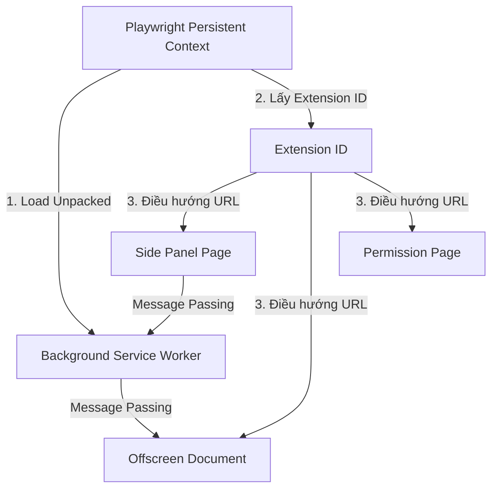

# Nghiên cứu Kỹ thuật: Ứng dụng Playwright cho UI và Chrome Extension Testing

Tài liệu này cung cấp cái nhìn toàn diện về Playwright, phân tích khả năng ứng dụng thực tế để kiểm thử giao diện người dùng (UI testing) và đặc biệt tập trung vào việc tự động hóa kiểm thử cho **Chrome Extension (sử dụng WXT Framework, Sidepanel, và Offscreen Document)** của dự án.

---

## 1. Tổng quan về Playwright

### Playwright là gì?
**Playwright** là một thư viện tự động hóa trình duyệt (browser automation) mã nguồn mở được phát triển bởi Microsoft. Nó cho phép lập trình viên viết các kịch bản kiểm thử E2E (End-to-End) đáng tin cậy, nhanh chóng và hoạt động nhất quán trên tất cả các công cụ trình duyệt hiện đại.

### Playwright khác gì so với Manual Testing?
| Tiêu chí | Manual Testing | Playwright Automation |
| :--- | :--- | :--- |
| **Tốc độ thực thi** | Chậm, phụ thuộc vào tốc độ thao tác của con người. | Rất nhanh, có thể chạy song song nhiều luồng kiểm thử. |
| **Độ chính xác** | Dễ xảy ra sai sót (human error), bỏ sót các case kiểm thử. | Thực thi chính xác 100% theo kịch bản đã định nghĩa. |
| **Khả năng tái lập** | Khó mô phỏng lại chính xác các thao tác chuột/phím có thời gian cực ngắn. | Dễ dàng tái lập cùng một điều kiện kiểm thử ở mọi lần chạy. |
| **Visual Regression** | Kiểm tra bằng mắt thường dễ bỏ sót các thay đổi nhỏ về layout/màu sắc. | Tự động so sánh từng pixel của màn hình với ảnh mẫu (snapshot). |
| **Chi phí vận hành** | Tăng tuyến tính theo quy mô dự án và số lần lặp lại. | Đầu tư ban đầu cao (viết code), nhưng chi phí chạy lại cực thấp. |

### Playwright phù hợp với loại project nào?
Playwright phù hợp với hầu hết các dự án web hiện đại:
* **Single Page Applications (SPA)**: React, Vue, Angular, Svelte.
* **Multi-Page Applications (MPA)** hoặc các trang tĩnh.
* **Chrome Extensions (Manifest V3)**: Đặc biệt mạnh nhờ khả năng kiểm soát Chromium sâu qua Persistent Context.
* **Các ứng dụng cần tương tác phần cứng hoặc API phức tạp**: Định vị (Geolocation), quyền thiết bị (Camera/Microphone), Mock Network.

### Playwright hỗ trợ những browser nào?
Playwright không điều khiển các browser cài sẵn trên máy theo cách thông thường mà đi kèm với các bản phân phối engine trình duyệt sạch (patched browser binaries):
* **Chromium**: Nền tảng cho Google Chrome, Microsoft Edge, Opera, Brave...
* **Firefox**: Engine Gecko của Mozilla.
* **WebKit**: Engine của Apple Safari.

> [!NOTE]
> Đối với kiểm thử Chrome Extension, Playwright **chỉ hỗ trợ chạy trên Chromium** vì các trình duyệt khác có cơ chế Extension API và cách cài đặt khác biệt hoàn toàn.

### Cách chạy ở Local và CI
* **Local (Headed & UI Mode)**: Khi phát triển test, ta chạy ở chế độ **Headed** (hiển thị trình duyệt thực tế) hoặc **UI Mode** (giao diện tương tác trực quan của Playwright giúp xem timeline, step-by-step, console logs).
* **CI/CD (Headless)**: Trên môi trường CI (GitHub Actions, GitLab CI), test chạy mặc định ở chế độ **Headless** (không giao diện) để tiết kiệm tài nguyên. Đối với Chrome Extension đòi hỏi headed mode, ta giả lập màn hình bằng công cụ như **Xvfb** (X Virtual Framebuffer) trên Linux container.

---

## 2. Các khả năng chính của Playwright cho UI Testing

### 2.1 E2E Testing
E2E (End-to-End) testing kiểm thử toàn bộ dòng nghiệp vụ của người dùng từ đầu đến cuối trên một hệ thống hoàn chỉnh.
* **Ví dụ luồng E2E**: Người dùng truy cập trang Login -> Nhập tài khoản -> Vào Dashboard -> Click "Start Recording" -> Thực hiện thao tác -> Click "Stop" -> Tải file video xuống -> Kiểm tra file video tồn tại.
* **Ưu điểm**: Đảm bảo tất cả các thành phần (Frontend, Backend, DB, Network) phối hợp hoạt động chính xác.
* **Giới hạn**: Thời gian chạy lâu, dễ bị ảnh hưởng bởi dữ liệu rác hoặc sự không ổn định của môi trường (flaky do network hoặc backend thật).

### 2.2 UI Interaction (Mô phỏng hành vi)
Playwright cung cấp API mô phỏng tương tác tự nhiên giống như người dùng thật:
* `locator.click()`: Tự động cuộn phần tử vào vùng nhìn thấy (scroll into view), đợi phần tử sẵn sàng (actionable) rồi mới click.
* `locator.fill()`: Nhập liệu vào input hoặc textarea (nhanh và an toàn hơn việc gõ từng phím).
* `locator.hover()`: Di chuyển chuột đến vị trí phần tử để kích hoạt CSS hover hoặc JS tooltip.
* `locator.dragTo()`: Kéo thả phần tử từ vị trí A sang vị trí B.
* `page.keyboard.press()`: Mô phỏng các phím tắt phức tạp (ví dụ: `Alt+Shift+F` để trigger Command của extension).
* `page.setInputFiles()`: Tải file lên (upload file) bằng cách chỉ định đường dẫn trực tiếp mà không cần mở OS dialog.
* `page.waitForEvent('download')`: Lắng nghe và kiểm soát sự kiện tải file (download file), lưu file vào thư mục chỉ định để verify dung lượng hoặc định dạng.
* `page.on('dialog', ...)`: Lắng nghe và tương tác với các native dialog như `alert`, `confirm`, `prompt`, hoặc ngăn chặn việc đóng tab (`beforeunload`).
* `context.waitForEvent('page')`: Bắt các trang mới (new tab) hoặc cửa sổ popup window được mở ra từ trang hiện tại.

### 2.3 Locator System (Hệ thống định vị thông minh)
Playwright khuyến khích sử dụng các locator hướng đến khả năng tiếp cận (accessibility) và trải nghiệm người dùng thực tế thay vì cấu trúc DOM kỹ thuật:
1. `page.getByRole(role, options)`: Định vị theo vai trò ngữ nghĩa của HTML (ví dụ: `button[name="Đăng nhập"]`, `checkbox`, `heading`). **Đây là Best Practice được đề xuất hàng đầu.**
2. `page.getByText(text)`: Định vị bằng nội dung chữ hiển thị trên màn hình.
3. `page.getByLabel(label)`: Định vị input thông qua thẻ `<label>` tương ứng.
4. `page.getByPlaceholder(placeholder)`: Định vị input qua văn bản gợi ý placeholder.
5. `page.getByTestId(id)`: Định vị bằng thuộc tính kiểm thử chuyên dụng (ví dụ: `data-testid="record-status-badge"`). Cực kỳ hữu ích khi các thuộc tính khác hay bị thay đổi bởi designer.
6. `page.locator('css or xpath')`: Chỉ sử dụng khi không thể định vị bằng các phương pháp trên. Hạn chế sử dụng CSS selector phụ thuộc sâu vào cấu trúc DOM (ví dụ: `div > div > span:nth-child(2)`) vì dễ gãy khi refactor code UI.

### 2.4 Auto-waiting và Assertion (Chờ tự động & Khẳng định)
Một trong những lý do khiến Selenium hoặc các tool cũ bị "flaky" (chạy lúc được lúc mất) là do bất đồng bộ trong UI. Playwright giải quyết triệt để bằng hai cơ chế:
* **Auto-waiting**: Trước khi thực hiện bất kỳ hành động nào (click, fill, hover), Playwright tự động kiểm tra xem phần tử đó đã:
  * Xuất hiện trong DOM chưa?
  * Đã hiển thị trên màn hình chưa (visible)?
  * Đã dừng hoạt ảnh chưa (stable)?
  * Có bị che bởi phần tử khác không?
  * Đã được kích hoạt chưa (enabled)?
* **Web-First Assertions**: Các khẳng định sử dụng lớp `expect` sẽ tự động thực hiện cơ chế retry liên tục cho đến khi đạt điều kiện mong muốn hoặc hết timeout (mặc định 5 giây).
  ```typescript
  // Playwright sẽ chờ tối đa 5s để nút biến mất khỏi màn hình, tránh lỗi UI đang load dở
  await expect(page.getByRole('button', { name: 'Loading' })).toBeHidden();
  ```

### 2.5 Multi-browser và Device Emulation
Playwright cho phép định nghĩa các cấu hình môi trường chạy đa dạng trong file config:
* **Browser Engines**: Chromium, Firefox, WebKit.
* **Device Emulation**: Giả lập các thiết bị di động (iPhone, Pixel) bằng cách cấu hình `viewport`, `userAgent`, và tỷ lệ pixel thiết bị (`deviceScaleFactor`).
* **Môi trường & Ngữ cảnh**:
  * Giả lập múi giờ (`timezoneId`), ngôn ngữ (`locale`).
  * Giả lập tọa độ địa lý (`geolocation`) để test tính năng bản đồ hoặc định vị.
  * Tự động cấp quyền (`permissions`) như `'camera'`, `'microphone'`, `'notifications'` mà không hiển thị OS prompt xin quyền.
  * Giả lập chế độ hiển thị sáng/tối (`colorScheme: 'dark' | 'light'`).

### 2.6 Visual Regression Testing (So sánh hình ảnh)
* **Khái niệm**: Playwright chụp ảnh màn hình hiện tại và so sánh pixel-by-pixel với một ảnh chuẩn mẫu (baseline snapshot) được lưu từ trước. Nếu tỷ lệ sai lệch vượt quá ngưỡng cho phép (threshold), test sẽ fail và sinh ra file diff trực quan.
* **Khi nào nên dùng**: Phù hợp cho các UI tĩnh ít thay đổi động như: Màn hình Login, bố cục Dashboard tổng quan, các biểu mẫu mẫu, sidepanel hoặc popup tĩnh, hóa đơn xuất ra file PDF/HTML.
* **Khi nào KHÔNG nên lạm dụng**: Không dùng cho các màn hình có dữ liệu động (thời gian, dữ liệu ngẫu nhiên, biểu đồ realtime) trừ khi đã thực hiện mock API hoặc ẩn các phần tử động đi (sử dụng thuộc tính `mask` trong config của snapshot).
* **Cách update snapshot**: Chạy lệnh `npx playwright test --update-snapshots` khi có sự thay đổi giao diện có chủ đích.

### 2.7 Debugging Tools (Công cụ gỡ lỗi)
* **Screenshot on failure**: Tự động chụp ảnh màn hình ngay tại thời điểm test bị fail để developer biết trạng thái UI lúc đó.
* **Video on failure/retry**: Ghi lại video toàn bộ quá trình tương tác của test để dễ dàng quan sát luồng hành vi bị lỗi.
* **Trace Viewer**: Công cụ debug tối thượng. Nó lưu lại mọi thông tin của đợt chạy test dưới dạng file `.zip`. Khi mở Trace Viewer, bạn có thể:
  * Rà soát timeline qua từng hành động của test.
  * Xem snapshot DOM thực tế tại từng bước (có thể inspect HTML/CSS tại thời điểm đó).
  * Xem console logs của trình duyệt và network requests tương ứng với từng step.
* **UI Mode**: Giao diện desktop trực quan cho phép chạy từng test case đơn lẻ, xem trực tiếp quá trình tương tác và tự động reload khi code test thay đổi.
* **Codegen**: Bộ sinh code tự động. Bạn thao tác trên trình duyệt giả lập, Playwright sẽ tự sinh ra đoạn code tương tác tương ứng (chọn locator tối ưu nhất).

### 2.8 Mock API / Network Interception
Playwright cho phép bạn can thiệp trực tiếp vào tầng mạng của trình duyệt:
```typescript
// Mock API GET /api/user để trả về dữ liệu rỗng và test UI empty state
await page.route('**/api/user', async route => {
  await route.fulfill({
    status: 200,
    contentType: 'application/json',
    body: JSON.stringify({ users: [] })
  });
});
```
* **Simulate Timeout/Error**: Có thể phá hủy request (`route.abort()`) hoặc làm chậm phản hồi (`delayed response`) để test trạng thái Loading hoặc Error của UI.
* **Mock bằng HAR**: Ghi lại luồng mạng thực tế thành file `.har` và phát lại (replay) trong môi trường test để đảm bảo dữ liệu nhất quán.
* **Chiến lược**:
  * *Nên mock API khi*: Test các trường hợp biên (lỗi hệ thống 500, quá hạn timeout, dữ liệu cực lớn, tài khoản hết hạn...) khó tái tạo bằng database thật.
  * *Nên dùng API thật khi*: Chạy các bài test E2E tích hợp để đảm bảo frontend và backend thực sự tương thích về mặt dữ liệu.

### 2.9 Authentication Reuse (Tái sử dụng trạng thái đăng nhập)
Để tránh việc mỗi test case đều phải thực hiện luồng nhập username/password và đợi OTP (rất mất thời gian và dễ lỗi), Playwright hỗ trợ lưu trữ trạng thái đăng nhập:
1. Viết một file setup thực hiện đăng nhập một lần duy nhất.
2. Lưu cookie và localStorage vào file JSON: `await context.storageState({ path: 'playwright/.auth/user.json' });`
3. Cấu hình các test case khác sử dụng lại file state này mà không cần đăng nhập lại.

### 2.10 Fixtures và Page Object Model (POM)
* **Page Object Model (POM)**: Là design pattern phổ biến trong kiểm thử UI. Ta gom toàn bộ các locator và phương thức tương tác của một trang vào một class riêng biệt.
  * *Lợi ích*: Nếu UI thay đổi (ví dụ đổi id nút Start thành `btn-start-record`), ta chỉ cần sửa ở một nơi duy nhất trong POM class thay vì sửa hàng chục file test.
* **Fixtures**: Là các hàm thiết lập môi trường (setup/teardown) được Playwright quản lý. Ta có thể tạo ra các custom fixture để truyền trực tiếp các POM class vào hàm test một cách sạch sẽ:
  ```typescript
  // Thay vì khởi tạo thủ công trong từng test:
  test('test recording', async ({ sidepanelPage }) => {
    await sidepanelPage.startRecording();
    await expect(sidepanelPage.timerLocator).toBeVisible();
  });
  ```

---

## 3. Playwright cho Chrome Extension Testing

Kiểm thử Chrome Extension phức tạp hơn web app thông thường vì nó chạy trong một môi trường đặc quyền của trình duyệt với nhiều thành phần (Popup, Sidepanel, Background/Service Worker, Content Script, Offscreen Document) giao tiếp qua tin nhắn (Message Passing).

### Cơ chế load Unpacked Extension trong Playwright
Để test Extension, Playwright bắt buộc phải chạy Chromium ở chế độ **Persistent Context** (một cấu hình thư mục người dùng thực tế thay vì cấu hình ẩn danh tạm thời) và truyền các tham số dòng lệnh để load folder extension đã được build:

```typescript
import { test as base, chromium, type BrowserContext } from '@playwright/test';
import path from 'path';

export const test = base.extend<{
  context: BrowserContext;
  extensionId: string;
}>({
  context: async ({}, use) => {
    // Đường dẫn đến thư mục build của extension (với WXT mặc định là dist/chrome-mv3)
    const pathToExtension = path.join(__dirname, '../../dist/chrome-mv3');
    
    const userDataDir = path.join(__dirname, '../../.playwright-mcp/user-data');
    const context = await chromium.launchPersistentContext(userDataDir, {
      headless: false, // BẮT BUỘC để load extension
      args: [
        `--disable-extensions-except=${pathToExtension}`,
        `--load-extension=${pathToExtension}`,
      ],
    });
    await use(context);
    await context.close();
  },
  extensionId: async ({ context }, use) => {
    // Lấy extension ID từ background service worker
    let [background] = context.serviceWorkers();
    if (!background) {
      background = await context.waitForEvent('serviceworker');
    }
    const extensionId = background.url().split('/')[2];
    await use(extensionId);
  },
});
```

### Cách tương tác với các thành phần của Extension



1. **Test Side Panel / Extension Page**:
   * Kể từ Manifest V3, Side Panel thực chất là một trang HTML chuyên dụng (`sidepanel.html`).
   * Ta có thể điều hướng trực tiếp bằng URL của extension:
     `await page.goto(`chrome-extension://${extensionId}/sidepanel.html`);`
   * Việc điều hướng trực tiếp giúp cô lập UI của side panel để test dễ dàng như một trang web thông thường.
2. **Test Offscreen Document**:
   * Dự án sử dụng Offscreen Document (`offscreen.html`) để thực hiện ghi âm/hình bằng MediaRecorder.
   * Để test UI tương tác hoặc theo dõi trạng thái offscreen, ta có thể lắng nghe sự kiện tạo page mới trong context hoặc chủ động mở trang offscreen bằng URL để kiểm tra console log/state:
     `const offscreenPage = await context.newPage();`
     `await offscreenPage.goto(`chrome-extension://${extensionId}/offscreen.html`);`
3. **Test Service Worker (Background Script)**:
   * Có thể lấy đối tượng service worker từ context để theo dõi lỗi hoặc log:
     `const worker = context.serviceWorkers()[0];`
     `worker.evaluate(() => console.log('Hello from test'));`
4. **Test Message/State Flow**:
   * Khi Sidepanel gửi message đến Background, ta có thể theo dõi luồng tin nhắn bằng cách lắng nghe sự kiện console log hoặc bắt các network request phát ra từ Background.

### Giới hạn khi test Chrome Extension bằng Playwright
1. **Chỉ chạy trên Chromium**: Không thể chạy test extension trên Firefox hay WebKit của Playwright.
2. **Không hỗ trợ Headless truyền thống**: Cấu hình `headless: true` sẽ vô hiệu hóa việc load extension của Chromium. Ta phải đặt `headless: false` hoặc sử dụng chế độ `--headless=new` trên các trình duyệt Chromium phiên bản mới.
3. **Native Screen Sharing Picker (`getDisplayMedia`)**: Khi bấm nút bắt đầu quay màn hình, trình duyệt sẽ hiển thị một popup native của hệ điều hành để người dùng chọn cửa sổ/màn hình muốn chia sẻ. Playwright **không thể click** vào popup native này.
   * *Giải pháp*: Cấu hình Chromium bypass dialog này bằng cách truyền các cờ giả lập thiết bị media trong `args` khi launch context:
     ```typescript
     args: [
       '--use-fake-ui-for-media-stream', // Tự động chấp nhận quyền camera/micro
       '--use-fake-device-for-media-stream', // Sử dụng video/audio giả lập (test pattern)
       '--auto-select-desktop-capture-source=Entire screen', // Tự động chọn nguồn quay màn hình
     ]
     ```

### Ví dụ Kịch bản Test áp dụng cho dự án "Meeting Recorder"
* **Test popup/sidepanel trạng thái idle**:
  * Mở sidepanel, kiểm tra hiển thị mặc định: Nút Start hoạt động, nút Pause/Stop disabled, các tùy chọn nguồn âm thanh (Mic/System/None) hiển thị đầy đủ.
* **Test sidepanel khi detect meeting**:
  * Giả lập việc mở một tab có URL Google Meet hoặc Zoom. Kiểm tra xem sidepanel có tự động nhận diện và hiển thị thông báo gợi ý "Meeting detected! Start recording?" hay không.
* **Test UI khi đang recording**:
  * Bấm Start, kiểm tra trạng thái UI chuyển sang "Recording": Icon nhấp nháy đỏ, hiển thị bộ đếm thời gian (timer) tăng dần, hiển thị nút Pause/Stop thay vì nút Start.
* **Test UI khi lỗi Permission**:
  * Chạy test với ngữ cảnh không cấp quyền camera/micro. Kiểm tra xem sidepanel có hiển thị màn hình cảnh báo lỗi Permission và hướng dẫn người dùng cách mở quyền cài đặt hay không.
* **Test warning khi đóng tab**:
  * Khi đang trong trạng thái recording, giả lập hành động người dùng đóng tab đang được record. Kiểm tra xem sự kiện `beforeunload` có được kích hoạt và hiển thị dialog cảnh báo hay không.
* **Test download output**:
  * Bấm Stop, đợi quá trình xử lý file hoàn tất. Bắt sự kiện tải file của Playwright và kiểm tra xem có lưu được file `.webm` thành công không.
* **Test state persistence**:
  * Thay đổi cấu hình chất lượng ghi (ví dụ từ HD sang Full HD). Đóng sidepanel và mở lại. Kiểm tra xem cấu hình Full HD có được lưu trong `chrome.storage.local` và hiển thị chính xác ở lần mở sau hay không.

---

## 4. Playwright có thể test những gì trong project UI?

Dưới đây là bảng phân tích chi tiết khả năng ứng dụng Playwright cho từng thành phần giao diện của dự án:

| Chức năng cần test | Có nên dùng Playwright? | Loại test phù hợp | Ghi chú triển khai thực tế |
| :--- | :---: | :--- | :--- |
| **Login / Auth Page** | **Có** | Functional UI / E2E | Dùng Storage State để lưu auth session sau lần đăng nhập đầu tiên. |
| **Dashboard quản lý video** | **Có** | Functional UI / Visual | Mock API danh sách video để kiểm tra UI hiển thị dạng lưới/dạng danh sách chính xác. |
| **Form cấu hình recording** | **Có** | Functional UI | Điền form (chọn độ phân giải, fps, nguồn audio) -> Lưu -> Verify. |
| **Modal xác nhận xóa video** | **Có** | Functional UI | Click nút Xóa -> Modal mở lên -> Click Confirm -> Verify modal đóng và video biến mất. |
| **Toast thông báo (Success/Error)**| **Có** | Functional UI | Bắt nhanh phần tử Toast (vốn biến mất sau vài giây) nhờ cơ chế auto-wait của Playwright. |
| **Bảng dữ liệu (Filter/Search/Page)**| **Có** | Functional UI / E2E | Nhập từ khóa -> Kiểm tra số hàng thay đổi. Click chuyển trang -> Kiểm tra URL thay đổi. |
| **Responsive Layout** | **Có** | Visual Regression | Test với các kích thước viewport khác nhau (Mobile, Tablet, Desktop). |
| **Visual Layout chính** | **Có** | Visual Regression | So sánh screenshot trang Dashboard, Side panel tĩnh với baseline. |
| **Tải file Video (.webm)** | **Có** | E2E | Lắng nghe sự kiện `page.waitForEvent('download')` để lấy file và kiểm tra dung lượng. |
| **API Error State (500/Timeout)** | **Có** | Functional UI | Mock API trả về mã lỗi 500 hoặc làm chậm response -> Kiểm tra UI hiển thị màn hình báo lỗi/loading tương ứng. |
| **Empty State** | **Có** | Functional UI / Visual | Mock API trả về danh sách rỗng `[]` -> Kiểm tra UI hiển thị ảnh minh họa trống và nút hướng dẫn. |
| **Loading State** | **Có** | Functional UI | Mock API phản hồi cực chậm -> Kiểm tra vòng xoay loading hoặc skeleton UI xuất hiện. |
| **Permission Denied State** | **Có** | Functional UI | Khởi tạo browser context không cấp quyền Microphone/Camera -> Kiểm tra UI báo lỗi. |
| **Side Panel Extension** | **Có** | Functional UI / Visual | Mở URL `chrome-extension://<id>/sidepanel.html` để test trực tiếp giao diện side panel. |
| **Trang Permission hướng dẫn** | **Có** | Functional UI | Mở trực tiếp trang `permission.html` để kiểm tra các bước hướng dẫn người dùng mở quyền. |
| **Nhận diện Meeting (Meet/Zoom)** | **Có** | E2E | Mở một tab phụ điều hướng đến `meet.google.com` -> Kiểm tra xem Side Panel có cập nhật trạng thái nhận diện meeting không. |
| **Service Worker State** | **Hạn chế** | Integration / Unit | Test các logic message passing thuần thông qua Unit test. Dùng Playwright chỉ để verify xem background có alive hay không. |
| **System Screen Picker** | **Không** | - | Là giao diện native của OS. **Phải bypass** bằng cờ Chromium `--use-fake-ui-for-media-stream` như đã nêu. |
| **Quay Video màn hình thực tế** | **Không** | - | Playwright không thể kiểm tra chất lượng hình ảnh/audio thực tế của video quay được. **Phải dùng video test giả lập**. |
| **Crash & Recovery Flow** | **Không** | - | Rất khó để mô phỏng Chromium crash một cách ổn định trong môi trường test tự động. Nên kiểm thử thủ công (manual). |

---

## 5. Giới hạn của Playwright

Nhận thức rõ giới hạn giúp team tránh sa lầy vào việc cố gắng tự động hóa những thứ không khả thi:

1. **Không thay thế hoàn toàn Manual Testing**: Playwright chỉ kiểm tra theo các kịch bản cứng nhắc đã được lập trình sẵn. Nó không thể đánh giá độ mượt của hoạt ảnh (animation), tính thẩm mỹ của thiết kế, hay trải nghiệm người dùng (UX) trực quan.
2. **Khó kiểm thử các tương tác Native OS**:
   * OS File Chooser (phải dùng phương thức bypass `page.setInputFiles`).
   * OS Screen Share Picker (phải bypass bằng flags chrome).
   * OS Permission Dialog (phải cấp quyền sẵn qua Browser Context).
3. **Flaky với Visual Regression**: Ảnh chụp giao diện chụp trên máy Mac của developer có thể lệch vài pixel so với ảnh chụp trên máy Linux ở CI do khác biệt về cơ chế khử răng cưa font chữ (font antialiasing) và driver render card màn hình.
   * *Giải pháp*: Cấu hình sai số cho phép (`maxDiffPixels` hoặc `threshold`) hoặc chỉ so sánh visual trên môi trường Docker đồng nhất.
4. **Tốc độ chạy E2E chậm**: Nếu chạy test E2E thực tế kết nối database thật cho hàng trăm test case, thời gian chạy có thể lên đến hàng giờ.
   * *Giải pháp*: Cần phân cấp chiến lược test, áp dụng mock dữ liệu tối đa cho các test case kiểm thử luồng UI.

---

## 6. Chiến lược kiểm thử đề xuất cho dự án

Để tối ưu hóa thời gian và nguồn lực, chúng ta nên triển khai phân tầng kiểm thử theo hình tháp (Testing Pyramid):

```
       / \
      /   \      Level 4: Visual Regression (Chỉ màn hình chính)
     /     \     Level 3: E2E Flows (2-3 luồng quan trọng nhất)
    /       \    Level 2: Functional UI Tests (Kiểm thử tương tác chi tiết - Mock API)
   /_________\   Level 1: Smoke Tests (Kiểm tra khởi động & Routing)
```

* **Level 1: Smoke Test (Chạy cực nhanh)**:
  * Đảm bảo extension load thành công mà không bị crash.
  * Mở được giao diện Side panel, trang Permission, trang Camera overlay.
  * *Tần suất*: Chạy mỗi khi có Commit mới trên mọi Branch.
* **Level 2: Functional UI Test (Tập trung tương tác giao diện - Mock API tối đa)**:
  * Kiểm tra hoạt động của tất cả form, dropdown, nút bấm trên Side panel.
  * Kiểm tra các trạng thái UI: Loading, Empty, Error khi API thất bại.
  * Test lưu cấu hình vào `chrome.storage`.
  * *Tần suất*: Chạy trước khi tạo Pull Request (PR) merge vào branch main.
* **Level 3: E2E Flow (Kiểm thử luồng thực tế)**:
  * Chạy luồng: Click Start -> Quay video test giả lập trong 5s -> Stop -> Export video -> Tải video xuống -> Xác thực file tải xuống.
  * *Tần suất*: Chạy hàng ngày (Nightly build) hoặc trước khi Release phiên bản mới.
* **Level 4: Visual Regression (Bảo vệ thiết kế)**:
  * Chỉ chụp và so sánh màn hình Side Panel trạng thái Idle và màn hình Dashboard quản lý video (sử dụng dữ liệu mock).
  * *Tần suất*: Chạy trước khi Release.
* **Level 5: CI/CD Integration**:
  * Tích hợp toàn bộ luồng test vào GitHub Actions.
  * Sử dụng thư viện `xvfb-run` để chạy Chromium headed trên môi trường Linux Headless của CI.
  * Lưu trữ kết quả dưới dạng Artifacts (Screenshots, Videos, Traces) nếu test bị fail để dễ dàng tải về debug.

---

## 7. Cấu trúc thư mục kiểm thử đề xuất

Đề xuất cấu trúc thư mục TypeScript đặt tại thư mục gốc của dự án:

```text
tests/
├── auth/                    # Kiểm thử các luồng liên quan đến tài khoản
│   └── login.spec.ts
├── dashboard/               # Kiểm thử trang quản lý video
│   └── video-list.spec.ts
├── extension/               # Kiểm thử chuyên sâu cho Extension
│   ├── sidepanel-ui.spec.ts # Test UI sidepanel (idle, loading, options)
│   ├── recording-flow.spec.ts # Test luồng quay video giả lập
│   └── permission.spec.ts   # Test trang xin quyền
├── visual/                  # Kiểm thử so sánh hình ảnh (Visual Comparison)
│   ├── sidepanel.visual.spec.ts
│   └── dashboard.visual.spec.ts
├── fixtures/                # Định nghĩa các custom fixtures của Playwright
│   ├── extension.fixture.ts # Custom fixture load unpacked extension
│   └── index.ts             # Gom nhóm và xuất tất cả fixtures
├── pages/                   # Thư mục Page Object Model (POM)
│   ├── base.page.ts         # Page base chứa các hàm dùng chung
│   ├── sidepanel.page.ts    # POM đại diện cho Sidepanel UI
│   └── dashboard.page.ts    # POM đại diện cho Dashboard UI
└── utils/                   # Các hàm bổ trợ (helpers) cho viết test
    └── mock-data.ts         # Mock data generator cho API
```

---

## 8. Ví dụ Code mẫu (TypeScript)

### 8.1 Cấu hình Playwright cho Extension (`playwright.config.ts`)

```typescript
import { defineConfig, devices } from '@playwright/test';

export default defineConfig({
  testDir: './tests',
  fullyParallel: false, // Chạy tuần tự đối với extension để tránh xung đột persistent context
  retries: process.env.CI ? 2 : 0,
  workers: 1, // Đặt workers = 1 khi test extension để tránh xung đột chrome profile
  reporter: 'html',
  use: {
    trace: 'on-first-retry',
    video: 'on-first-retry',
    screenshot: 'only-on-failure',
  },
  projects: [
    {
      name: 'chromium',
      use: {
        ...devices['Desktop Chrome'],
        // Cần đảm bảo context mặc định không ghi đè cấu hình persistent context trong fixture
      },
    },
  ],
});
```

### 8.2 Định nghĩa Custom Fixture cho Extension (`tests/fixtures/extension.fixture.ts`)

```typescript
import { test as base, chromium, type BrowserContext, type Page } from '@playwright/test';
import path from 'path';
import fs from 'fs';

export const test = base.extend<{
  context: BrowserContext;
  extensionId: string;
  sidepanelPage: Page;
}>({
  context: async ({}, use) => {
    // Trỏ đến thư mục build dist của WXT
    const pathToExtension = path.join(__dirname, '../../dist/chrome-mv3');
    
    if (!fs.existsSync(pathToExtension)) {
      throw new Error(`Extension build folder not found at ${pathToExtension}. Please run 'npm run build' first.`);
    }

    const userDataDir = path.join(__dirname, '../../.playwright-mcp/user-data-test');
    
    const context = await chromium.launchPersistentContext(userDataDir, {
      headless: false, // Bắt buộc phải false để load extension
      args: [
        `--disable-extensions-except=${pathToExtension}`,
        `--load-extension=${pathToExtension}`,
        '--use-fake-ui-for-media-stream', // Bypass camera/micro prompt
        '--use-fake-device-for-media-stream', // Dùng camera/micro giả lập
        '--auto-select-desktop-capture-source=Entire screen', // Bypass screen capture source picker
      ],
    });

    await use(context);
    await context.close();
  },
  
  extensionId: async ({ context }, use) => {
    let [background] = context.serviceWorkers();
    if (!background) {
      background = await context.waitForEvent('serviceworker');
    }
    // Trích xuất ID từ URL: chrome-extension://plmehkdmfenfighdnboaknnolkpngdpb/background.js
    const extensionId = background.url().split('/')[2];
    await use(extensionId);
  },

  sidepanelPage: async ({ context, extensionId }, use) => {
    const page = await context.newPage();
    // Điều hướng trực tiếp đến trang sidepanel của extension
    await page.goto(`chrome-extension://${extensionId}/sidepanel.html`);
    await use(page);
  }
});

export { expect } from '@playwright/test';
```

### 8.3 Page Object Model cho Sidepanel (`tests/pages/sidepanel.page.ts`)

```typescript
import { type Page, type Locator } from '@playwright/test';

export class SidepanelPage {
  readonly page: Page;
  readonly startBtn: Locator;
  readonly stopBtn: Locator;
  readonly timerText: Locator;
  readonly qualitySelect: Locator;
  readonly statusBadge: Locator;

  constructor(page: Page) {
    this.page = page;
    // Sử dụng locator khuyến nghị (getByRole, getByTestId)
    this.startBtn = page.getByRole('button', { name: /start recording/i });
    this.stopBtn = page.getByRole('button', { name: /stop/i });
    this.timerText = page.getByTestId('timer-display');
    this.qualitySelect = page.getByLabel(/video quality/i);
    this.statusBadge = page.getByTestId('status-badge');
  }

  async startRecording() {
    await this.startBtn.click();
  }

  async stopRecording() {
    await this.stopBtn.click();
  }

  async selectQuality(quality: string) {
    await this.qualitySelect.selectOption(quality);
  }
}
```

### 8.4 Viết Kịch bản Kiểm thử UI (`tests/extension/sidepanel-ui.spec.ts`)

```typescript
import { test, expect } from '../fixtures/extension.fixture';
import { SidepanelPage } from '../pages/sidepanel.page';

test.describe('Extension Sidepanel UI Tests', () => {
  
  test('kiểm tra trạng thái mặc định của giao diện', async ({ sidepanelPage }) => {
    const sidepanel = new SidepanelPage(sidepanelPage);
    
    // Nút Start phải hoạt động
    await expect(sidepanel.startBtn).toBeEnabled();
    // Nút Stop mặc định phải bị disable
    await expect(sidepanel.stopBtn).toBeDisabled();
    // Trạng thái ban đầu phải là idle
    await expect(sidepanel.statusBadge).toHaveText('Idle');
  });

  test('kiểm tra trạng thái UI khi đang ghi hình', async ({ sidepanelPage }) => {
    const sidepanel = new SidepanelPage(sidepanelPage);
    
    await sidepanel.startRecording();
    
    // Nút Start biến mất hoặc bị disable, nút Stop được kích hoạt
    await expect(sidepanel.stopBtn).toBeEnabled();
    await expect(sidepanel.statusBadge).toHaveText('Recording');
    
    // Đợi timer chạy (ví dụ hiển thị khác 00:00)
    await expect(sidepanel.timerText).not.toHaveText('00:00');
  });

  test('kiểm tra lưu cấu hình chất lượng video', async ({ sidepanelPage, context, extensionId }) => {
    const sidepanel = new SidepanelPage(sidepanelPage);
    
    await sidepanel.selectQuality('1080p');
    
    // Đóng tab sidepanel hiện tại
    await sidepanelPage.close();
    
    // Mở lại sidepanel trong tab mới
    const newSidepanelPage = await context.newPage();
    await newSidepanelPage.goto(`chrome-extension://${extensionId}/sidepanel.html`);
    
    const reOpenedSidepanel = new SidepanelPage(newSidepanelPage);
    // Kiểm tra cấu hình vẫn được giữ nguyên là 1080p
    await expect(reOpenedSidepanel.qualitySelect).toHaveValue('1080p');
  });
});
```

### 8.5 Test Download File và Beforeunload Warning

```typescript
import { test, expect } from '../fixtures/extension.fixture';
import { SidepanelPage } from '../pages/sidepanel.page';

test('kiểm tra warning khi đóng tab và luồng tải video', async ({ sidepanelPage }) => {
  const sidepanel = new SidepanelPage(sidepanelPage);
  
  // Bắt đầu ghi
  await sidepanel.startRecording();
  await expect(sidepanel.statusBadge).toHaveText('Recording');
  
  // Thiết lập bắt dialog cảnh báo beforeunload
  let dialogTriggered = false;
  sidepanelPage.on('dialog', async dialog => {
    dialogTriggered = true;
    expect(dialog.message()).toContain('Recording is in progress. Are you sure you want to leave?');
    await dialog.accept(); // Đồng ý rời trang (hoặc dismiss để ở lại)
  });
  
  // Bấm nút dừng ghi và chuẩn bị tải file
  // Playwright bắt sự kiện download bằng cách lắng nghe song song với hành động click Stop
  const downloadPromise = sidepanelPage.waitForEvent('download');
  await sidepanel.stopRecording();
  const download = await downloadPromise;
  
  // Kiểm tra tên file tải về và lưu vào thư mục tests/downloads
  expect(download.suggestedFilename()).toContain('.webm');
  await download.saveAs(`./tests/downloads/${download.suggestedFilename()}`);
});
```

### 8.6 Mock API & Test Error State

```typescript
import { test, expect } from '../fixtures/extension.fixture';

test('kiểm tra UI hiển thị khi API tải danh sách video bị lỗi 500', async ({ sidepanelPage }) => {
  // Intercept request lấy danh sách video và trả về lỗi 500
  await sidepanelPage.route('**/api/videos', async route => {
    await route.fulfill({
      status: 500,
      contentType: 'application/json',
      body: JSON.stringify({ error: 'Internal Server Error' })
    });
  });

  // Reload trang hoặc click vào tab Dashboard
  await sidepanelPage.reload();
  
  // Kiểm tra UI hiển thị thông báo lỗi thân thiện cho user
  const errorAlert = sidepanelPage.getByRole('alert');
  await expect(errorAlert).toBeVisible();
  await expect(errorAlert).toHaveText(/không thể tải danh sách video, vui lòng thử lại sau/i);
});
```

### 8.7 Cấu hình GitHub Actions CI Workflow (`.github/workflows/playwright.yml`)

```yaml
name: Playwright Tests
on:
  push:
    branches: [ main, develop ]
  pull_request:
    branches: [ main, develop ]
jobs:
  test:
    timeout-minutes: 15
    runs-on: ubuntu-latest
    steps:
    - uses: actions/checkout@v4
    
    - uses: actions/setup-node@v4
      with:
        node-version: 18
        cache: 'npm'
        
    - name: Install dependencies
      run: npm ci
      
    - name: Build Extension (unpacked)
      run: npm run build # Sinh ra thư mục dist/chrome-mv3 để test load
      
    - name: Install Playwright Browsers
      run: npx playwright install --with-deps chromium
      
    - name: Run Playwright tests (with Xvfb for extension testing)
      run: xvfb-run --auto-servernum --server-args="-screen 0 1280x1024x24" npx playwright test
      
    - uses: actions/upload-artifact@v4
      if: always()
      with:
        name: playwright-report
        path: playwright-report/
        retention-days: 30
```

---

## 9. Best Practices khi viết Test bằng Playwright

Để có được bộ test suite chất lượng cao, dễ bảo trì và không bị chạy sai (flaky), team cần tuân thủ nghiêm ngặt các quy tắc sau:

1. **Ưu tiên User-Facing Locators**: Luôn dùng `getByRole`, `getByText`, `getByLabel` để đảm bảo test của bạn kiểm thử giao diện dưới góc nhìn của người dùng thực tế và tăng tính tiếp cận. Tránh dùng class CSS của tailwind/bootstrap vì chúng thay đổi rất thường xuyên khi thiết kế thay đổi.
2. **Tuyệt đối không dùng Timeout cứng (`page.waitForTimeout(ms)`)**:
   * *Sai*: `await page.waitForTimeout(3000);` (làm chậm test vô ích nếu máy chạy nhanh, hoặc vẫn bị fail nếu mạng hôm đó quá chậm).
   * *Đúng*: Chờ một trạng thái cụ thể xuất hiện: `await expect(page.getByRole('button')).toBeVisible();` hoặc sử dụng `page.waitForSelector()`.
3. **Mỗi test case phải độc lập hoàn toàn**: Tránh việc test case B chạy phụ thuộc vào kết quả của test case A. Mỗi test nên tự chuẩn bị dữ liệu (seeding data) và tự dọn dẹp dữ liệu của mình (cleanup).
4. **Không viết test phụ thuộc thứ tự chạy**: Playwright mặc định sẽ chạy song song các file test. Nếu các test case viết phụ thuộc thứ tự, chúng sẽ bị fail khi chạy song song.
5. **Mock API đối với các case khó**: Đừng cố gắng tạo ra các lỗi hệ thống thật từ phía backend chỉ để test UI hiển thị lỗi. Hãy dùng `page.route()` để trả về mã lỗi 500 hoặc làm chậm mạng để test màn hình loading.
6. **Sử dụng Trace Viewer làm công cụ chính để debug trên CI**: Khi test chạy trên CI bị fail, không nên mất thời gian đoán lỗi. Hãy tải file artifact `playwright-report` về máy, mở Trace Viewer lên và xem chính xác từng bước tương tác chuột cùng với console log.
7. **Sử dụng Page Object Model (POM) khi có luồng phức tạp**: Mọi thao tác lặp lại nhiều lần (như Login, tạo mới bản ghi, chọn nguồn ghi) nên được đóng gói vào class Page để tái sử dụng.
8. **Chạy test song song (Parallelism)**: Cấu hình `fullyParallel: true` cho web app để giảm thời gian chạy test. Tuy nhiên, đối với Chrome Extension test, đặt `fullyParallel: false` để tránh xung đột khi chia sẻ Chromium persistent profile.

---

## 10. Kết luận, khuyến nghị & Rủi ro cần lưu ý

### Kết luận
Playwright là một công cụ **cực kỳ mạnh mẽ và phù hợp nhất** đối với dự án hiện tại của chúng ta. Khả năng kiểm soát Chromium persistent context giúp giải quyết triệt để bài toán khó khăn nhất là tự động hóa kiểm thử Chrome Extension (popup, sidepanel, offscreen document).

### Đề xuất lộ trình triển khai cho team
1. **Pha 1: Setup Infrastructure**: Cấu hình file `playwright.config.ts`, tạo custom fixture load unpacked extension và tích hợp thử nghiệm lệnh chạy `npx playwright test` trên máy local.
2. **Pha 2: Viết Smoke Tests**: Viết các kịch bản cơ bản nhất (Level 1) để đảm bảo Extension load thành công và Sidepanel mở được đúng URL.
3. **Pha 3: Tích hợp CI/CD**: Cài đặt workflow GitHub Actions chạy smoke tests kèm theo `xvfb-run` ngay lập tức để bảo vệ các commit mới trên nhánh chính.
4. **Pha 4: Mở rộng Functional UI Tests**: Viết test cho các màn hình cấu hình, trạng thái rỗng (empty state), trạng thái lỗi permission, và trạng thái loading bằng kỹ thuật mock API.
5. **Pha 5: E2E Recording test**: Viết kịch bản E2E kiểm tra luồng quay video giả lập đầy đủ từ bấm Start -> ghi hình -> Stop -> Kiểm tra file tải về.

### Rủi ro và Giới hạn cần lưu ý
> [!WARNING]
> **1. Rủi ro Flaky do môi trường khi test ghi hình thực tế**:
> Việc ghi hình video/audio thực tế phụ thuộc rất lớn vào tài nguyên CPU của máy chạy test. Trên các container CI (thường chỉ có 2 vCPUs), việc chạy ghi hình thật có thể bị giật lag, dẫn đến rớt khung hình hoặc lỗi timeout.
> *Khuyến nghị*: Bắt buộc phải dùng cờ Chromium `--use-fake-device-for-media-stream` để trình duyệt phát ra một video/audio test mẫu (test pattern) có sẵn có dung lượng cực nhẹ và ổn định.

> [!CAUTION]
> **2. Giới hạn test trình duyệt khác**:
> Chúng ta chỉ có thể chạy kiểm thử tự động Extension trên Chromium. Điều này đồng nghĩa với việc các lỗi đặc thù của Extension trên các trình duyệt khác (nếu sau này port sang Firefox) vẫn phải thực hiện thông qua kiểm thử thủ công (manual testing).

> [!IMPORTANT]
> **3. Đảm bảo Extension được Build trước khi chạy Test**:
> Playwright trỏ đến thư mục unpacked extension (`dist/chrome-mv3`). Nếu developer quên chạy `npm run build` trước khi chạy test, Playwright sẽ báo lỗi không tìm thấy thư mục extension hoặc chạy code test trên bản build cũ.
> *Khuyến nghị*: Định nghĩa một script trong `package.json` tự động build trước khi chạy test:
> `"test:e2e": "npm run build && playwright test"`

---

## 📋 Checklist Triển khai cho Developer

- [ ] Cài đặt Playwright dependency: `npm install -D @playwright/test`
- [ ] Khởi tạo cấu hình mặc định bằng lệnh: `npx playwright init` (chọn TypeScript, không cài github actions mặc định vì cần custom cấu hình)
- [ ] Sao chép và cấu hình file `playwright.config.ts` hỗ trợ extension.
- [ ] Viết file custom fixture `extension.fixture.ts` để quản lý persistent browser context.
- [ ] Viết POM đầu tiên cho `SidepanelPage`.
- [ ] Viết 3 test cases đầu tiên cho trạng thái Idle, Recording, và chỉnh sửa cấu hình chất lượng ghi hình.
- [ ] Cấu hình chạy thử local bằng lệnh: `npx playwright test --ui` (UI Mode).
- [ ] Tạo file workflow `.github/workflows/playwright.yml` tích hợp chạy ngầm trên CI bằng `xvfb-run`.
- [ ] Chạy thử PR đầu tiên để verify kết quả trên GitHub Actions.
- [ ] Đào tạo ngắn (15-30p) cho các thành viên trong team cách viết Page Object Model và cách sử dụng Trace Viewer để debug lỗi.
