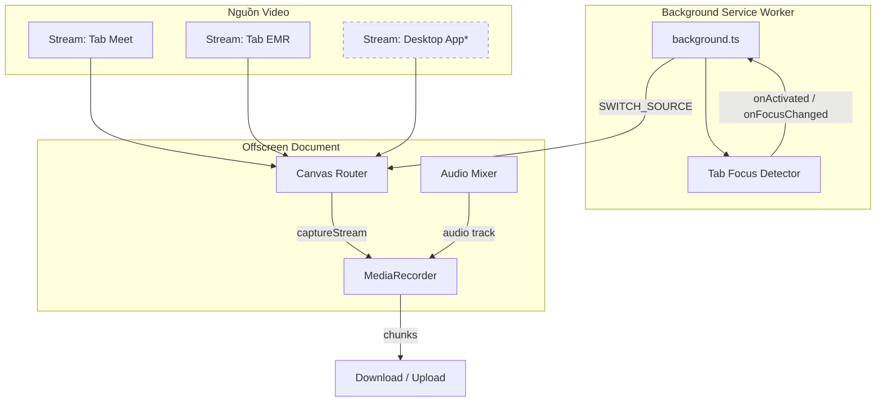
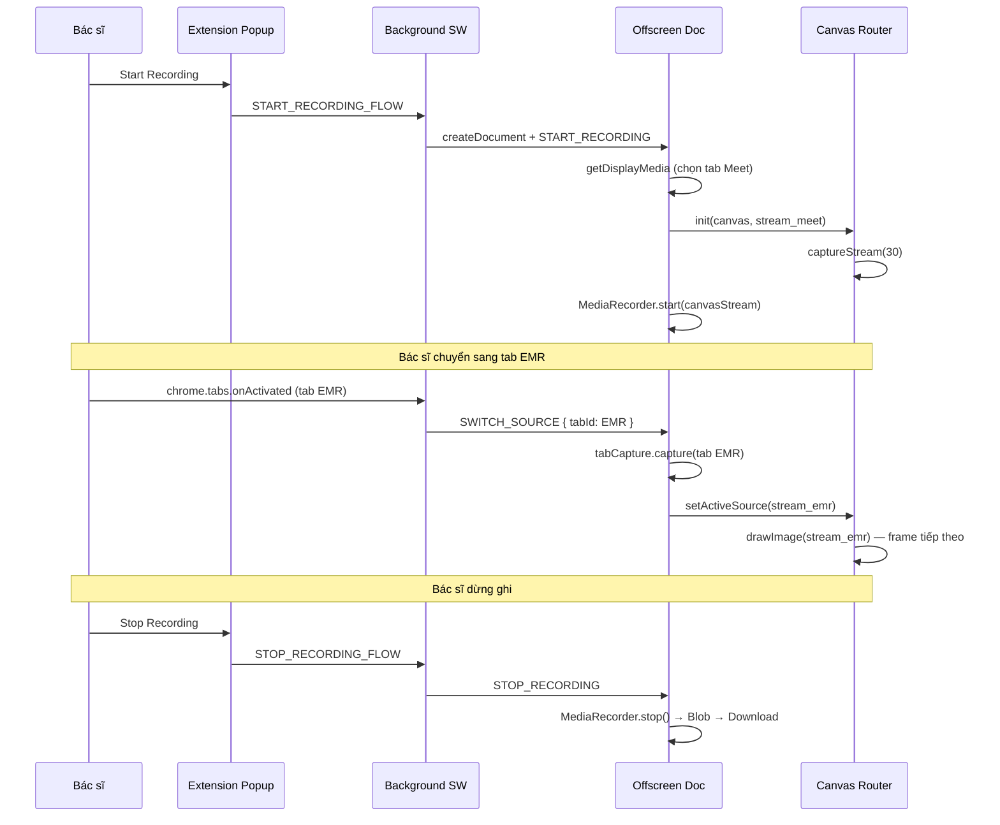

# Nghiên cứu Chuyên sâu: Ghi hình Focus 1-1 (Single Active Source Recording)

Tài liệu này tập trung phân tích phương pháp **Focus 1-1** — ghi hình **một nguồn duy nhất tại mỗi thời điểm**, tự động chuyển đổi nguồn khi bác sĩ thay đổi tab hoặc ứng dụng đang làm việc. Đây là phương án **P1** trong [research_multiple_sharing_recording.md](research_multiple_sharing_recording.md) và được khuyến nghị làm **MVP đầu tiên**.

---

## 1. Định nghĩa & Phạm vi

### 1.1. Focus 1-1 là gì?

**Focus 1-1** (Single Active Source Recording) là chiến lược ghi hình trong đó:

- Tại **bất kỳ thời điểm n nào**, chỉ **một nguồn video** được ghi vào file output.
- Khi bác sĩ chuyển focus (tab Chrome, cửa sổ khác), hệ thống **tự động chuyển nguồn** mà **không dừng** `MediaRecorder`.
- Output là **một file video duy nhất** chứa toàn bộ phiên tư vấn, với các đoạn nối tiếp nhau theo thứ tự thời gian thực.

```
Thời gian ──────────────────────────────────────────────►

Nguồn A (Google Meet)  ████████████
Nguồn B (Tab EMR)                    ████████
Nguồn C (X-Ray Viewer)                       ██████████

Output (1 file)        ████████████████████████████████████
                       [Meet segment][EMR segment][X-Ray segment]
```

### 1.2. Focus 1-1 KHÔNG phải là gì?

| Khái niệm | Focus 1-1 | Khác biệt |
| :--- | :---: | :--- |
| Ghi song song nhiều nguồn (Parallel) | ❌ | Parallel ghi 2–3 nguồn cùng lúc |
| Composite / PIP (ghép hình) | ❌ | Composite hiển thị nhiều nguồn trên 1 khung hình |
| Ghi toàn màn hình | ❌ | Full screen ghi mọi thứ, vi phạm HIPAA |
| Ghi 1 tab cố định không chuyển | ❌ | Tab cố định không theo focus bác sĩ |

### 1.3. Bối cảnh Telehealth

Trong phiên tư vấn y tế, bác sĩ thường chuyển qua lại giữa:
1. Cuộc gọi video với bệnh nhân (Google Meet / Teams / Zoom)
2. Bệnh án điện tử (EMR web hoặc desktop)
3. Trình xem chẩn đoán (DICOM, PDF lab results)

Focus 1-1 đảm bảo file ghi lại **đúng thứ bác sĩ đang xem** tại mỗi thời điểm, tạo bản ghi kiểm toán lâm sàng mà không lộ dữ liệu ngoài phạm vi.

---

## 2. Kiến trúc Focus 1-1

### 2.1. Sơ đồ Tổng thể



> [!NOTE]
> Stream Desktop App chỉ khả dụng với Native Helper (Giai đoạn 2).

### 2.2. Hai Biến thể Triển khai

| Biến thể | Phạm vi | Phát hiện focus | Capture nguồn |
| :--- | :--- | :--- | :--- |
| **P1a — Browser-Only** | Chỉ tab/cửa sổ Chrome | `chrome.tabs.onActivated`, `chrome.windows.onFocusChanged` | `chrome.tabCapture` / `getDisplayMedia` |
| **P1b — Hybrid** | Tab Chrome + app desktop | Browser APIs + Native Helper IPC | `getDisplayMedia` + Native Messaging |

### 2.3. Canvas Router — Thành phần Cốt lõi

Canvas Router là lớp trung gian thay thế việc ghi trực tiếp `MediaStream` nguồn (cách hiện tại trong [entrypoints/offscreen/main.ts](https://github.com/L-N-D/Meeting-Recorder-EXT/blob/v0.1/entrypoints/offscreen/main.ts)):

```
Luồng hiện tại (baseline):
  getDisplayMedia → videoTrack → MediaRecorder

Luồng Focus 1-1 (đề xuất):
  [Stream A, Stream B, Stream C] → Canvas Router → canvas.captureStream(30) → MediaRecorder
                                        ↑
                              switch active source tại đây
```

**Tại sao dùng Canvas thay vì thay track trực tiếp?**

| Phương pháp | Độ trễ chuyển | Rủi ro | MediaRecorder |
| :--- | :--- | :--- | :--- |
| Thay `videoTrack` trên MediaStream | 500ms – 1.5s | Gap/black frame trên output | Có thể bị pause/error |
| Canvas Router (vẽ nguồn mới) | <50ms | Không gap | Không bị ảnh hưởng |

---

## 3. Luồng Hoạt động Chi tiết

### 3.1. Sequence Diagram — Browser-Only (P1a)



### 3.2. Các Bước Khởi tạo

1. **User chọn nguồn ban đầu** qua `getDisplayMedia` (giữ UX quen thuộc, một lần duy nhất).
2. **Background SW đăng ký listeners:**
   - `chrome.tabs.onActivated` — tab nào active trong Chrome.
   - `chrome.windows.onFocusChanged` — cửa sổ Chrome nào được focus.
3. **Offscreen Document khởi tạo Canvas Router:**
   - Tạo `<canvas>` ẩn (1920×1080 hoặc match nguồn).
   - `requestAnimationFrame` loop vẽ frame từ nguồn active.
   - `canvas.captureStream(30)` → feed vào `MediaRecorder`.
4. **Audio luôn liên tục:** Mic + system audio được mix một lần qua [utils/audioMixer.ts](https://github.com/L-N-D/Meeting-Recorder-EXT/blob/v0.1/utils/audioMixer.ts), **không thay đổi** khi chuyển nguồn video.

### 3.3. Các Bước Chuyển Nguồn

```
1. Background nhận sự kiện tab activated (tabId = X)
2. Kiểm tra tabId X có trong danh sách "monitored tabs" không
   ├── Không → bỏ qua (tab không liên quan đến phiên tư vấn)
   └── Có → gửi SWITCH_SOURCE tới offscreen
3. Offscreen:
   a. tabCapture.capture({ tabId: X }) → newStream
   b. Canvas Router: activeSource = newStream (không stop MediaRecorder)
   c. Stop track cũ (giải phóng resource)
4. Frame tiếp theo của canvas vẽ từ newStream → output liên tục
```

**Thời gian chuyển mục tiêu:** <50ms (1–2 frame ở 30fps).

---

## 4. Phát hiện Focus — Chi tiết Kỹ thuật

### 4.1. Browser-Only Detection

| Sự kiện | API | Khi nào fire | Độ tin cậy |
| :--- | :--- | :--- | :---: |
| Tab activated | `chrome.tabs.onActivated` | User click tab khác trong cùng cửa sổ Chrome | Cao |
| Tab updated | `chrome.tabs.onUpdated` | URL thay đổi trong tab | Cao |
| Window focus | `chrome.windows.onFocusChanged` | User click cửa sổ Chrome khác | Cao |
| Tab visibility | `document.visibilityState` (content script) | Tab bị ẩn/hiện | Trung bình |
| Chrome mất focus | `chrome.windows.onFocusChanged(windowId=NONE)` | User click ra app ngoài Chrome | Cao (phát hiện) nhưng **không capture được app ngoài** |

### 4.2. Monitored Tabs — Whitelist

Không phải mọi tab Chrome đều được ghi khi active. Extension duy trì **whitelist** các tab/cửa sổ đã được user chọn lúc bắt đầu:

```typescript
interface MonitoredSource {
  id: string;           // tabId hoặc streamId
  type: 'tab' | 'window' | 'screen';
  label: string;        // "Google Meet", "EMR Portal"
  stream: MediaStream | null;
}
```

Khi bác sĩ chuyển sang tab **không** trong whitelist (ví dụ: Gmail cá nhân), Canvas Router **giữ nguyên nguồn cuối cùng** thay vì ghi tab mới — tránh vi phạm HIPAA.

### 4.3. Native Helper Detection (P1b — Giai đoạn 2)

| OS | API | Event | Latency |
| :--- | :--- | :--- | :--- |
| Windows | `SetWinEventHook(EVENT_SYSTEM_FOREGROUND)` | Cửa sổ foreground thay đổi | <10ms |
| macOS | `NSWorkspace.didActivateApplicationNotification` | App active thay đổi | <20ms |
| Linux X11 | `_NET_ACTIVE_WINDOW` property | Cửa sổ active thay đổi | <15ms |

Helper gửi message `{ type: 'FOCUS_CHANGED', windowId, appName, pid }` qua Native Messaging → Background SW → Offscreen.

---

## 5. Xử lý Âm thanh trong Focus 1-1

### 5.1. Nguyên tắc: Audio Không Chuyển Nguồn

Trong Focus 1-1, **audio track giữ nguyên xuyên suốt session** dù video source thay đổi:

```
Video:  [Meet] → [EMR] → [X-Ray]     (chuyển theo focus)
Audio:  [Mic + System Audio]          (cố định từ lúc bắt đầu)
```

**Lý do:**
- Tránh gap/khựng audio khi chuyển nguồn video.
- Đảm bảo giọng bác sĩ và bệnh nhân luôn được ghi, kể cả khi bác sĩ xem EMR (Meet vẫn phát audio nền).
- Đơn giản hóa pipeline — không cần re-mix audio mỗi lần switch.

### 5.2. Cấu hình Audio theo OS

| OS | Nguồn audio bệnh nhân | Cấu hình |
| :--- | :--- | :--- |
| Windows | System loopback (WASAPI) | Chọn "Entire Screen" + "Share audio" lúc bắt đầu |
| Windows (tốt hơn) | Tab audio (Meet tab) | Chọn "Chrome Tab" + "Share audio" — tránh thu email/notification |
| macOS | Tab audio only | Chọn tab Meet + "Share tab audio"; system loopback cần BlackHole |
| Linux | Tab audio hoặc PipeWire monitor | Chọn tab hoặc monitor source |

### 5.3. Tránh Echo / Double Mixing

> [!WARNING]
> **Scenario nguy hiểm:** Ghi system audio (chứa Meet) **và** capture tab Meet riêng.
> 
> **Giải pháp:**
> - Chỉ chọn **một** nguồn audio: hoặc system loopback, hoặc tab audio.
> - Nếu dùng tab audio cho Meet: khi chuyển sang tab EMR (không có audio), audio track vẫn giữ stream Meet ban đầu.
> - Trong [utils/audioMixer.ts](https://github.com/L-N-D/Meeting-Recorder-EXT/blob/v0.1/utils/audioMixer.ts): mic route vào destination, system audio route vào destination **và** `audioContext.destination` (để bác sĩ nghe được).

---

## 6. So sánh Focus 1-1 với Các Phương án Khác

### 6.1. Ma trận So sánh

| Tiêu chí | Focus 1-1 (P1) | Composite (P2) | Parallel (P3) | Full Screen (P5) |
| :--- | :---: | :---: | :---: | :---: |
| Khả năng Implement | **Cao** | Cao | Trung bình | Cao |
| Độ ổn định | **Cao** | Trung bình | Thấp | Cao |
| Độ phức tạp | **Thấp** | Trung bình | Cao | Thấp |
| Performance | **Cao** | Trung bình | Thấp | Cao |
| Production (HIPAA) | **Cao** | Cao | Trung bình | Thấp |
| Đa OS | Trung bình – Cao | Trung bình | Trung bình | Cao |
| UX bác sĩ | **Tốt** (tự động) | Tốt | Kém (nhiều dialog) | Kém (lộ data) |
| Giá trị kiểm toán lâm sàng | **Cao** | Cao | Cao | Thấp |

### 6.2. Khi nào nên dùng Focus 1-1?

| Scenario | Focus 1-1 phù hợp? | Lý do |
| :--- | :---: | :--- |
| Bác sĩ xem từng tài liệu một (EMR → X-Ray → Meet) | ✅ | Ghi đúng thứ bác sĩ focus |
| Cần ghi đồng thời cuộc gọi + EMR trên cùng khung hình | ❌ → dùng P2 | Focus 1-1 chỉ ghi 1 nguồn tại 1 thời điểm |
| Workflow 100% trên Chrome tabs | ✅ | P1a đủ, không cần Native Helper |
| Bác sĩ dùng EMR desktop app | ⚠️ → cần P1b | Browser-Only không detect app ngoài Chrome |
| Phiên tư vấn >1 giờ | ✅ | 1 encoder, ổn định dài hạn |
| Máy cấu hình thấp (i5 gen 8, 8GB) | ✅ | CPU 10–20%, thấp nhất trong các phương án multi-source |

---

## 7. Gap Analysis — Codebase Hiện tại vs Focus 1-1

### 7.1. Những gì đã có

| Thành phần | File | Trạng thái |
| :--- | :--- | :---: |
| Offscreen document cho capture | [entrypoints/offscreen/main.ts](https://github.com/L-N-D/Meeting-Recorder-EXT/blob/v0.1/entrypoints/offscreen/main.ts) | ✅ |
| MediaRecorder lifecycle + chunk | [utils/recording.ts](https://github.com/L-N-D/Meeting-Recorder-EXT/blob/v0.1/utils/recording.ts) | ✅ |
| Audio mixing (mic + system) | [utils/audioMixer.ts](https://github.com/L-N-D/Meeting-Recorder-EXT/blob/v0.1/utils/audioMixer.ts) | ✅ |
| Background orchestrator | [entrypoints/background.ts](https://github.com/L-N-D/Meeting-Recorder-EXT/blob/v0.1/entrypoints/background.ts) | ✅ |
| Popup UI start/stop | [components/RecorderControls.tsx](https://github.com/L-N-D/Meeting-Recorder-EXT/blob/v0.1/components/RecorderControls.tsx) | ✅ |
| Download file sau ghi | [entrypoints/background.ts](https://github.com/L-N-D/Meeting-Recorder-EXT/blob/v0.1/entrypoints/background.ts) | ✅ |

### 7.2. Những gì cần xây dựng

| Thành phần | Mô tả | Effort |
| :--- | :--- | :--- |
| **Canvas Router** | Module vẽ nguồn active lên canvas, `captureStream()` | 3–4 ngày |
| **Tab Focus Detector** | Listener `chrome.tabs.onActivated` + whitelist logic | 2 ngày |
| **Source Switch Handler** | Nhận `SWITCH_SOURCE`, gọi `tabCapture`, cập nhật Canvas Router | 2–3 ngày |
| **Monitored Sources Manager** | UI chọn/ quản lý danh sách tab theo dõi | 2 ngày |
| **Quyền `tabs`** | Thêm vào [wxt.config.ts](https://github.com/L-N-D/Meeting-Recorder-EXT/blob/v0.1/wxt.config.ts) | 0.5 ngày |
| **Switch latency test** | Đo và tối ưu thời gian chuyển nguồn | 1–2 ngày |
| **Chunk storage (IndexedDB)** | Thay blob RAM bằng ghi chunk realtime | 3 ngày |

**Tổng effort P1a (Browser-Only):** ~2–3 tuần.

### 7.3. Thay đổi Kiến trúc

```
Hiện tại:
  background.ts ──► offscreen/main.ts ──► getDisplayMedia ──► ScreenRecorder

Focus 1-1:
  background.ts ──► TabFocusDetector ──► SWITCH_SOURCE message
       │                                        │
       └──► offscreen/main.ts ◄────────────────┘
                │
                ├── CanvasRouter (NEW)
                │     ├── activeSource: MediaStream
                │     ├── renderLoop: requestAnimationFrame
                │     └── captureStream(30) → MediaStream
                │
                ├── audioMixer.ts (giữ nguyên, audio cố định)
                └── ScreenRecorder (giữ nguyên, ghi canvas stream)
```

---

## 8. Canvas Router — Thiết kế Module

### 8.1. Interface

```typescript
interface CanvasRouterOptions {
  width: number;    // 1920
  height: number;   // 1080
  fps: number;      // 30
}

class CanvasRouter {
  private canvas: HTMLCanvasElement;
  private ctx: CanvasRenderingContext2D;
  private activeSource: MediaStream | null;
  private videoElement: HTMLVideoElement;
  private animFrameId: number;

  constructor(options: CanvasRouterOptions);

  /** Gán nguồn video mới — gọi khi chuyển focus */
  setActiveSource(stream: MediaStream): void;

  /** Trả về MediaStream từ canvas để feed MediaRecorder */
  getOutputStream(): MediaStream;

  /** Dọn dẹp */
  destroy(): void;
}
```

### 8.2. Render Loop

```typescript
private renderLoop = () => {
  if (this.activeSource && this.videoElement.readyState >= 2) {
    this.ctx.drawImage(
      this.videoElement,
      0, 0,
      this.canvas.width,
      this.canvas.height
    );
  }
  this.animFrameId = requestAnimationFrame(this.renderLoop);
};
```

### 8.3. Chuyển Nguồn

```typescript
setActiveSource(stream: MediaStream): void {
  // Stop old video element
  if (this.videoElement.srcObject) {
    const oldStream = this.videoElement.srcObject as MediaStream;
    oldStream.getVideoTracks().forEach(t => t.stop());
  }

  // Attach new source
  this.activeSource = stream;
  this.videoElement.srcObject = stream;
  this.videoElement.play();

  // MediaRecorder KHÔNG bị ảnh hưởng — vẫn ghi canvas.captureStream()
}
```

---

## 9. Đánh giá Focus 1-1 theo 6 Tiêu chí

### 9.1. Bảng Tổng hợp

| Tiêu chí | P1a (Browser-Only) | P1b (Hybrid) | Ghi chú |
| :--- | :---: | :---: | :--- |
| **Khả năng Implement** | Cao | Trung bình | P1a mở rộng codebase hiện tại; P1b thêm Native Helper |
| **Độ ổn định** | Cao | Trung bình – Cao | 1 encoder, audio cố định; P1b phụ thuộc IPC |
| **Độ phức tạp** | Thấp | Trung bình – Cao | Canvas Router là module duy nhất mới (P1a) |
| **Performance** | Cao | Cao | CPU 10–20%, RAM 100–200MB |
| **Production** | Trung bình – Cao | Cao | P1a = MVP; P1b = production đầy đủ |
| **Đa OS** | Trung bình | Cao | P1a: chỉ Chrome tabs; P1b: + desktop apps |

### 9.2. Chi tiết Độ ổn định

| Scenario | Hành vi mong đợi | Rủi ro | Mitigation |
| :--- | :--- | :--- | :--- |
| Chuyển tab 50 lần trong 1 giờ | Video liên tục, không gap | Track cũ leak memory | Stop old track sau mỗi switch |
| Session 2 giờ liên tục | File playable, audio liên tục | RAM tăng dần (chunks) | Ghi chunk xuống IndexedDB mỗi 30s |
| Tab bị đóng giữa session | Canvas giữ frame cuối hoặc fallback | Frozen frame trên output | Detect `tab.onRemoved`, notify user |
| Chrome bị minimize | Canvas vẫn render (offscreen) | Không ảnh hưởng | Offscreen doc không bị throttle |
| User stop share (native bar) | Dừng ghi toàn bộ | Mất session | `videoTrack.onended` handler (đã có) |

### 9.3. Chi tiết Performance

Benchmark ước tính trên Intel i5-8250U, 8GB RAM, Chrome 120+:

| Metric | P1a (1 nguồn 1080p) | Baseline hiện tại (1 nguồn) | Overhead Canvas |
| :--- | :--- | :--- | :--- |
| CPU | 12–18% | 10–15% | +2–3% (drawImage) |
| RAM | 120–180 MB | 80–150 MB | +40 MB (canvas buffer) |
| Switch latency | 30–50 ms | N/A | — |
| Encode bitrate | 2–4 Mbps | 2–4 Mbps | Không đổi |

**Kết luận:** Overhead Canvas Router chấp nhận được (<5% CPU, <50MB RAM).

---

## 10. Lộ trình Triển khai Focus 1-1

### 10.1. Giai đoạn 1a — Browser-Only MVP (2 tuần)

| Tuần | Task | Deliverable |
| :--- | :--- | :--- |
| **W1** | Canvas Router module + unit test | `utils/canvasRouter.ts` |
| **W1** | Tích hợp Canvas Router vào offscreen | offscreen ghi canvas stream thay vì direct stream |
| **W1** | Tab Focus Detector trong background | `chrome.tabs.onActivated` listener |
| **W2** | Source Switch Handler (tabCapture → Canvas) | Chuyển tab tự động khi ghi |
| **W2** | Monitored Sources whitelist | Chỉ switch giữa tab đã chọn |
| **W2** | Test: 1 giờ ghi + 30 lần chuyển tab | Pass soak test |

### 10.2. Giai đoạn 1b — Hybrid Extension (4 tuần, sau MVP)

| Tuần | Task | Deliverable |
| :--- | :--- | :--- |
| **W3–W4** | Native Helper Windows (C#) | Focus detection + Native Messaging |
| **W5** | Native Helper macOS (Swift) | Tương tự Windows |
| **W6** | Tích hợp IPC → Canvas Router | Switch sang desktop app capture |
| **W6** | Fallback logic + heartbeat | Graceful degradation về P1a |

### 10.3. Quyền Extension cần thêm

```typescript
// wxt.config.ts — bổ sung cho Focus 1-1
permissions: [
  'offscreen',
  'desktopCapture',
  'downloads',
  'activeTab',
  'tabs',           // NEW: tab focus detection
  'tabCapture',     // NEW: capture tab programmatically
  'storage',        // NEW: lưu monitored sources config
]
```

---

## 11. Rủi ro & Giảm thiểu (Focus 1-1)

| Rủi ro | Xác suất | Mức độ | Giảm thiểu |
| :--- | :---: | :---: | :--- |
| Gap video khi switch | Thấp | Cao | Canvas Router (<50ms); không restart MediaRecorder |
| Tab capture resolution thấp | Trung bình | Trung bình | `tabCapture` max 720p — chấp nhận cho EMR text; 1080p cho Meet qua getDisplayMedia |
| Audio mất khi chuyển tab | Thấp | Nghiêm trọng | Audio track cố định, không gắn với video source |
| Whitelist miss tab quan trọng | Trung bình | Trung bình | UI cho phép thêm tab vào whitelist mid-session |
| `tabCapture` fail (tab chưa load) | Trung bình | Thấp | Retry 3 lần; giữ nguồn cũ nếu fail |
| Canvas OOM (session dài) | Trung bình | Cao | Chunk storage IndexedDB thay blob RAM |

---

## 12. Kết luận

**Focus 1-1 (P1) là phương án tối ưu cho MVP** vì:

1. **Implement nhanh nhất** (~2 tuần) — mở rộng trực tiếp codebase hiện tại.
2. **Performance tốt nhất** trong các phương án multi-source (1 encoder, 1 canvas draw).
3. **Ổn định cao nhất** — audio cố định, MediaRecorder không restart khi switch.
4. **HIPAA-safe** — chỉ ghi tab/cửa sổ trong whitelist, không full screen.
5. **Nền tảng cho P2/P4** — Canvas Router là shared component cho Composite và Hybrid.

**Khuyến nghị hành động:**
- Bắt đầu **Giai đoạn 1a** ngay — xây Canvas Router + Tab Focus Detector.
- Song song chuẩn bị **Production Checklist** (Mục 12 trong [research_multiple_sharing_recording.md](research_multiple_sharing_recording.md)).
- Sau MVP ổn định, mở rộng sang **P1b (Hybrid)** nếu bác sĩ cần ghi app desktop ngoài Chrome.
