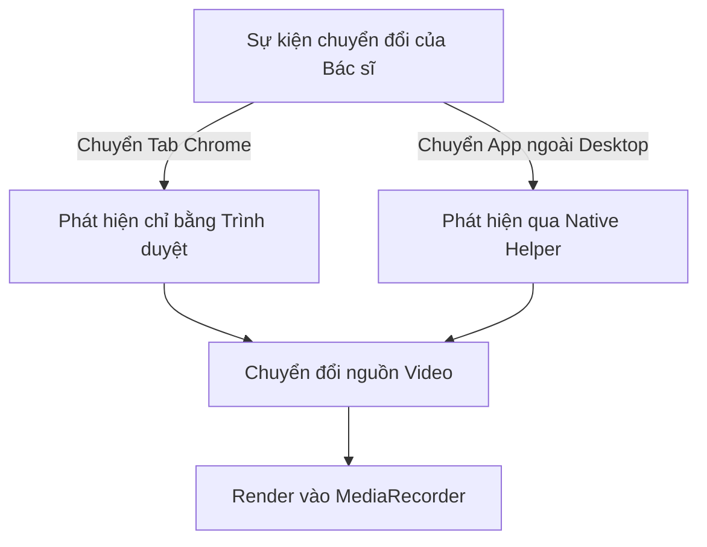
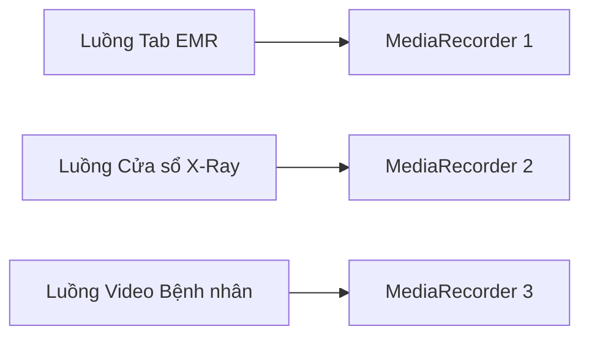
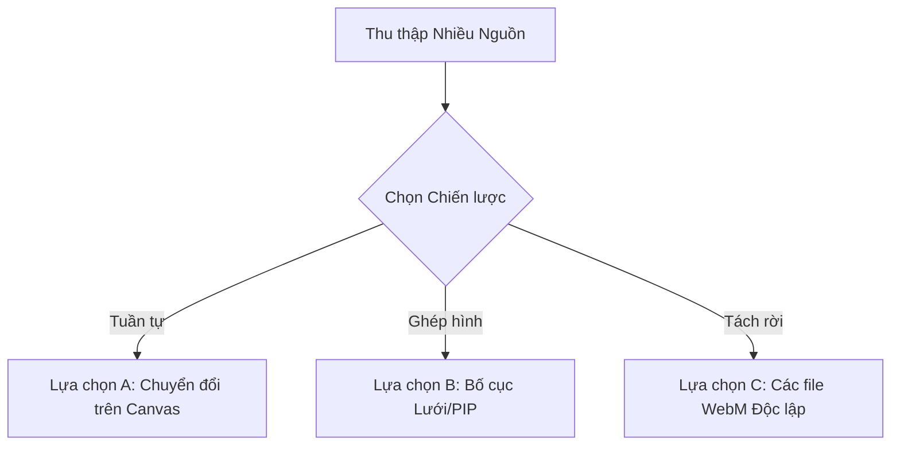
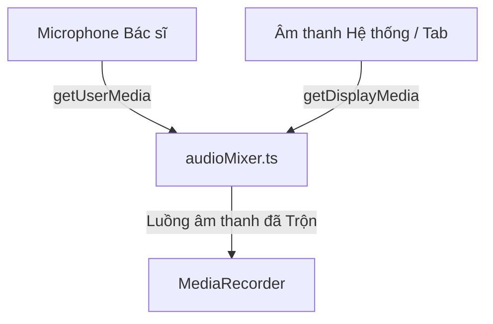
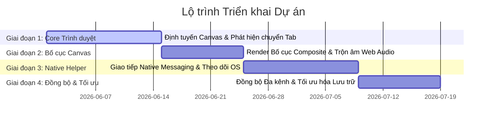
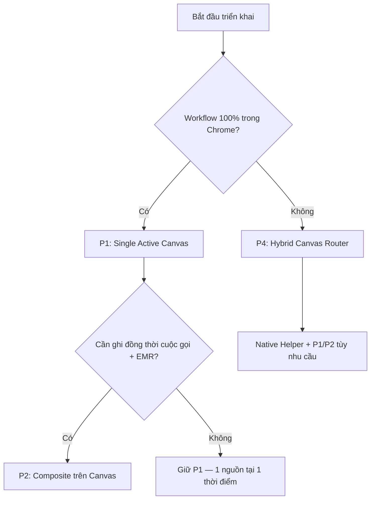

# Tài liệu Nghiên cứu & Đánh giá Khả thi: Ghi hình Nhiều Nguồn Chia sẻ trên Browser Extension

Tài liệu nghiên cứu này phân tích các thách thức kỹ thuật, tính khả thi và các chiến lược triển khai để ghi lại nhiều nguồn nội dung trong một browser extension phục vụ cho lĩnh vực y tế từ xa (telemedicine). Tài liệu chi tiết hóa cơ chế theo dõi nguồn hoạt động, mã hóa luồng song song, điều hướng/trộn âm thanh, tối ưu hóa trải nghiệm người dùng (UX), các hạn chế đa nền tảng và đề xuất kiến trúc triển khai theo từng giai đoạn.

---

## 1. Định nghĩa Vấn đề & Bối cảnh Y tế từ xa (Telehealth)

Trong y tế từ xa, không gian làm việc số của bác sĩ trong một phiên tư vấn cho bệnh nhân rất động và thay đổi liên tục. Một phiên tư vấn điển hình thường bao gồm:
*   **Luồng Giao tiếp:** Cuộc gọi video/audio tư vấn trực tiếp (ví dụ: Google Meet, Microsoft Teams, Zoom).
*   **Bệnh án Điện tử (EMR):** Các cổng thông tin web hoặc ứng dụng desktop để ghi chép bệnh án và xem lịch sử bệnh nhân.
*   **Công cụ Chẩn đoán:** Trình xem X-Ray/MRI (DICOM web viewers), bảng kết quả xét nghiệm hoặc báo cáo PDF.

### Vấn đề
Các công cụ ghi màn hình truyền thống của trình duyệt chỉ ghi lại một tab duy nhất, một cửa sổ ứng dụng duy nhất hoặc toàn bộ màn hình:
1.  **Ghi hình một Tab/Cửa sổ:** Nếu bác sĩ chuyển từ cuộc gọi video sang tab EMR hoặc trình xem X-Ray bên ngoài, trình ghi hình sẽ không ghi lại nội dung mới được focus, làm mất đi bối cảnh tương tác chẩn đoán quan trọng.
2.  **Ghi hình toàn bộ Màn hình:** Ghi lại toàn bộ màn hình nền sẽ chụp lại tất cả mọi thứ, nhưng điều này dẫn đến rủi ro nghiêm trọng về bảo mật thông tin và tuân thủ pháp lý y tế (ví dụ: hiển thị thông báo hệ điều hành, ứng dụng chat cá nhân, email hoặc hồ sơ của bệnh nhân khác). Điều này vi phạm các quy định về quyền riêng tư chăm sóc sức khỏe như HIPAA và GDPR.

### Mục tiêu
Chúng ta cần một giải pháp ghi hình hỗ trợ **nhiều kịch bản chia sẻ nội dung** đồng thời đảm bảo:
*   **Độ tin cậy cao:** Không bị mất dữ liệu âm thanh hoặc video trong suốt quá trình tư vấn.
*   **Độ chính xác lâm sàng:** Đồng bộ hóa chính xác giữa âm thanh và video để bảo toàn bối cảnh chẩn đoán.
*   **Ảnh hưởng hiệu năng thấp:** Tránh làm quá tải CPU/GPU trên các máy tính cấu hình văn phòng phổ thông của bệnh viện.
*   **Trải nghiệm người dùng (UX) liền mạch:** Giảm thiểu tối đa các thao tác thủ công từ bác sĩ trong quy trình làm việc của họ.

---

## 2. Ghi hình Một Nguồn Hoạt động Duy nhất (Single Active Source Recording)

Ghi hình một nguồn hoạt động duy nhất là kịch bản chỉ ghi lại một nguồn nội dung tại một thời điểm nhất định, nhưng cho phép nguồn hoạt động này thay đổi linh hoạt khi bác sĩ chuyển đổi qua lại giữa các ứng dụng hoặc tab.



### Nghiên cứu Kỹ thuật

#### Browser Extension có thể phát hiện các tab đang hoạt động không?
**Có.** Browser extension có quyền truy cập đầy đủ vào các API điều hướng và trạng thái tab của Chrome:
*   `chrome.tabs.onActivated`: Kích hoạt khi tab hoạt động trong một cửa sổ thay đổi.
*   `chrome.tabs.onUpdated`: Kích hoạt khi URL, tiêu đề hoặc trạng thái tải của tab thay đổi, cho phép theo dõi điều hướng bên trong cùng một tab.
*   `chrome.windows.onFocusChanged`: Theo dõi khi người dùng chuyển đổi giữa các cửa sổ Chrome khác nhau.

#### Browser Extension có thể phát hiện các ứng dụng/cửa sổ đang hoạt động trên OS không?
**Không thể trực tiếp.** Do cơ chế bảo mật sandbox, trình duyệt không thể truy vấn trạng thái focus cửa sổ ở cấp độ hệ điều hành. Extension không thể biết khi nào bác sĩ chuyển sang một ứng dụng desktop ngoài trình duyệt (chẳng hạn như phần mềm EMR cài trên máy hoặc trình xem DICOM offline) nếu chỉ dùng API Web tiêu chuẩn. Cần một ứng dụng hỗ trợ chạy dưới máy (**Native Helper**) cho việc này.

#### Browser Extension có thể phát hiện màn hình (monitor) đang hoạt động không?
**Không.** Mặc dù trình duyệt có thể truy vấn các thuộc tính màn hình (ví dụ: thông qua Window Management API hoặc `window.screen`), nó không thể theo dõi monitor vật lý nào đang được xem, màn hình nào đang có con trỏ chuột focus hoặc đang nhận đầu vào của người dùng.

#### Các API Trình duyệt có sẵn
*   `navigator.mediaDevices.getDisplayMedia()`: Yêu cầu người dùng chọn màn hình/cửa sổ/tab thông qua hộp thoại hệ thống và trả về một luồng `MediaStream`.
*   `chrome.desktopCapture.chooseDesktopMedia()`: API của extension hiển thị hộp thoại chọn nguồn của Chrome và trả về một `streamId` để truyền vào `navigator.mediaDevices.getUserMedia()`.
*   [entrypoints/offscreen/main.ts](https://github.com/L-N-D/Meeting-Recorder-EXT/blob/v0.1/entrypoints/offscreen/main.ts): Được sử dụng để chạy các API này trong một tài liệu ẩn (Offscreen Document) nhằm đảm bảo quá trình ghi hình vẫn tiếp tục chạy ngầm ổn định.

#### Khi nào cần ứng dụng Native Helper?
Cần có ứng dụng Native Helper khi muốn:
1.  Phát hiện khi một ứng dụng desktop ngoài trình duyệt được focus trên OS.
2.  Theo dõi vị trí con trỏ chuột trên các màn hình vật lý khác nhau để suy đoán màn hình nào đang hoạt động.
3.  Thực hiện chuyển đổi nguồn video mượt mà mà không phải hiển thị lại hộp thoại yêu cầu quyền của Chrome (vốn bắt buộc đối với `getDisplayMedia` vì lý do bảo mật).

### Đánh giá các phương án

| Tiêu chí | Tiếp cận chỉ bằng Trình duyệt (Browser-Only) | Tiếp cận kết hợp Native Helper (Hybrid) |
| :--- | :--- | :--- |
| **Độ phức tạp** | **Thấp:** Sử dụng các Web API tiêu chuẩn; không yêu cầu cài đặt phần mềm bên ngoài. | **Cao:** Đòi hỏi biên dịch, phân phối và thiết lập giao tiếp IPC với một file thực thi riêng cho từng OS. |
| **Độ tin cậy** | **Cao:** Sử dụng các luồng API đã được tối ưu hóa cực tốt của nhân Chrome. | **Trung bình - Cao:** Phụ thuộc vào độ ổn định của giao tiếp liên tiến trình (IPC) và tiến trình chạy ẩn của Helper. |
| **Ảnh hưởng UX** | **Trung bình:** Chuyển tab trong Chrome rất mượt, nhưng chuyển sang app ngoài bắt buộc phải ghi toàn màn hình (rủi ro bảo mật) hoặc hiển thị lại hộp thoại cấp quyền liên tục. | **Tốt xuất sắc:** Tự động phát hiện và chuyển đổi ghi hình các ứng dụng ngoài desktop mà không cần bất kỳ pop-up yêu cầu cấp quyền nào từ người dùng. |
| **Ảnh hưởng Hiệu năng** | **Tối thiểu:** Chỉ mã hóa (encode) một luồng video 1080p duy nhất. | **Thấp - Trung bình:** Thêm một lượng nhỏ tài nguyên hao tổn cho Helper truy vấn OS và gửi tin nhắn IPC. |

---

## 3. Ghi hình Song song (Parallel Recording - Nhiều Nguồn Đồng thời)

Ghi hình song song là việc thu thập nhiều nguồn (ví dụ: tab EMR, cửa sổ X-Ray và camera của bác sĩ) cùng một lúc dưới dạng các luồng độc lập.



### Nghiên cứu Kỹ thuật

#### Chrome Extension có thể ghi nhiều nguồn cùng lúc không?
**Có, nhưng có giới hạn nghiêm ngặt.** Một extension có thể giữ nhiều đối tượng `MediaStream` cùng một lúc. Tuy nhiên, việc thu thập nhiều nguồn màn hình/cửa sổ thông qua `getDisplayMedia` đòi hỏi phải gọi API này nhiều lần.
Mỗi lần gọi, Chrome sẽ bắt buộc hiển thị một hộp thoại cấp quyền riêng biệt. Việc yêu cầu bác sĩ phải xác nhận 3-4 hộp thoại chọn nguồn liên tục khi bắt đầu cuộc gọi y tế là một trải nghiệm người dùng rất tệ.

#### Các API hỗ trợ
*   `navigator.mediaDevices.getDisplayMedia()` chạy trong bối cảnh offscreen (ví dụ: [entrypoints/offscreen/main.ts](https://github.com/L-N-D/Meeting-Recorder-EXT/blob/v0.1/entrypoints/offscreen/main.ts)).
*   `chrome.tabCapture.capture()`: Ghi hình tab hiện tại theo lập trình mà không cần hộp thoại chọn, nhưng bị giới hạn trong phạm vi tab của extension, độ phân giải thấp và yêu cầu tương tác kích hoạt thủ công.

#### Giới hạn Số lượng Luồng và Ảnh hưởng Hiệu năng
Mã hóa nhiều luồng video cùng lúc phụ thuộc vào bộ mã hóa phần cứng (hardware encoder) hoặc phần mềm chạy trong tiến trình trình duyệt.

1.  **2 luồng 1080p 30fps (Băng thông khoảng 4-6 Mbps kết hợp):**
    *   **CPU:** Chiếm khoảng 15% - 25% trên các dòng CPU Intel i5/i7 thế hệ mới hoặc Apple Silicon.
    *   **Bộ nhớ (RAM):** Cần khoảng 150MB - 300MB làm bộ đệm.
    *   **Khả thi:** Hoàn toàn khả thi trên các máy tính cấu hình trung bình.
2.  **3 luồng 1080p 30fps (Băng thông khoảng 6-9 Mbps kết hợp):**
    *   **CPU:** Chiếm khoảng 35% - 50%. Có nguy cơ cao kích hoạt quạt tản nhiệt hết công suất và gây giảm xung nhịp do nhiệt độ (thermal throttling) trên các máy laptop y tế đời cũ.
    *   **Bộ nhớ (RAM):** Khoảng 300MB - 500MB.
    *   **Khả thi:** Rủi ro cao. Hiện tượng mất khung hình (frame drops) có thể xảy ra nếu CPU bị quá tải bởi các ứng dụng khác (ví dụ: EMR tải dữ liệu nặng).
3.  **Ghi màn hình 4K (Băng thông khoảng 10-15 Mbps):**
    *   **CPU:** Một luồng 4K ở tốc độ 30fps tương đương xử lý ~8.3 triệu pixel mỗi frame (gấp 4 lần 1080p). Việc mã hóa phần mềm 4K thời gian thực cực kỳ nặng.
    *   **Khả thi:** Ghi màn hình 4K song song với các luồng khác rất dễ gây lag giật, mất đồng bộ âm thanh-video hoặc làm sập (crash) trang offscreen do tràn bộ nhớ.
4.  **Nhiều màn hình vật lý:**
    *   Việc ghi hai màn hình vật lý cùng lúc yêu cầu hai nguồn capture từ `getDisplayMedia`. Điều này nhân đôi tải xử lý CPU và yêu cầu hai bộ mã hóa hoạt động đồng thời, vượt quá giới hạn an toàn trên các máy tính thông thường của bệnh viện.

---

## 4. Chiến lược Xuất Video (Output Video Strategies)

Khi chúng ta thu thập từ nhiều nguồn, cần phải chọn phương án đóng gói video đầu ra.



### Lựa chọn A — Một Video Duy nhất (Tuần tự)
Chỉ có nguồn đang hoạt động được ghi vào file video tại bất kỳ mốc thời gian nào.

*   **Chiến lược chuyển đổi nguồn:**
    Thay vì dừng và bắt đầu lại `MediaRecorder` liên tục (tạo ra nhiều file nhỏ rời rạc), extension nên hướng tất cả các luồng vào một HTML5 `<canvas>` ẩn (chạy ngầm trong offscreen document) làm "bộ định tuyến video". Canvas này sẽ vẽ liên tục các khung hình của luồng đang hoạt động lên ngữ cảnh của nó, và ta sẽ ghi lại chính luồng canvas đó:
    ```javascript
    const stream = canvas.captureStream(30);
    ```
    Khi cần chuyển đổi nguồn, chỉ cần cập nhật hàm render để vẽ luồng mới thay thế cho luồng cũ.
*   **Giải pháp ghép các đoạn video:** Nếu không dùng Canvas mà xuất ra các file nhỏ riêng biệt, chúng cần được ghép lại:
    *   *WebAssembly FFmpeg (FFmpeg.wasm):* Ghép video trực tiếp ở client nhưng yêu cầu tải file WASM lớn (>30MB), tốn bộ nhớ và có thể làm đơ trình duyệt trong lúc xử lý.
    *   *Ghép video phía Máy chủ (Server-Side):* Client tải lên các đoạn video WebM tuần tự lên server, server sẽ sử dụng FFmpeg chạy ngầm để nối chúng lại nhanh chóng. Đây là phương pháp khuyên dùng để đảm bảo an toàn dữ liệu y tế.
*   **Khoảng trống ghi hình (Recording Gaps):** Chuyển đổi bằng Canvas có độ trễ cực thấp (<50ms). Trong khi đó, việc chuyển đổi luồng trực tiếp bằng cách thay thế track WebRTC thông thường có thể làm đứng hình video từ 500ms đến 1.5s.

### Lựa chọn B — Một Video Duy nhất (Ghép hình - Composite)
Nhiều nguồn video được thu thập đồng thời và kết hợp thành một bố cục duy nhất (ví dụ: song song hai bên hoặc hình-trong-hình - PIP) trên một canvas chung.

*   **Tính khả thi của việc ghép hình bằng Canvas:** Rất khả thi. Sử dụng `CanvasRenderingContext2D.drawImage()`, ta có thể ánh xạ các luồng khác nhau vào các góc tương ứng của một canvas độ phân giải 1920x1080.
*   **Yêu cầu mã hóa:** Chỉ cần chạy một instance `MediaRecorder` duy nhất, giảm tải lưu trữ. Tuy nhiên, trình duyệt phải giải mã (decode) tất cả các luồng đầu vào trong thời gian thực trước khi vẽ chúng lên canvas, làm tăng tải giải mã của GPU/CPU.
*   **Thách thức đồng bộ Âm thanh-Video:** Do việc vẽ khung hình canvas chạy trên luồng chính của trình duyệt (hoặc offscreen worker), nếu CPU bị quá tải, việc vẽ hình sẽ bị trễ. Trong khi đó, âm thanh được trộn bằng Web Audio API chạy trên một luồng hệ thống riêng có độ ưu tiên cao. Sự lệch pha này dẫn đến hiện tượng hình ảnh bị chậm hơn so với tiếng (lệch pha audio-video).

### Lựa chọn C — Các Video Tách rời
Mỗi nguồn video tạo ra và lưu trữ một file video hoàn toàn độc lập.

*   **Yêu cầu lưu trữ:** Rất cao. Việc lưu trữ ba luồng độc lập làm tăng dung lượng ổ cứng gấp ba lần, gây đầy bộ nhớ IndexedDB cục bộ và tăng thời gian upload lên máy chủ qua mạng internet của phòng khám.
*   **Độ phức tạp khi phát lại (Playback):** Việc phát đồng bộ nhiều file video trên trình duyệt đòi hỏi phải viết code JS tùy biến sử dụng `requestAnimationFrame` để theo dõi và điều chỉnh `playbackRate` của các video chạy chậm hơn nhằm khớp với một đồng hồ thời gian chung.
*   **Khía cạnh Pháp lý & Y tế:** Đem lại tính toàn vẹn cao nhất cho hồ sơ bệnh án (không có nội dung nào bị che khuất hay cắt bỏ), nhưng quản lý nhiều file làm tăng rủi ro thất lạc file, lỗi tải lên một phần hoặc ghép sai video vào hồ sơ bệnh nhân.

---

## 5. Nghiên cứu Xử lý Âm thanh (Audio Handling Research)

Quy định y tế yêu cầu ghi lại rõ ràng giọng nói của cả bác sĩ (microphone) và bệnh nhân (âm thanh hệ thống/tab), kết hợp với bất kỳ âm thanh nào phát ra từ các công cụ chẩn đoán.



### Thu âm Thanh Hệ thống (Master Audio)

#### Browser Extension có thể truy cập trực tiếp âm thanh hệ thống không?
**Không.** Vì lý do bảo mật, trình duyệt không thể trực tiếp can thiệp vào luồng âm thanh đầu ra của OS.
*   **Giải pháp trên Chrome:** Khi người dùng bắt đầu `getDisplayMedia`, họ phải tích vào ô "Share audio" (chỉ có trên Windows khi chọn "Toàn màn hình", hoặc trên các nền tảng khi chọn "Tab Chrome"). Luồng âm thanh này sau đó mới có thể được lấy ra và xử lý như trong [utils/audioMixer.ts](https://github.com/L-N-D/Meeting-Recorder-EXT/blob/v0.1/utils/audioMixer.ts).
*   **Hạn chế theo Hệ điều hành:**
    *   *Windows:* Hỗ trợ tốt qua WASAPI Loopback khi chọn chia sẻ "Toàn màn hình".
    *   *macOS:* CoreAudio mặc định chặn loopback âm thanh hệ thống. Trình duyệt không thể ghi âm thanh hệ thống trừ khi người dùng cài một thiết bị âm thanh ảo bên thứ ba (ví dụ: *BlackHole* hoặc *Loopback*) và chọn nó làm thiết bị đầu ra mặc định.
    *   *Linux:* Hỗ trợ sẵn thông qua các monitor source của PipeWire/PulseAudio.

#### Rủi ro tiếng Vọng (Echo) và Trộn trùng lặp (Double Mixing)
Nếu bác sĩ chọn ghi toàn bộ màn hình (thu âm hệ thống) đồng thời ghi cả tab Google Meet, giọng nói của bệnh nhân sẽ bị thu lại hai lần: một lần từ luồng âm thanh hệ thống và một lần từ luồng của tab Google Meet. Điều này tạo ra âm thanh bị vang vọng, rất khó nghe.

### Thu âm theo từng Ứng dụng (Per-Application Audio)
*   **Hạn chế của Trình duyệt:** Trình duyệt không thể cô lập âm thanh theo từng tiến trình hệ thống (ví dụ: "chỉ ghi âm ứng dụng Zoom nhưng bỏ qua ứng dụng Spotify").
*   **Yêu cầu Native Helper:** Cần một Helper can thiệp vào tầng âm thanh của OS. Trên Windows, nó có thể dùng các API Core Audio (WASAPI Loopback nhắm vào các PID tiến trình cụ thể). Trên macOS, bắt buộc phải cài đặt driver âm thanh ảo và thiết lập định tuyến âm thanh trong hệ thống.

### So sánh các Chiến lược Trộn Âm thanh

| Chiến lược | Độ đồng bộ hình-tiếng | Độ tin cậy | Mức độ phù hợp Y khoa |
| :--- | :--- | :--- | :--- |
| **A: Một luồng âm thanh hệ thống duy nhất** | Hoàn hảo | Cao (loopback của OS) | **Thấp:** Thu lẫn cả các âm thanh thông báo hệ thống, email, nhạc nền không liên quan. |
| **B: Trộn tất cả nguồn âm thanh (Web Audio API)** | Cao (xử lý trên luồng audio chuyên dụng) | Cao | **Trung bình - Cao:** Tất cả âm thanh gộp chung vào 1 track; không thể tách riêng tiếng bác sĩ và bệnh nhân sau khi ghi. |
| **C: Lưu các Track âm thanh riêng biệt** | Phức tạp (cần định dạng chứa nhiều track) | Trung bình (phụ thuộc định dạng container) | **Cao:** Cho phép chạy các thuật toán chuyển giọng nói thành văn bản (speech-to-text) độc lập cho từng kênh bác sĩ và bệnh nhân. |

---

## 6. Phát hiện Nguồn Hoạt động (Detecting Active Source)

Để chuyển đổi nguồn ghi tự động, extension cần xác định cửa sổ hoặc tab nào bác sĩ đang thực sự thao tác.

### Tiếp cận chỉ dùng Trình duyệt (Browser-Only)
*   **Thay đổi Tab (`chrome.tabs.onActivated`):** Theo dõi xem tab Chrome nào đang hoạt động trong cửa sổ hiện tại.
*   **Focus trên DOM (`window.onfocus` / `document.visibilityState`):** Bắn ra sự kiện khi tab trình duyệt bị mất focus.
*   **Thuật toán phỏng đoán (Heuristics):**
    *   *Theo dõi Chuột:* Content script thu thập tọa độ di chuyển của chuột để nhận biết phân vùng trang web nào đang được tương tác.
    *   *Phân tích pixel (Frame Diffing):* Theo dõi thay đổi pixel trên các video track được capture. Một nguồn tĩnh (như tab EMR không hoạt động) sẽ có độ thay đổi pixel thấp, ngược lại trang đang hoạt động sẽ có hoạt động cao.
*   **Đánh giá:** Hoạt động rất chính xác và tin cậy bên trong Chrome, nhưng hoàn toàn vô tác dụng đối với các ứng dụng desktop ngoài trình duyệt.

### Tiếp cận dùng Native Helper
*   **Windows:** Gọi hàm `GetForegroundWindow()` kết hợp với cơ chế hook sự kiện Windows (`SetWinEventHook` lắng nghe sự kiện `EVENT_SYSTEM_FOREGROUND`). Cung cấp thông tin thời gian thực ngay khi cửa sổ hoạt động thay đổi.
*   **macOS:** Sử dụng thuộc tính `NSWorkspace.shared.frontmostApplication` thông qua một Helper viết bằng Swift/Objective-C, hoặc đăng ký nhận sự kiện `activeSpaceDidChangeNotification` và `didActivateApplicationNotification`.
*   **Linux (X11):** Truy vấn ID cửa sổ đang hoạt động thông qua giao thức X11 (`_NET_ACTIVE_WINDOW`).
*   **Linux (Wayland):** Cơ chế bảo mật của Wayland chặn việc truy vấn cửa sổ. Helper buộc phải tương tác qua các giao thức D-Bus đặc thù của từng desktop environment hoặc các cổng portal hệ thống, khiến việc hỗ trợ Linux chung trở nên phức tạp.
*   **Đánh giá:** Độ chính xác 100% cho tất cả các cửa sổ trên hệ điều hành, nhưng đòi hỏi cài đặt phần mềm và quyền chạy ứng dụng native từ người dùng.

---

## 7. Nhận thức về Nền tảng Cuộc họp (Meeting Platform Awareness)

Ghi hình các cuộc gọi y tế từ xa có thể tiếp cận theo hai mô hình:

1.  **Dựa trên Focus của Người dùng (Doctor-Centric):** Ghi lại những gì bác sĩ thực sự đang nhìn. Nếu bác sĩ chuyển sang xem X-Ray, video ghi lại X-Ray.
2.  **Dựa trên Nội dung được Chia sẻ (Patient-Centric):** Chỉ ghi lại những gì đang được chia sẻ với bệnh nhân. Nếu bác sĩ mở một tài liệu riêng tư ở màn hình khác, nó sẽ không bị ghi lại.

### Đọc dữ liệu Nền tảng Cuộc họp (Chrome Content Scripts)

*   **Google Meet:** Inject content script để phân tích DOM của trang.
    *   Phát hiện xem người dùng có đang trình chiếu hay không bằng cách kiểm tra các nút điều khiển trình chiếu (ví dụ: thuộc tính `[data-is-presenting="true"]` hoặc aria-label đặc trưng).
    *   Có thể lấy trực tiếp thẻ video trình chiếu từ DOM để capture riêng luồng đó.
*   **Microsoft Teams (Bản Web):** Content script theo dõi các thành phần layout để nhận biết vùng chứa nội dung đang chia sẻ.
*   **Zoom (Bản Web):** Tương tự như Teams; sử dụng các mẫu truy vấn DOM để tìm thẻ canvas hoặc thẻ video đang hiển thị luồng chia sẻ.
*   *Lưu ý:* Nếu bác sĩ sử dụng các app desktop cài trên máy (Zoom desktop, Teams desktop), content script của extension không thể can thiệp hay đọc cấu trúc DOM của các app này.

### Phân tích quy trình Lâm sàng
Trong y học, **Nội dung được Chia sẻ** là bản ghi có giá trị pháp lý quan trọng nhất vì nó chứng minh thông tin lâm sàng nào đã được truyền đạt cho bệnh nhân. Tuy nhiên, **Focus của Người dùng** lại cần thiết cho mục đích kiểm toán để chỉ ra bác sĩ đã xem xét những dữ liệu nào trước khi đưa ra quyết định chẩn đoán.
*   *Khuyến nghị:* Một bố cục composite song song ghi lại cả cuộc gọi tư vấn (Nội dung Chia sẻ) và trình xem tài liệu hoạt động (Focus của Bác sĩ) là giải pháp tối ưu nhất cho y tế từ xa.

---

## 8. Khả năng tương thích Đa nền tảng (Cross-Platform Compatibility)

| Hệ điều hành | Khả năng chạy chỉ bằng Trình duyệt | Khả năng chạy với Native Helper | Các Hạn chế & Rào cản chính |
| :--- | :--- | :--- | :--- |
| **Windows 10/11** | Cao | Cao (C# / C++ Helper) | Hỗ trợ đầy đủ ghi âm hệ thống WASAPI loopback. Đóng gói phân phối file exe dễ dàng. |
| **macOS** | Trung bình - Thấp | Cao (Swift / Objective-C) | macOS hạn chế chia sẻ âm thanh hệ thống. Ứng dụng Helper yêu cầu người dùng cấp quyền "Screen Recording" trong System Settings. |
| **Linux (X11)** | Cao | Cao (Go / Rust / C) | API truy vấn trạng thái cửa sổ mở và rõ ràng. |
| **Linux (Wayland)** | Trung bình - Thấp | Thấp | Wayland chặn việc truy cập thông tin các cửa sổ khác và hạn chế thu âm hệ thống. Bắt buộc sử dụng PipeWire portal. |

---

## 9. Phân tích Rủi ro (Risk Analysis)

| Rủi ro | Khả năng xảy ra | Mức độ nghiêm trọng | Chiến lược Giảm thiểu |
| :--- | :--- | :--- | :--- |
| **Mất Âm thanh / Rớt Mic** | Trung bình | **Nghiêm trọng** | Triển khai cơ chế kiểm tra dự phòng âm thanh trong [utils/audioMixer.ts](https://github.com/L-N-D/Meeting-Recorder-EXT/blob/v0.1/utils/audioMixer.ts) để đo biên độ âm lượng. Hiển thị cảnh báo trực quan trên UI nếu biên độ âm thanh đầu vào bằng 0 liên tục trong >5 giây. |
| **Quá tải CPU & Giảm Hiệu năng Máy** | Cao | **Cao** | Giới hạn tần suất xử lý canvas. Render các khung hình canvas ở mức 15fps hoặc 20fps thay vì 30fps. Ưu tiên sử dụng cấu hình H.264 được tăng tốc phần cứng nếu được hỗ trợ. |
| **Sập trang Offscreen do đầy RAM (OOM)** | Trung bình | **Nghiêm trọng** | Thay vì lưu giữ toàn bộ dữ liệu video dưới dạng các blob lớn trong RAM (như cách làm hiện tại trong [utils/recording.ts](https://github.com/L-N-D/Meeting-Recorder-EXT/blob/v0.1/utils/recording.ts)), hãy ghi các đoạn dữ liệu định kỳ xuống File System API của Chrome hoặc IndexedDB. |
| **Vi phạm bảo mật HIPAA (Lộ dữ liệu nhạy cảm)** | Cao | **Nghiêm trọng** | Hạn chế ghi toàn bộ màn hình. Chỉ cho phép chọn ghi tab hoặc cửa sổ cụ thể, kết hợp bố cục Canvas ẩn để đảm bảo các yếu tố chạy nền (như thông báo chat, email cá nhân) không bị ghi vào file video. |
| **Âm thanh bị Vọng / Trộn trùng lặp** | Cao | **Trung bình** | Tắt tiếng (mute) các đường truyền phát phụ của các luồng trùng lặp trong AudioContext. Nếu thu âm thanh tab và âm thanh hệ thống cùng lúc, tách riêng luồng trong AudioContext và chỉ đưa ra một đầu ra trộn duy nhất. |

---

## 10. Khuyến nghị Kỹ thuật & Kiến trúc (Technical Recommendation)

### Kết luận khả thi
*   **Chỉ chạy trên Trình duyệt:** Chỉ khả thi nếu toàn bộ phiên làm việc của bác sĩ diễn ra trên các tab Chrome. Giải pháp này không thể theo dõi các ứng dụng desktop ngoài trình duyệt và không thể thu âm thanh hệ thống trên macOS nếu không cài thêm phần mềm hỗ trợ.
*   **Kiến trúc lai Hybrid (Extension + Native Helper):** Đây là kiến trúc bắt buộc để xây dựng một sản phẩm ghi hình cuộc họp y tế chuyên nghiệp, hỗ trợ đầy đủ các ứng dụng ngoài trình duyệt và kiểm soát âm thanh toàn diện trên cả Windows và macOS.

### Kiến trúc Đề xuất: Canvas Composition Router (Hybrid)

Giải pháp tối ưu là sử dụng **Kiến trúc lai Hybrid**, trong đó Browser Extension quản lý vòng đời ghi hình và kết hợp bố cục hiển thị, còn một Native Helper gọn nhẹ chạy ngầm trên máy sẽ theo dõi tiêu điểm cửa sổ hệ điều hành và hỗ trợ định tuyến âm thanh.

```
+---------------------------------------------------------------------------------+
|                         KHÔNG GIAN LÀM VIỆC CỦA BÁC SĨ                          |
|                                                                                 |
|   +--------------------------+                      +-----------------------+   |
|   |    TRÌNH DUYỆT CHROME    |                      |   ỨNG DỤNG DESKTOP    |   |
|   |                          |                      |  (Local DICOM / EMR)  |   |
|   |  +--------------------+  |                      +-----------+-----------+   |
|   |  |   Trang Extension  |  |                                  |               |
|   |  | (Offscreen Canvas) |  |                                  |               |
|   |  +---------^----------+  |                                  |               |
|   +------------|-------------+                                  |               |
|                |                                                |               |
+----------------|------------------------------------------------|---------------+
                 |                                                |
                 |               Native Messaging                 |
                 +------------------------------------------------+
                                         |
                                         v
                              +--------------------+
                              |   NATIVE HELPER    |
                              | (OS Focus Monitor) |
                              +--------------------+
```

1.  **Module Native Helper:** Một ứng dụng nhỏ chạy ẩn (được đóng gói kèm bộ cài đặt extension) để theo dõi các sự kiện thay đổi tiêu điểm cửa sổ thông qua các API của hệ điều hành. Ứng dụng này giao tiếp với Background Service Worker của Chrome Extension qua giao thức Native Messaging.
2.  **Bộ định tuyến Canvas ẩn (Offscreen Canvas Router):**
    *   Extension mở một offscreen document.
    *   Nó tiến hành capture luồng cuộc gọi video y tế và luồng cửa sổ/màn hình phụ.
    *   Cả hai luồng video này được vẽ lên một đối tượng HTML5 Canvas ẩn.
    *   Khi Native Helper gửi tin nhắn báo bác sĩ vừa chuyển sang một ứng dụng desktop hoặc tab khác, Canvas Router sẽ tự động chuyển đổi vùng hiển thị phụ để vẽ nguồn mới đó, hoặc thay đổi bố cục hiển thị (ví dụ: phóng to cửa sổ bệnh án EMR).
3.  **Hệ thống Âm thanh Nhất quán:**
    *   Âm thanh từ micro (`getUserMedia`) và âm thanh hệ thống/ứng dụng được trộn thành một luồng duy nhất trong AudioContext bằng hàm [mixAudioStreams](https://github.com/L-N-D/Meeting-Recorder-EXT/blob/v0.1/utils/audioMixer.ts#L18).
    *   Để tránh tiếng vọng, extension định tuyến âm thanh hệ thống qua một node lọc, loại bỏ tín hiệu phản hồi từ giọng nói của chính bác sĩ.

### Các Giai đoạn Triển khai Đề xuất



#### Giai đoạn 1: Lõi Trình duyệt (Chuyển đổi Tab Chrome)
*   **Mục tiêu:** Xây dựng khung nền tảng chạy trong Chrome.
*   **Phạm vi:** Triển khai phát hiện chuyển tab (`chrome.tabs.onActivated`). Định tuyến các luồng tab đang hoạt động vào một Canvas ẩn và tiến hành ghi lại canvas đó thông qua `MediaRecorder`.
*   *Kết quả:* Tính năng ghi hình mượt mà tự động chạy theo tab hoạt động của Chrome (chỉ giới hạn trong trình duyệt).

#### Giai đoạn 2: Bố cục Ghép hình (Composite Canvas Layouts)
*   **Mục tiêu:** Hoàn thiện bố cục hình ảnh và trộn âm.
*   **Phạm vi:** Vẽ song song luồng camera cuộc họp và luồng tab làm việc trên canvas (bố cục PIP hoặc chia đôi màn hình). Tích hợp module trộn âm thanh an toàn bằng cách dùng [utils/audioMixer.ts](https://github.com/L-N-D/Meeting-Recorder-EXT/blob/v0.1/utils/audioMixer.ts).
*   *Kết quả:* Xuất ra một file WebM duy nhất chứa đầy đủ hình ảnh ghép và âm thanh đã trộn của cuộc gọi y tế.

#### Giai đoạn 3: Tích hợp Native Helper (Theo dõi Cửa sổ Hệ điều hành)
*   **Mục tiêu:** Mở rộng khả năng ghi hình ra toàn bộ máy tính của bác sĩ.
*   **Phạm vi:** Phát triển file chạy Native Helper (sử dụng C# cho Windows và Swift cho macOS). Thiết lập kết nối IPC Native Messaging ổn định giữa Chrome và Helper.
*   *Kết quả:* Tự động chuyển đổi tiêu điểm ghi hình khi bác sĩ tương tác với một ứng dụng bên ngoài Chrome.

#### Giai đoạn 4: Tối ưu hóa Âm thanh đa kênh & Lưu trữ
*   **Mục tiêu:** Đảm bảo an toàn dữ liệu và phục vụ hậu xử lý AI.
*   **Phạm vi:** Thay đổi cơ chế lưu trữ video từ ghi đè RAM sang ghi file tạm xuống IndexedDB theo thời gian thực. Tách âm thanh của bác sĩ và hệ thống thành các kênh độc lập trong file WebM để hỗ trợ các tính năng tự động nhận diện và gõ bệnh án bằng AI.

> [!NOTE]
> Chi tiết triển khai phương pháp Focus 1-1 (Single Active Source): xem [research_focus_1_1_recording.md](research_focus_1_1_recording.md).

---

## 11. Ma trận Đánh giá Cuối cùng

Phần này tổng hợp đánh giá trên **6 tiêu chí chuẩn hóa** cho tất cả phương án đã phân tích. Thang điểm: **Cao / Trung bình / Thấp / Không khả thi**.

| Phương án | Khả năng Implement | Độ ổn định | Độ phức tạp | Performance | Production | Đa OS |
| :--- | :---: | :---: | :---: | :---: | :---: | :---: |
| **P1 — Browser-Only, Single Active (Canvas tuần tự)** | Cao | Cao | Thấp | Cao | Trung bình | Trung bình |
| **P2 — Browser-Only, Composite (Canvas ghép hình)** | Cao | Trung bình | Trung bình | Trung bình | Trung bình | Trung bình |
| **P3 — Parallel Recording (Multi-file độc lập)** | Trung bình | Thấp | Cao | Thấp | Thấp | Trung bình |
| **P4 — Hybrid + Canvas Router (đề xuất)** | Trung bình | Trung bình – Cao | Cao | Trung bình | Cao* | Cao** |
| **P5 — Full Screen (baseline hiện tại)** | Cao | Cao | Thấp | Cao | Thấp | Cao |

\* Production = **Cao** sau khi hoàn thành Giai đoạn 3–4 và đáp ứng Production Checklist (Mục 12).
\*\* Đa OS = **Cao** trên Windows 10/11 và macOS; Linux X11 = Trung bình; Wayland = Thấp (không khuyến nghị v1).

### 11.1. Giải thích chi tiết từng tiêu chí

#### Khả năng Implement
| Phương án | Đánh giá | Lý do |
| :--- | :---: | :--- |
| P1 | Cao | Chỉ dùng Web API + `chrome.tabs`; Canvas router mở rộng từ codebase hiện tại ([entrypoints/offscreen/main.ts](https://github.com/L-N-D/Meeting-Recorder-EXT/blob/v0.1/entrypoints/offscreen/main.ts)). Effort ước lượng: 2–3 tuần. |
| P2 | Cao | Thêm logic vẽ composite trên Canvas; không cần Native Helper. Effort: 2 tuần trên nền P1. |
| P3 | Trung bình | Nhiều `MediaRecorder` đồng thời, quản lý upload/sync nhiều file, playback phức tạp. Effort: 4–6 tuần. |
| P4 | Trung bình | Cần phát triển Native Helper (C# + Swift), IPC Native Messaging, đồng bộ phiên bản. Effort: 6–8 tuần (Giai đoạn 3–4). |
| P5 | Cao | Đã implement — `getDisplayMedia` + `ScreenRecorder` trong codebase hiện tại. |

#### Độ ổn định
| Phương án | Đánh giá | Rủi ro chính | Giảm thiểu |
| :--- | :---: | :--- | :--- |
| P1 | Cao | Gap <50ms khi chuyển nguồn Canvas; session dài 1–2h ổn với 1 encoder | Không restart `MediaRecorder`; giữ audio track liên tục |
| P2 | Trung bình | Lệch pha A/V khi CPU quá tải do decode nhiều luồng | Giới hạn 2 nguồn input; canvas 20fps |
| P3 | Thấp | OOM khi 3+ encoder; mất file một phần khi upload fail | Không khuyến nghị cho telehealth |
| P4 | Trung bình – Cao | IPC disconnect; Helper bị antivirus kill | Heartbeat + auto-reconnect; fallback về P1 |
| P5 | Cao | Ổn định runtime cao nhưng không đáp ứng yêu cầu nghiệp vụ | Chỉ dùng làm baseline |

#### Độ phức tạp (kỹ thuật & vận hành)
| Phương án | Code | Vận hành | Tổng |
| :--- | :---: | :---: | :---: |
| P1 | Thấp | Thấp | **Thấp** |
| P2 | Trung bình | Thấp | **Trung bình** |
| P3 | Cao | Cao (nhiều file, sync) | **Cao** |
| P4 | Cao | Cao (cài Helper, cập nhật đồng bộ) | **Cao** |
| P5 | Thấp | Thấp | **Thấp** |

#### Performance
| Phương án | CPU (1080p 30fps) | RAM | Ghi chú |
| :--- | :--- | :--- | :--- |
| P1 | 10–20% | 100–200 MB | 1 encoder + 1 canvas draw |
| P2 | 20–35% | 200–350 MB | Decode 2 luồng + composite |
| P3 | 35–50%+ | 300–500 MB+ | 2–3 encoder song song |
| P4 | 15–30% | 150–300 MB | Tương tự P1/P2 + overhead IPC ~1–2% CPU |
| P5 | 10–15% | 80–150 MB | Thấp nhất nhưng ghi toàn màn hình |

#### Khả năng áp dụng Production
| Phương án | HIPAA | Deploy | Monitoring | Kết luận |
| :--- | :---: | :---: | :---: | :---: |
| P1 | Cao (chỉ ghi tab/cửa sổ chọn) | Cao (chỉ extension) | Trung bình | **Trung bình** — phù hợp MVP |
| P2 | Cao | Cao | Trung bình | **Trung bình** |
| P3 | Trung bình | Thấp | Thấp | **Thấp** |
| P4 | Cao | Trung bình (cần Helper) | Cao (sau Giai đoạn 4) | **Cao*** |
| P5 | Thấp (lộ dữ liệu nền) | Cao | Thấp | **Thấp** |

#### Tương thích đa OS
| OS | P1 (Browser) | P4 (Hybrid) | Ghi chú |
| :--- | :---: | :---: | :--- |
| Windows 10/11 | Cao | Cao | WASAPI loopback; Native Helper C# |
| macOS 12+ | Trung bình | Cao | Cần quyền Screen Recording; audio loopback cần driver ảo hoặc Helper |
| Linux X11 | Cao | Trung bình – Cao | PipeWire/PulseAudio monitor source |
| Linux Wayland | Thấp | Thấp | Không khuyến nghị v1 — portal hạn chế |

### 11.2. Ma trận Chiến lược Output Video (A / B / C)

| Tiêu chí | A — Tuần tự (Single Active) | B — Composite | C — Multi-file |
| :--- | :---: | :---: | :---: |
| Khả năng Implement | Cao | Cao | Trung bình |
| Độ ổn định | Cao | Trung bình | Thấp |
| Độ phức tạp | Thấp | Trung bình | Cao |
| Performance | Cao | Trung bình | Thấp |
| Production | Trung bình – Cao | Trung bình | Thấp |
| Đa OS | Trung bình – Cao | Trung bình | Trung bình |

### 11.3. Ma trận Chiến lược Audio (A / B / C)

| Tiêu chí | A — System loopback duy nhất | B — Web Audio mix (hiện tại) | C — Multi-track riêng |
| :--- | :---: | :---: | :---: |
| Khả năng Implement | Cao | Cao (đã có [utils/audioMixer.ts](https://github.com/L-N-D/Meeting-Recorder-EXT/blob/v0.1/utils/audioMixer.ts)) | Trung bình |
| Độ ổn định | Cao | Cao | Trung bình |
| Độ phức tạp | Thấp | Thấp | Trung bình |
| Performance | Cao | Cao | Trung bình |
| Production (Y khoa) | Thấp | Trung bình – Cao | Cao |
| Đa OS | Trung bình (macOS hạn chế) | Trung bình – Cao | Trung bình |

### 11.4. Khuyến nghị Cuối cùng



**Lộ trình khuyến nghị:**
1. **MVP (4 tuần):** P1 Browser-Only — Canvas router + tab detection. Xem chi tiết tại [research_focus_1_1_recording.md](research_focus_1_1_recording.md).
2. **v1.1 (+2 tuần):** P2 Composite — PIP cuộc gọi + tab làm việc.
3. **v2.0 (+6 tuần):** P4 Hybrid — Native Helper cho app desktop ngoài Chrome.

---

## 12. Production Readiness Checklist

Checklist bắt buộc trước khi triển khai lên môi trường bệnh viện thực tế.

### 12.1. Chrome Web Store & Quyền Extension

| Hạng mục | Trạng thái hiện tại | Yêu cầu Production |
| :--- | :--- | :--- |
| Quyền `offscreen` | ✅ Có ([wxt.config.ts](https://github.com/L-N-D/Meeting-Recorder-EXT/blob/v0.1/wxt.config.ts)) | Giữ nguyên |
| Quyền `desktopCapture` | ✅ Có | Giữ nguyên |
| Quyền `tabs` | ❌ Chưa có | **Thêm** — cần cho `chrome.tabs.onActivated` (P1) |
| Quyền `nativeMessaging` | ❌ Chưa có | **Thêm** khi triển khai P4 |
| Quyền `storage` | ❌ Chưa có | **Thêm** — lưu cấu hình và trạng thái session |
| Manifest V3 Service Worker | ✅ Có | Đảm bảo offscreen document không bị kill khi SW idle >30s |
| Chrome Web Store review | ⚠️ Chưa submit | Chuẩn bị mô tả rõ mục đích y tế; tránh quyền thừa |

### 12.2. Native Helper (P4)

| Hạng mục | Yêu cầu |
| :--- | :--- |
| Auto-start cùng Chrome | Đăng ký trong Windows Registry / macOS LaunchAgent |
| Auto-update đồng bộ | Helper version phải khớp extension version; kiểm tra khi khởi động |
| Heartbeat IPC | Ping mỗi 5s; fallback về Browser-Only nếu mất kết nối >15s |
| Antivirus whitelist | Đóng gói ký số (code signing) cho exe/dmg |
| Quyền tối thiểu | Chỉ đọc foreground window; không keylog, không capture nội dung |

### 12.3. Monitoring & Telemetry

| Sự kiện | Hành động |
| :--- | :--- |
| Audio amplitude = 0 liên tục >5s | Cảnh báo UI "Microphone may be muted" |
| `MediaRecorder.onerror` | Log + thông báo user + lưu partial recording nếu có chunk |
| Offscreen OOM | Ghi chunk xuống IndexedDB thay vì giữ blob RAM ([utils/recording.ts](https://github.com/L-N-D/Meeting-Recorder-EXT/blob/v0.1/utils/recording.ts)) |
| IPC disconnect (P4) | Fallback P1 + log event |
| Session >90 phút | Kiểm tra memory leak; rotate chunk storage |

### 12.4. Testing

| Loại test | Mô tả | Ngưỡng pass |
| :--- | :--- | :--- |
| **Soak test** | Ghi liên tục 2 giờ, chuyển tab 50+ lần | Không crash, không mất audio, file playable |
| **Switch latency** | Đo thời gian chuyển nguồn Canvas | <100ms (target <50ms) |
| **Tab switch test** | Chuyển 10 tab Chrome trong khi ghi | Video liên tục, không gap >200ms |
| **Audio echo test** | Ghi tab Meet + system audio | Không double-mix |
| **Low-spec machine** | Intel i5 gen 8, 8GB RAM | CPU <30%, không thermal throttle |
| **Network upload** | Upload file 500MB trên mạng 10Mbps | Retry 3 lần, resume partial |

### 12.5. HIPAA & Tuân thủ

| Yêu cầu | Chiến lược |
| :--- | :--- |
| Không ghi dữ liệu ngoài phạm vi | Chỉ capture tab/cửa sổ được chọn; cấm full screen mặc định |
| Mã hóa truyền tải | HTTPS/TLS cho upload server |
| Mã hóa lưu trữ | Encrypt-at-rest trên server; xóa file tạm local sau upload |
| Audit log | Ghi lại: thời gian bắt đầu/dừng, nguồn capture, user ID |
| Consent | Hiển thị thông báo ghi hình cho bác sĩ trước khi bắt đầu session |

### 12.6. Fallback & Degradation

| Tình huống | Hành vi |
| :--- | :--- |
| Native Helper không chạy | Fallback P1 (chỉ tab Chrome) + thông báo user |
| macOS không có audio loopback | Ghi mic only + cảnh báo "Patient audio unavailable" |
| Canvas không khả dụng | Fallback ghi trực tiếp `MediaStream` (như hiện tại) |
| MediaRecorder codec không hỗ trợ H.264 | Fallback VP9/WebM (đã có trong [utils/recording.ts](https://github.com/L-N-D/Meeting-Recorder-EXT/blob/v0.1/utils/recording.ts)) |

---

## 13. Khuyến nghị Nền tảng & Ngưỡng Hiệu năng

### 13.1. Ma trận Hỗ trợ OS (Production v1)

| OS | Mức hỗ trợ | Phương án khuyến nghị | Ghi chú triển khai |
| :--- | :---: | :--- | :--- |
| **Windows 10/11** | ✅ Target chính | P1 → P4 | WASAPI loopback; Helper C#; enterprise GPO deploy |
| **macOS 12+** | ✅ Target chính | P1 → P4 | Screen Recording permission; Helper Swift; notarize app |
| **Linux X11** | ⚠️ Hỗ trợ phụ | P1 only | PipeWire monitor; không Native Helper v1 |
| **Linux Wayland** | ❌ Không hỗ trợ v1 | — | Document limitation; redirect user sang X11 hoặc Windows |
| **ChromeOS** | ❌ Ngoài phạm vi | — | Không hỗ trợ Native Helper |

### 13.2. Ngưỡng Hiệu năng Chấp nhận được

Áp dụng cho máy tính cấu hình văn phòng bệnh viện (Intel i5 gen 8+, 8GB RAM, không GPU rời).

| Metric | Ngưỡng chấp nhận | Ngưỡng cảnh báo | Hành động khi vượt cảnh báo |
| :--- | :--- | :--- | :--- |
| CPU usage (ghi hình) | < 25% | > 30% | Giảm canvas fps xuống 15fps |
| RAM usage (extension) | < 300 MB | > 500 MB | Flush chunk xuống IndexedDB |
| Switch latency (Canvas) | < 50 ms | > 100 ms | Log + tối ưu render loop |
| Audio dropout | 0 lần/session | ≥ 1 lần | Hiển thị cảnh báo + retry audio track |
| Frame drops | < 1% frames | > 5% frames | Giảm resolution xuống 720p |
| File size (1 giờ 1080p) | 1–2 GB | > 3 GB | Giảm bitrate hoặc fps |
| Session duration tối đa | 2 giờ liên tục | — | Prompt user lưu + restart nếu cần |

### 13.3. So sánh với Giải pháp Thay thế

| Giải pháp | Multi-source | HIPAA-safe | Tích hợp EMR | Effort |
| :--- | :---: | :---: | :---: | :---: |
| **Extension P1/P4 (đề xuất)** | ✅ | ✅ | ✅ (tùy biến) | Trung bình – Cao |
| OBS Studio | ✅ | ⚠️ (full screen) | ❌ | Thấp (user cài riêng) |
| Loom Extension | ❌ (1 tab) | ⚠️ | ❌ | — (sản phẩm có sẵn) |
| Zoom built-in recording | ❌ (chỉ meeting) | ✅ | ❌ | — |
| Windows Game Bar | ❌ | ❌ | ❌ | — |

**Kết luận:** Extension tùy biến (P1 → P4) là lựa chọn duy nhất đáp ứng đồng thời multi-source switching, HIPAA compliance và tích hợp workflow bác sĩ.
